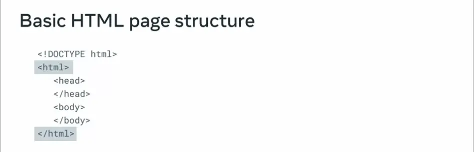
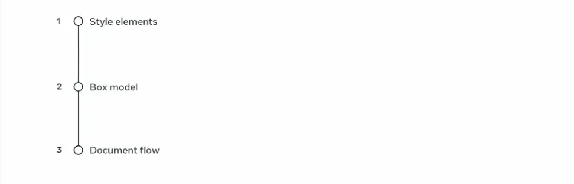
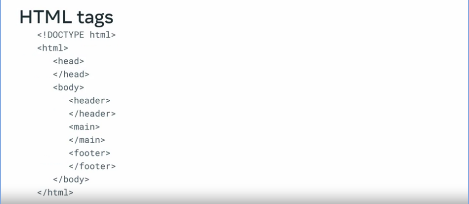
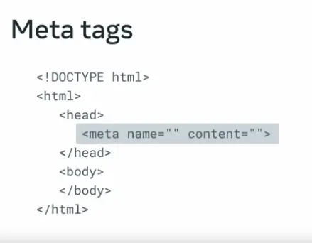

<!--~~~~~~~~~~~~~~~~~~~~~~~~~~~~~~~~~~~~~~~~~~~~~~~~~~~~~~~~~~~~~~~~~~~~~~~~~~~~~~~~~~~~~~~~~~~~-->
<!--~~~~~~~~~~~~~~~~~~~~~~~~~~~ readme.md of meta html css in depth ~~~~~~~~~~~~~~~~~~~~~~~~~~~~-->
<!--~~~~~~~~~~~~~~~~~~~~~~~~~~~~~~~~~~~~~~~~~~~~~~~~~~~~~~~~~~~~~~~~~~~~~~~~~~~~~~~~~~~~~~~~~~~~-->
<h1>meta/coursera HTML & CSS in Depth</h1>

<!--~~~~~~~~~~~~~~~~~~~~~~~~~~~~~~~~~~~~~~~~~~~~~~~~~~~~~~~~~~~~~~~~~~~~~~~~~~~~~~~~~~~~~~~~~~~~-->
<!--~~~~~~~~~~~~~~~~~~~~~~~~~~~~~~~~~~~~~~ coursera logo ~~~~~~~~~~~~~~~~~~~~~~~~~~~~~~~~~~~~~~~-->
<!--~~~~~~~~~~~~~~~~~~~~~~~~~~~~~~~~~~~~~~~~~~~~~~~~~~~~~~~~~~~~~~~~~~~~~~~~~~~~~~~~~~~~~~~~~~~~-->
<p align="center">

</p>

<h6 align="center">(Coursera/meta)</h6>

<!--~~~~~~~~~~~~~~~~~~~~~~~~~~~~~~~~~~~~~~~~~~~~~~~~~~~~~~~~~~~~~~~~~~~~~~~~~~~~~~~~~~~~~~~~~~~~-->
<!--~~~~~~~~~~~~~~~~~~~~~~~~~~~~~~~~~~~~~~ 01. meta logo ~~~~~~~~~~~~~~~~~~~~~~~~~~~~~~~~~~~~~~~-->
<!--~~~~~~~~~~~~~~~~~~~~~~~~~~~~~~~~~~~~~~~~~~~~~~~~~~~~~~~~~~~~~~~~~~~~~~~~~~~~~~~~~~~~~~~~~~~~-->
<p align="center">

</p>

<h2>Course syllabus</h2>

<h3>Prerequisites</h3>

To take this course, you don't need any developer experience, but you must be eager to get started with coding.

<h3>Module 1</h3>

In the first module, you will start with an introduction to the course and gain insight into what your career path as an HTML and CSS developer might look like. You will also receive tips on how to take this course successfully. Then, you'll move on to semantic tags and the importance of taking a structured approach to creating a well-formed web page. After which you will learn about metadata and tags and how you can use them to influence your web page's ranking through Search Engine Optimization (SEO). Following this section, you will learn about user input and forms and you will create and test a form by yourself. In the final part of the module, you will learn about media elements and you'll learn how to embed video and audio on a web page.

After completing this module, you should be able to:

- Use common semantic and meta tags to improve the accessibility, readability and SEO of a web page.
- Create commonly-used web page layouts and components.
- Create and test a form with client-side validation.
- Recognize server-side connections and the languages used to carry out requests and responses.
- Post form data to a server.
- Create a video and audio player that can rate the media played.

<h3>Module 2</h3>

In module 2, you will focus on CSS layouts, grids and flexboxes. You will learn about fundamental layouts that you can use to design a good web page. Next, you will learn about CSS selectors which correspond to specific elements or element groups in an HTML document. In this section, you also learn about pseudo-class selectors that you can use to improve the interactivity of your web pages without having to add overly advanced styling. In this module, you will also learn about keyframes, animations and effects in CSS. The final part of this module is about how to use browser developer tools to assist with debugging and resolving HTML and CSS issues.

After completing this module you should be able to:

- Use Flexbox and CSS grids to create responsive layouts and charts.
- Use advanced CSS selectors such as pseudo-classes for targeted styling.
- Use CSS effects to introduce text effects, animations and transformations into your stylesheet.
- Create simple keyframe animations.
- Perform basic front-end testing, debugging and error handling.
- Adapt your CSS to perform as expected in different browsers.

<h3>Module 3</h3>

In the last module, you will have an opportunity to recap what you learned in the course and put it into practice by creating a home page for a client persona.

After completing this module, you should be able to:

- Apply the skills you learned in this course to introduce more advanced styling into your portfolio.

<b>Course Introduction</b>

Perhaps you know a little about HTML and CSS from another course you did, or perhaps you don't know much at all.

Either way, a quick summary will be useful.

So let's explore some basic HTML and CSS principles and practices.

HTML stands for Hypertext Markup Language.

But what does that mean?

<!--~~~~~~~~~~~~~~~~~~~~~~~~~~~~~~~~~~~~~~~~~~~~~~~~~~~~~~~~~~~~~~~~~~~~~~~~~~~~~~~~~~~~~~~~~~~~-->
<!--~~~~~~~~~~~~~~~~~~~~~~~~~~~~~~~~~ 02. hypertext vs markup ~~~~~~~~~~~~~~~~~~~~~~~~~~~~~~~~~~-->
<!--~~~~~~~~~~~~~~~~~~~~~~~~~~~~~~~~~~~~~~~~~~~~~~~~~~~~~~~~~~~~~~~~~~~~~~~~~~~~~~~~~~~~~~~~~~~~-->
<p align="center">

</p>

Hypertext is text which contains links to other text.

Markup refers to tags and elements used within a document.


HTML elements with their opening and closing tags in angle brackets make up an HTML document.

These elements form the structure of a webpage and describe what to display to the web browser.

When it comes to HTML, it's important to know about the purpose of HTML in the web browser.

The use of HTML tags and correct syntax, and how HTML elements are used in a web document.

But what can you do with HTML?

You can add images to a web page with HTML code.

You can use it to display data in tables, and you can build forms with a wide range of inputs.

Also, using the correct HTML structure and appropriate elements as a foundation is an essential part of building accessible websites.

HTML can assist in ensuring web accessibility by supporting the technology people with disabilities use to interact with and understand websites.

Another important concept to know about when you're talking about HTML is the Document Object Model or DOM.

Users need to be able to interact with elements on a web page.

This means that HTML document must be represented in a way that JavaScript code can query and update it.

That's the function of the DOM.

It's a model of the objects in your HTML file.

Web developers interact with the DOM through JavaScript to update content, set up events and animate HTML elements.

Now that you've covered the basics of HTML, let's move on to CSS or Cascading Style Sheets.

If HTML is the frame and structure of a building, then CSS is the paint, wallpaper, fixtures, and overall style.

CSS tells the web browser how to display HTML elements on screen.



You use CSS to style elements within an HTML document, create an appealing layout for your webpage using the box model, and arrange page elements using normal document flow.

That was your HTML and CSS refresher.

Now get ready to dive deeper into learning more about these two topics.

<b>Semantic tags and why we need them</b>

By now you know that HTML describes the content of a web page.

But how do you describe the meaning of a web page?

To understand this in a real-world context, think of buttons in an elevator.

The vertical arrangement of buttons isn't enough for someone to understand their meaning.

To convey the meaning or semantics of the button, numbers are added so that people know which button will take them to which floor.

When you write HTML it's good practice to semantically describe the content.

This allows search engines and accessibility software such as screen readers to understand the contents of a page, fortunately you can do this by using some basic HTML tags.

For example, using a heading tags such as H1 describes that the content is a heading.

Similarly, the UL and OL tags describe lists.

However, there are many more semantic HTML elements available to you as a developer.

In this report I will share a structured approach you can take to make sure that you create a well-formed web page.



Let's revisit the basic structure of an HTML page which includes the head and body.

Inside the body tag you can lay out the website with very semantic tags to describe each of the sections.



For a typical HTML page, the structure can be semantically described using the header, main and footer semantic HTML tags.


For example, suppose you lay out your page with a header section that contains some company logo and navigation links.

Then a main section contains sections and articles.

Finally, a footer section contains contact information and social media links.


The main navigation section of your web page can also be described semantically using the Nav tag.

Depending on how web pages designed the Nav element is often placed after the header element and the header element is used for logos.


The main links of your website are then added inside the Nav element.

It is common practice for developers to specify their links as an unordered list inside the Nav element.

Next is the main content of a web page.

The two key semantic elements for your main content are the article and section elements.

First let's examine the article element.

The HTML specification states that according to the World Wide Web Consortium's website, the article element indicates content which represents a complete.

Or self-contained composition in a document page application or site that is independently distributable.

That's quite a mouthful.


It may help to think of a page in a newspaper.

There are many articles on the page and you can cut out the individual articles with scissors if needed.

The articles you can remove are the article element.

Examples; forum post, magazine or newspaper article, a blog entry, user submitted comment, interactive widget or gadget, or any independent item of content.

Let's examine how the article element is used say you are developing a blog about your summer holiday.

It's good practice to contain the blog post content inside of the article element because it's a complete self-contained composition on a web page.


You should place the article element within the main element.

Then add your regular heading &lt;h2&gt; and paragraph &lt;p&gt; tags within the article element.
 The reason for doing it this way is because the main element semantically represents the main content of the page.

And inside of it there can be multiple article elements for something like a blog post list.


At the end of your document is the footer element.

This might contain additional navigational links or content.

It is important to note that semantic elements are not limited to this structure.

Since their purpose is to describe the semantics of the content, the elements can be nested inside of each other.

If it accurately describes the content, let's update the previous example to use a nested semantic structure.

You add a header element to the article element, inside the header element at the heading element with the blog title and a paragraph element describing the date and author of the blog post.

Inside the main element at the content of the blog post.

That's it, let's examine the section element.

You can add a section element to semantically define individual sections of the article.

It is important to note that sections should contain heading elements to semantically describe the section.


It is also possible to use section elements to describe different sections of your webpage, the section element doesn't require the article element.
 It all depends on how you want to semantically describe your page.

And now you know how to semantically describe the contents of a web page, your web pages more accessible because the content is semantically described to add meaning.

Now, search engines and accessibility software can easily understand the contents of your well-formed web page.

<b>Semantic tags in action</b>

The Little Lemon Restaurant has asked me to add a new blog page to their website. They've told me that the page will contain several blog posts, and that it must use semantic html so that search engines and accessibility software can understand the semantics of the page.


I've set up my basic html document structure in a file named blog.html. I'll start off by adding my basic semantic structure.


First, I add the header element. Followed by the nav element, Followed by the main element. Followed by the footer element.

Remember this structure describes the semantics of this html document. Specifically, the header element will be used to display the Little Lemon logo, and the nav element will be used to describe the navigational structure of the website.

The main element will feature the main content of the web page, and the footer will be used to display copyright information.

When a search engine or accessibility software reads this document, the semantic tags will help the software understand the purpose and meaning of different sections of the document.

I will now add the details to each element. Inside the header element, I add the Little Lemon logo using the image tag.

Inside the nav element, I add the navigation links in an ordered list element using the ul tag.

I then add three list item elements using the li tag. Inside the list items, I add the hyperlinks for index.html, location.html and blog.html using the anchor tag.

In the main element, I add an h1 tag for the blog heading.

The restaurant told me that there will be two blog posts for their website.

I add two article elements after the h1 element. Inside the first article element, I add an h2 tag for the title of the blog post.

The title is 20% off this weekend. I then add a paragraph element below the title which contains the blog post text.

Inside the second article element, I add an h2 tag for the title which is our new menu.

Again, I add a paragraph element below the title which contains the blog post text.

Finally, I add a paragraph element to the footer element.

In this paragraph element, I add the copyright notice.

The blog pages now semantically described through the html document.

I now save the file by pressing Control and S or Command and S on Mac.

I then right click the blog.html file and select live preview to preview the file.

The blog page looks good and all thanks to proper semantic design that ensures accessibility and search engine optimization.

I'm sure that the Little Lemon Restaurant will get lots of business through their blog, and their customers with disabilities will be able to access the blog with no problems

<b>Metadata</b>
When was the last time you used a search engine? Probably in the last few hours or minutes. Perhaps you just wanted to quickly look something up or maybe you needed more in-depth information on a topic. Either way, the search engine you used will have returned a list of results that were most relevant to what you searched for. But how does a search engine determine which web pages are most relevant in this video? You will learn how search engines analyze web pages and how meta tags help provide information for search engines.


A major part of launching a website is a process called search engine optimization or SEO. This process involves making improvements to a website's content semantics & delivery to improve its ranking in search results.
 You might be wondering what exactly does a search engine do when it analyzes a web page?

Well when a search engine visits your website, it analyzes the html document and media content.

If it finds a link to another html document, it follows the link to that document and continues following links until it is finished analyzing the entire website.

Based on the results of the analysis and the content on your website, the search engine will rank the website for various search terms.

So, while your website might be the number one result for one search term, it could rank very low for another.

Every search engine has its own algorithm for ranking websites.

And while it's not disclosed how the ranks are determined, there are many best practices you can follow to influence how search engines analyze and rank your website.

But for now, let's just focus on how meta tags influence website ranking.


Meta tags define metadata about a web page.

What is metadata? You ask? It's data about other data which in this case is data about the web page.

Meta tags are added inside the head element of your html document and as you know, nothing inside the head element is displayed in the web browser.


In other words, meta tags are unseen elements within the browser. Note that there is no closing tag for the meta tag.



The meta element has two attributes, name and content.

The name attribute specifies the name of the metadata and the content attribute specifies the value of the metadata.

Let's examine some examples of metadata.


The author metadata specifies the author of the web page.

The name attribute is author and the content attribute is the person and company who are the author of the web page.


The description metadata describes the content of the web page.

This is often used by search engines as descriptive text in search results.

The name attribute is set to description and the content attribute is the descriptive text.


The keywords metadata was previously used to provide search keywords for search engines.

However, this led to a lot of websites using the keywords metadata to manipulate search rankings.

One of the major search engines now ignores this metadata and another uses keywords metadata as a spam indicator because of this, it's recommended not to include this metadata in modern web pages.


Another type of metadata is the robot's metadata and it tells search engines if and how they should analyze your web page.

The name 'robots' comes from the automated software often referred to as bots, that search engines used to analyze websites.


The content attribute for Robots has four possible values. Index tells the bot to analyze the page. Follow tells the bot to also visit all links on the web page. No index tells the bot not to analyze the page. Some bots will ignore this so it's best not to rely on this to stop bots from analyzing your page and no follow tells the bot not to visit links on the web page. Again, some bots will ignore this value so it's best not to rely on it.


Finally, there's the view ports metadata. The view port metadata is important when designing responsive web pages. Why you might ask because when a web pages viewed on a phone or tablet, the device will by default attempt to render the web page as if it is being viewed on a desktop. This results in a poor browsing experience for the user. The solution is to define view ports metadata. There are many values available for view ports metadata. The most used value for the mobile experiences is to set the width to device dash with and the initial scale to 1.0, you can learn more about view ports in the additional reading. It's important to note that view port metadata does not solve all the issues with browsing websites on mobile devices.

The other part of the solution is responsive web design.

But we were talking about search engine optimization, right? View port metadata is important for the user experience and it's also important for search engine optimization.

This is because many search engines now include websites mobile experience as a part of their ranking algorithms, there is more metadata that you can define on you web page to specifically improve its presence on social media.

But that's for later modules.


For now, it's important to know that author, description, keywords, robots and viewports metadata all play a role in the search engine optimization of web pages.

<b>Bare bones layout</b>

An important part of being a developer is not just the tools you use, such as your integrated development environment, but also the repository of knowledge and code templates you build up over time. In this module, I'm going to introduce you to one of these templates, which will help you get set up quickly for building webpages. Let's open Visual Studio Code to go through the templates step-by-step. In the folder, we have _ <b>index.html</b> _along with the JS folder and a CSS folder. Inside the JS folder, there's a file named _ <b>script.js</b> _. There is no content in this file. It is added to this folder so that you can easily add JavaScript code to the webpage. I recommend that you add any other JavaScript files to this folder too. Next, I'll open the CSS folder. In the folder there's a file named _ <b>styles.css</b> _. Again, there is no content in this file, but it is here so that you can easily add CSS rules to the webpage. Again, it's best if you add any other CSS files also to this folder.


I go back to my template folder and open it in Visual Studio Code. I open the index.html file. The file has a semantic HTML document structure set up.

At the top, there is the DOCTYPE declaration followed by the HTML root element. Inside the root element, there are the head and body elements in the head element. The title and meta tags are already optimized for search engines. I recommend that you update the title along with the description and author meta tags. Below, are the Meta tags for the Open Graph Protocol. Don't worry about the details of these tags just yet as you learn about them in a later module.

For now, the main thing to know is that if you plan on sharing the webpage on social media, you should remember to uncomment this HTML section and update the content attributes.


The next block of commented out code is for icons. If you want to show an icon in the web browser tab for your website, you can update the href attributes here to point to your icon.

Remember it you always link elements for the CSS style sheet to the last section of the head element.

To speed things up for you, there is a link already set up to reference the styles.css file in the CSS folder.

By now you can probably see how useful this template is.


Let's continue to the body element. The body element already contains a basic semantic structure. This includes the header element for your website title or logo, the nav element for your website navigation, the main element for your main content, and the footer element for any copyright notices or links to secondary webpages.


Below the footer element, you add script elements for JavaScript files. To make your life easy, a script element is already set up to reference the script.js file in the JS folder. With this template, you'll be able to quickly start building out webpages. It's worth keeping a copy of this template on your local machine to use and reference in future projects.

In this module, you've been introduced to a semantic HTML template that you can use for building webpages. Good luck.

<b>Layout design</b>

As you build web pages throughout your career, you'll notice that many pages follow similar layouts and structures. This is the outcome of many years of research into user interface design and user experience. Different companies, libraries and frameworks then adopt the resulting best practices.

Many examples of these layouts can be seen in the popular bootstrap framework. However, many other frameworks provide similar designs.

<b>Top navbar layout</b>

Websites often have a top navbar layout to provide a set of essential anchor links to the user. These typically link to the main areas of the website, such as product pages, careers pages or contact pages. This provides the visitor to the website with a consistent navigation experience.


<b>Carousel layout</b>

Product-focused websites often use a large carousel on their homepage to highlight their featured products, discounts and offers. The carousel contains content items that will rotate through the carousel area at a fixed interval.


<b>Blog layout</b>

The blog layout is used to feature multiple content items of differing importance.

It is often seen on news websites where new articles will appear on the page each day based on current events.


The layout typically features different-sized feature areas followed by a series of article summary areas that link to full articles.


<b>Dashboard layout</b>

Dashboard layouts are often used in enterprise software for managing various web applications. They typically feature a sidebar for navigation with the main content area containing forms for configuration or reporting data such as graphs and tables. This trendy layout provides a good user experience for business users.


<b>More layouts</b>

You can explore more of these layouts on the bootstrap examples page in the additional resources.

Consider these layouts when building websites and web applications so that you provide your audience with the best user experience possible.

<b>UX with meta tags</b>

Social networks are a great tool to share content with friends and family, and even with coworkers and business partners.

When you share a link, most social networks generate a preview of the link to let users know what the linked webpage is about.

Now that you're learning more about front end web development, you're probably wondering how social networks generate these previews.

In this module, you will learn how Meta tags help webpages create previews of other web pages.

By using Meta tags to control what information is displayed to users, you can get more clicks when you share your websites.

But the Meta tags web developers use for this purpose are different from the traditional SEO Meta tags that you learned about earlier in this lesson.

Traditional SEO Meta tags are oriented towards search results, not direct links.

Facebook's rapid growth led to millions of people sharing thousands of links every day.

To improve the user experience, they had to find a way to display information about a website before a user clicks on the link.

To address this challenge, Facebook established the Open Graph Protocol in 2010.


The Open Graph Protocol is a set of Metadata rules that allow web pages to describe themselves to social networks.
 There are many Metadata options available within the protocol, but before you learn about them, let's first discuss how the Open Graph Protocol Metadata is defined.

Earlier in this lesson, you learned that Meta tags are defined inside of the head element of an HTML document.

The Open Graph Protocol also uses Meta tags added to the head element, but they are slightly different. Instead of the name attribute, the Open Graph Protocol uses the property attribute to define the Metadata name.

Then, like the regular Meta tags, it uses the content attribute to define the Metadata value.

Each property in the Open Graph Protocol starts with og : as a convention to identify it as an Open Graph Protocol related tag.

The Open Graph Protocol requires that you must always include four properties on a webpage.


These are title, type, URL, and image.

The title property defines the title of the page, this is the text that will appear in the preview.

The type property defines the type of content, such as website, video, music, or article.

Depending on the value you specify as the type, other properties may be required.

You will learn about these in a later module.

The URL property defines the permanent web address that the social network must use for the specific page.

The image property defines a URL to an image that must display when the website is shared.

Together, these Open Graph Protocol properties enables social media platforms to create a preview of the shared web link.

Say, you share a blog post.

The title of the post is the og:title, the blog post URL is the og:url, and the image that displays is the og:image.

There are several other optional properties that you will learn more about later. But let's briefly explore three of these.

The description property provides a description of the webpage.


The og:locale property describes the language and territory of the webpage's content.

For example, en\_US specifies that the page is in English and the locale is the United States.

The og:site\_name property describes the name of the overall website that the webpage belongs to.

You've now learned how to use Metadata to describe web pages so that social networks can improve user experience by previewing shared content.

Next time you share a website on a social network, you can use what you've learned about Open Graph Protocol properties to generate more clicks.

<b>Social media cards</b>

Before Facebook introduced the Open Graph Protocol (OGP), search engine web crawlers, including social media websites, used the internal heuristics of a website to make the best possible guess in terms of the title, description, and preview images to be used for the content. This often led to social networks not completely successfully interpreting the post or information shared in the URL provided. Even today sometimes when you open a link for a website, the preview generated will be an out-of-scale image or a random image that is possibly embedded somewhere within the web page. This is where meta tags come in to help the end-user take better control of their content.

Over the years, the successful implementation of OGP has led to other social media giants, including sister companies owned by Meta, to adopt the protocol to improve the user experience. These platforms have their own meta tags that prefix and replace 'og' that you have encountered earlier in the course.

<b>Need for social media cards</b>

With the number of users and the use of internet marketing on the rise, user attention is the currency. It is said that a picture is worth a thousand words and the internet is a living proof of it: a caption and image can drive users towards or away from a website. The title and description shared with an URL should summarize the contents of a web page. In some cases, it may refer to generic information about the entire website. While for others you may tailor the social media (SM) card for a specific page on a website that you're sharing. 'type' is an important OGP tag in SM cards that help describe the details of a link such as if it's a book, article, movie and so on, and provide more detailed metadata for specific types. For example, in case of the music type, you can add details for the song, album, duration or any other information about the song. For a regular user scrolling through social media, the link provided with the image preview has only one chance and a moment's attention to make a good impression. In such cases, the role of social media cards becomes very important.

The extra time spent by a developer to add social media tags is worth the effort!

<b>Social media cards and SEO</b>

The internet today is an interconnected graph that is internally a web of URL links, web crawlers, and search engine optimization tools. Together, a web page's image and title are the store front to invite the user. But the social media cards also play an important role in boosting the rankings for the web crawlers used by search engines. They provide the crawlers with the necessary information to build metadata that eventually helps in ranking websites. Additionally, it also helps track traffic to your website.

While it's advised to stick to the required tags in social media cards, a developer can also use auxiliary tags that may be suitable.

For example, the use of the video tag that helps to play in-line when displayed on social media websites like Meta.

Meta also has a dedicated page to assist developers that you can find in the additional resources for this section.

<b>Setting up a social media card</b>

Little Lemon restaurant has hired a marketing firm to help them advertise their business.

The firm recommends that the restaurant will run a social media campaign.

So, the owners of the restaurant asked me to make sure that the website is ready to be shared on different social media platforms.

Now let's examine how to prepare a web page so it can be linked on social media platforms.

I've opened index.html in visual studio code.


At a minimum, I need to add four pieces of metadata required by the protocol.

To do this, I add the four meta tags inside the head element.

On the first meta tag, I add the property attribute and set its value to og:title.

I then add the content attribute and set its value to our menu.

This metadata is the title that will be displayed in the preview on the social media platform.

It's important to note that this value should reflect the content of the individual web page and not the website as a whole.

On the second meta tag, I add the property attributes and set its value to og:type.

I then add the content attribute and set its value to website.

This metadata informs the social platforms that this content being shared is a website.

On the third meta tag, I add the property attribute and set its value to og:image.

I then add the content attribute and set its value to logo.png.

This metadata informs the social media platform what the preferred preview images.

In this case, it will be good to display the Little Lemon restaurant logo.

On the last meta tag, I add the property attributes and set its value to og:url.

I then add the content attribute and set its value to the url of the Little Lemon website.

The web page is now ready to be shared on social media platforms.

However, there is some optional metadata I can add to provide additional information to the platforms.

Since the platforms vary in what they display to their users, it's best to provide as much information as possible.


I'll add three more or meta tags to the head element.

On the first tag, I had the property attribute and set its value to og:description.

I then add the content attribute and set its value to Little Lemon is a family-owned Mediterranean restaurant, focused on traditional recipes served with a modern twist.

If the social media platform displays a description of the page when it is shared, this text will be displayed to inform the users what the web page is about.

On the second tag, I add the property attribute and set its value to og:locale.

I then add the content attribute and set its value to en\_US.

This will inform the social media platforms that the locale of the website is US English.

On the last tag, I add the property attribute and set its value to og:site\_name.

I then add the content attribute and set its value to Little Lemon.

Some social media platforms will also display the website name beside the page title.

So, this will ensure that the website title is correct.

The Little Lemon website is now ready for its big social media campaign.

Hopefully, this will lead to lots of new customers.

In this module, you've explored a practical example of how to add open graph protocol metadata.

You should now know how to add the four required meta tags title, type, image, and URL.

You also learned how to add additional meta tags that provide extra information like the website description and locale. Well done.

<b>Additional resources</b>

The following resources will be helpful as additional references in dealing with different concepts related to the topics you have covered in this section. 

- [HTML meta tags](https://www.dofactory.com/html/metatags)
- [Semantic elements](https://www.freecodecamp.org/news/semantic-html5-elements/)
- [Simple bare bones HTML webpage](https://www.instructables.com/Bare-Bones-Web-Page/)
- [HTML5/CSS bare-bones newsletter template](https://www.vandelaydesign.com/newsletter-tutorial/)
- [Add open graph social metadata- Twitter](https://www.digitalocean.com/community/tutorials/how-to-add-twitter-card-and-open-graph-social-metadata-to-your-webpage-with-html)
- [Essential meta tags for social media](https://css-tricks.com/essential-meta-tags-social-media/)
- [The meta element](https://developer.mozilla.org/en-US/docs/Web/HTML/Element/meta)
- [Open graph protocol](https://ogp.me/)
- [Using open graph protocol on website](https://www.freecodecamp.org/news/what-is-open-graph-and-how-can-i-use-it-for-my-website/)
- [Meta OGP guide for webmasters](https://developers.facebook.com/docs/sharing/webmasters/)
- [Bootstrap with HTML](https://www.bootstrapdash.com/blog/use-bootstrap-with-html)
- [Bootstrap Layout Examples](https://getbootstrap.com/docs/5.2/examples/)

<b>Forms and validation</b>

You've most likely encountered forms when registering an account on a website, or when filling out your address for something you've bought online.

As a developer, you'll use HTML forms to capture user input.

Capturing input is one thing, but the form also needs to ensure the data is usable. How can you ensure the user input is valid?

For example, let's say you are building an online food delivery website.

Say a user accidentally makes an error when entering the delivery address and the form accepts it, although the location does not exist.

It will cause a very bad user experience when the food never arrives.

This is where form validation comes in.

Form validation is a process that ensures that the data entered by the user in a form is valid and conforms to rules defined by the developer.

There are two methods of form validation, client-side validation and server-side validation.

Client-side validation checks for errors as soon as they are typed into the form.

This is done by the web browser or by JavaScript code, and provide the user with immediate feedback.

The client-side validation process starts by checking if a form has been filled out correctly. If there are no errors, the form will be submitted to the server for processing.

However, if there are errors, an error message will alert the user of the invalid data and how to change it for successful submission.

For example, you decide to use the input element with its type attributes set to email.

If the user does not enter a valid email address, the web browser will display an error message informing them that the data they entered is not a valid email address.

On the other hand, server-side validation checks for errors after the data has been submitted to the web server.

Server-side validation is more secure because it prevents malicious users from tampering with your website's code and submitting invalid data to your server.

When the form data is received by the web server, the backend will validate the data before processing it.

This validation can run more complex checks, such as checking the data against a database, or validating the data against business requirements.

Most websites use both client-side and server-side validation to provide immediate feedback to users, but also to protect against malicious data submission and to ensure data integrity.

Let's examine how HTML allows you to do simple client-side validation.

HTML has several input types that are validated by the web browser.


As demonstrated in the example, email is used for email addresses.

Others include "tel" for telephone numbers, "url" for URLs such as www.data.com, "date" for date values, "time" for time values, "number" for numeric values, "range" for numeric values which have a minimum and maximum value, and "color" for color selection.

Say for instance, a user makes mistakes on a user account form when entering a telephone number and URL, the browser will validate the entered data against the requirements of the input type and provide user feedback.


Another example is the required attribute, which indicates that the user must supply a value to an input field.

The web browser will alert a user if a required value is outstanding.

That's the basics of client and server-side validation of forms.

You'll learn more about HTML validation capabilities in the next reading.

<b>Input types</b>

You already learned about the input HTML tag and how the type property determines the data your users can type in. This cheat sheet should be a reference to decide what type best suits your use case. Most of the inputs go hand in hand with the label tag for best accessibility practices.

<h4>Button</h4>

This displays a clickable button and it's mostly used in HTML forms to activate a script when clicked. <b>&lt;input</b><b>   </b><b>type="button"</b><b>   </b><b>value="Click me"</b><b>  </b><b>onclick="msg()" /&gt;</b>

Keep in mind you can also define buttons with the <b>&lt;button&gt;</b> tag, with the added benefit of being able to place content like text or images inside the tag.

```
<button onclick="alert('Are you sure you want to continue?')">
    
</button>
```

<h4>Checkbox</h4>

Defines a check box allowing single values to be selected or deselected. They are used to let a user select one or more options of a limited number of choices.

```
<input type="checkbox" id="dog" name="dog" value="Dog">
<label for="dog">I like dogs</label>
<input type="checkbox" id="cat" name="cat" value="Cat">
<label for="cat">I like cats</label>
```

<h4>Radio</h4>

Displays a radio button, allowing only a single value to be selected out of multiple choices. They are normally presented in radio groups, which is a collection of radio buttons describing a set of related options that share the same "name" attribute.

```
<input type="radio" id="light" name="theme" value="Light">
<label for="light">Light</label>
<input type="radio" id="dark" name="theme" value="Dark">
<label for="dark">Dark</label>
```

<h4>Submit</h4>

Displays a submit button for submitting all values from an HTML form to a form-handler, typically a server. The form-handler is specified in the form's "action" attribute:

```
<form action="myserver.com" method="POST">

  …

<input type="submit" value="Submit" />

</form>
```

<h3>Text</h3></h3>

Defines a basic single-line text field that a user can enter text into.

```
<label for="fname">First name:</label>
<input type="text" id="fname" name="fname">
```

<h4>Password</h4>

Defines a single-line text field whose value is obscured, suited for sensitive information like passwords.

```
<label for="pwd">Password:</label>

<input type="password" id="pwd" name="pwd">
```

<h4>Date</h4>

Displays a control for entering a date with no time (year, month and day).

```
<label for="dob">Date of birth:</label>

<input type="date" id="dob" name="date of birth">
```

<h4>Datetime-local</h4>

Defines a control for entering a date and time, including the year, month and day, as well as the time in hours and minutes.

```
<label for="birthdaytime">Birthday (date and time):</label>

<input type="datetime-local" id="birthdaytime" name="birthdaytime">
```

<h4>Email</h4>

Defines a field for an email address. It's similar to a plain text input, with the addition that it validates automatically when submitted to the server.

```
<label for="email">Enter your email:</label>

<input type="email" id="email" name="email">
```

<h4>File</h4>

Displays a control that lets the user select and upload a file from their computer. To define the types of files permissible you can use the "accept" attribute. Also, to enable multiple files to be selected, add the "multiple" attribute.

```
<label for="myfile">Select a file:</label>

<input type="file" id="myfile" name="myfile">
```

<h4>Hidden</h4>

Defines a control that is not displayed but whose value is still submitted to the server.

```
<input type="hidden" id="custId" name="custId" value="3487">
```

<h4>Image</h4>

Defines an image as a graphical submit button. You should use the "src" attribute to point to the location of your image file.

```
<input type="image"src="submit_img.png" alt="Submit" width="48" height="48">
```

<h4>Number</h4>

Defines a control for entering a number. You can use attributes to specify restrictions, such as min and max values allowed, number intervals or a default value.

```
<input type="number" id="quantity" name="quantity" min="1" max="5">
```

<h4>Range</h4>

Displays a range widget for specifying a number between two values. The precise value, however, is not considered important. This is typically represented using a slider or dial control. To define the range of acceptable values, use the "min" and "max" properties.

```
<label for="volume">Volume:</label>

<input type="range" id="volume" name="volume" min="0" max="10">
```

<h4>Reset</h4>

Displays a button that resets the contents of the form to their default values.

```
<input type="reset">
```

<h4>Search</h4>

Defines a text field for entering a search query. These are functionally identical to text inputs, but may be styled differently depending on the browser.

```
<label for="gsearch">Search in Google:</label>

<input type="search" id="gsearch" name="gsearch">
```

<h4>Time</h4>

Displays a control for entering a time value in hours and minutes, with no time zone.

```
<label for="appt">Select a time:</label>

<input type="time" id="appt" name="appt">
```

<h4>Tel</h4>

Defines a control for entering a telephone number. Browsers that do not support "tel" fall back to standard text input. You can optionally use the "pattern" field to perform validation.

```
<label for="phone">Enter your phone number:</label>

<input type="tel" id="phone" name="phone" pattern="[+]{1}[0-9]{11,14}">
```

<h4>Url</h4>

Displays a field for entering a text URL. It works similar to a text input, but performs automatic validation before being submitted to the server.

```
<label for="homepage">Add your homepage:</label>

<input type="url" id="homepage" name="homepage">
```

<h4>Week</h4>

Defines a control for entering a date consisting of a week-year number and a year, with no time zone. Keep in mind that this is a newer type that is not supported by all the browsers.

```
<label for="week">Select a week:</label>

<input type="week" id="week" name="week">
```

<h4>Month</h4>

Displays a control for entering a month and year, with no time zone. Keep in mind that this is a newer type that is not supported by all the browsers.

```
&lt;label for="bdaymonth">Birthday (month and year):&lt;/label>

&lt;input type="month" id="bdaymonth" name="bdaymonth" min="1930-01" value="2000-01">
```

<b>Creating a form</b>

The Little Lemon restaurant wants to expand its service by taking online orders to deliver food to customers at home.

To do this, they need their customers to set up an account on their website.

In this module, you will learn how to create a simple signup form for user accounts on the Little Lemon website.


I've set up my basic HTML document structure in a file named, signup.html.

I start off by adding the form element.

The restaurant requires that the customer data is sent securely.

I will set the method attribute to post so that is submitted using an HTTP post request.

You will learn more about different methods of form submission later.

For now, you just need to know that if you send a form via an HTTP post request, it improves the data security of the form.

The restaurant wants to collect the customer's first name, last name, and email address.

Of course, the form also needs a field for the password, and another to confirm the password.

I need to create a form with five fields in total.

I'll start by adding the input elements, also known as the form fields.

First, I'll set up six div elements, one for each input element, and one for the sign up button.

The div elements will cause each field of the form to display in its own CSS block.

Now, I'll start adding the input elements.

I add an input element for the first name to the first div element.

Since the user will input plain texts for this form field, I set the type attribute to text.

I also set the name and id attributes to user\_first\_name.

Remember that the name attribute sets the key for the value submitted to the web server.

Later in this module, I'll explain why I set the ID attribute.

Next, I add an input element for the last name.

Like the first name element, I set the type attribute to text, and the name and ID attributes to user\_last\_name.

I then add an input element for the email address.

To make sure users enter a valid email address in this field, I set the type attribute to email.

Earlier you learned that doing so establishes HTML's client-side validation.

I also set the name and ID attributes to user\_email.

Next, I add the input element for the password.

I want the password to be hidden on screen as the user types it, so I set the type attribute to password.

When an input field is set to password, each character that a user enters will display as a placeholder character, such as the bullet point.

The content in the field will contain the password that the user enters, but it will be hidden.

I then set the name and ID attributes to user\_password.

Finally, I add the input element for confirming the password.

Again, I set the type to password to hide the content of the input field on screen.

I then set the name and ID attributes to user\_confirm\_password.

Now that our input fields are set up,

I save the file and open the Live Preview to check the webpage.

Everything displays correctly.

However, I'd like to improve the user experience by informing the user what each field represents.


To do this, I'll add a label element before each input element.

Now I want to explain why I set the ID attribute for each input field earlier in the module.

The reason for this, is that it allows me to associate a label with each input element.

Labels improve the user experience and assist accessibility software and understanding the form.

I now add a label element above the first input element.

Inside the label element, I add the descriptive text for the input field.

In this case, the text description will be first name.

Then, to associate the label with the input field, I add the four attribute and set its value to match the value of the ID attribute of the input element.

Finally, I'll add a line break tag after the label element so that the input field displays below the label. I then repeat the same process for each input element.


I save the file again and open the Live Preview.

Oh, yes, that's much better.

The form labels now display above the input fields.


To finalize the form, I need to add one more thing, the submit button. Inside the last div element, I add a button element.

I set the button type attribute to submit.

Then inside the button element, I add the text, sign up.

I save the file again and open the Live Preview.

The form is now ready to use.

Once the backend is set up by a backend developer to accept the data submitted via the form, users will be able to create their accounts.

In this module, you learned how to create a basic form with several different input fields, each in its own CSS block, you covered how to set the method attribute to submit the form in a secure way, and you also now know how to associate a label with an input field to improve the user experience.

Good luck with creating your own signup forms.

<b>Making the most of client-side validation</b>

Have you ever completed a form online and then after you've clicked on the submit button, one of the fields turned red?

There are many reasons for error messages when you complete online forms, the format could be wrong, but sometimes an error results when a field is empty or if a value is too long or too short.

As a developer, you can use HTML and CSS to guide users to enter the correct data on forms and in this way, save web server resources.

In this section, you will learn more about the capabilities of client-side validation in HTML and how to use CSS to effectively alert users when data is incorrect.

By now you've learned about the different HTML input types and how they validate the format of data, but there are additional attributes that you can apply to elements for further validation.


First, let's explore how you can ensure that the user provides a value to a form field. This example of a log-in form contains two fields, one for the username and one for the password.

It also contains a submit button to submit the form.

If a user hasn't added a username or password and clicks the "Submit" button, the browser will allow the form to submit to the web server.

But this is a waste of server resources because although the server-side validation will pick up the missing information and prevent the processing of the request, a HTTP request was still submitted.

Let's improve this form by using client-side validation to ensure the user enters values to both fields.


Now with the required attribute in the code, if one of the fields is empty and the user clicks the submit button, the request will not be submitted to the web server.


The web browser will focus on the first empty input element and inform the user that a field is empty.

Now the form creates a much better user experience and prevents unnecessary usage of web server resources, but user input that is too short or too long would also result in unnecessary submissions to the web server.

Another way to validate user input is to specify the required length for data.

Let's say you want the usernames to be at least three characters long and a maximum of 12 characters, or maybe you want to ensure more secure passwords by requiring a minimum password length of five characters.

Fortunately, there are two more attributes you can use to ensure the correct length of data.


You can add the min length and max length attributes to the fields to specify the required length. In this case, since the minimum value for the username is set to three, a two-character entry would be invalid.

If you click the submit button now, the web browser will inform you of the length requirements.

A built-in function of the browser will generate the message displayed on screen.

Again, a much better user experience and management of web server resources.

Now let's focus on the way the browser communicates errors to the users, like a form field that turns red when the data is invalid.

This can be readily implemented using CSS.

To highlight a field in red when the data is invalid, you use the input element selector.


You then apply the pseudo-class selector called invalid.

You will learn more about pseudo-class selectors later in this course.

For now, the key thing to know is that they are used to select elements based on their state, such as whether the input data is valid or invalid.


Then you add a CSS property to set the border of the element to read.

But since all the form fields are empty when the form loads initially, their state is still practically invalid.

This will cause all form fields to display read from the start like demonstrated in this Real-world example of a login screen.

Ideally, you only want fields to appear red as the user enters invalid data.


To do this, you need to apply another pseudo-class called focus, which checks if the user is currently entering data into this field.

Now the form will appear normal when the page first loads, and when the user starts inputting data, the field will turn red if the data is invalid.

This module gave you a brief introduction to how you can use client-side validation and CSS pseudo-class selectors to improve the user experience of forms.

As you learn more about JavaScript in other courses, you will be able to use even more advanced techniques to improve form validation.

<b>Visual Studio Code on Coursera</b>

In addition to having Visual Studio Code installed on your own computer, in this course and throughout this program, you'll have the opportunity to work in Visual Studio Code right here on Coursera!

As you progress through the course, you'll be able to write code in hands-on activities called </b>Labs</b>. In these labs you'll be able to open Visual Studio Code and start writing code without ever leaving the course.


<h4>How to get started working on Labs</h4>

The Labs contain instructions explaining the coding task.


When you click the button to open the lab, a new tab will open with Visual Studio Code already setup and ready for you to start writing code!


You'll see all the files for the lab in the Project folder in the left sidebar.


And the large editor area where you write your code for the lab.


All <b>Lab</b> exercises will include two important files. A <b>README.md</b> file which contains instructions for using Visual Studio Code and most importantly, how to run and view the output of your code. The README.md file is the same for every Lab. There will also be an <b>instructions.md</b> file which provides specific instructions for each Lab.

These files may look a little confusing at first. They're written using a language called Markdown. Markdown is just used to add formatting to text elements. Don't worry, you don't have to know anything about Markdown. If you open these files in <b>Preview</b> you'll just see the formatted output and they'll look totally normal.

You'll also likely see quite a few files and folders when you open in the Lab. Many of the files and folders you'll be able to ignore. To get started, look at the <b>instructions.md</b> file and it will explain which file or files you'll be working in.

<b>Working in the Terminal</b>

For Labs in some courses, you may need to use a tool called the Terminal from time to time to complete course activities. You can open this by selecting the <b>Terminal</b> option in the upper Visual Studio Code toolbar.


<b>How to download files from your Visual Studio Code Lab to your local device</b>

1. Select the <b>Lab Files</b> button in your Lab Toolbar.
2. You'll be able to download your full workspace, specific folders, or individual files through the checkbox selection tool.
3. After you've selected these files, use the <b>Download</b> link to download your files to your local device.


How to upload local files to your Visual Studio Code Lab

If you'd like to upload your course files from your local device to your Visual Studio Code lab, <b>drag and drop</b> your file from your local device into the Visual Studio Code file tree.


How to get a fresh copy of course-provided starter files

Your work will be saved and persist within your Visual Studio Code lab while you are enrolled in the course. If you'd like to get a fresh copy of the original instructor-provided files at any time, you can do this through the <b>Lab Help</b> option in your Lab Toolbar. Don't worry - your original work and files will still remain in your lab until you personally remove or delete them, even when refreshing your files through the steps below.

1. First rename your original files to something like _[yourfilename] [original].[your file extension]`._ You can do this by right-clicking on your file in the Visual Studio Code file tree, selecting <b>Rename</b> , and providing a new file name.

For example for index.html, this could be renamed to _`index [original].html`_

1. Select <b>Lab Help</b> from your Lab Toolbar and then select <b>Get latest version.</b>


1. You should nowsee a fresh copy of the original instructor-provided files in your lab, in addition to your own (renamed) files.

<b>Create and test a form (solution)</b>

The following code is an example solution for the previous exercise.

This code is placed inside the &lt;main&gt; element of index.html.

```
<form>
    <div>
        <label for="username">Username</label>
        <input type="text" id="username" required minlength="2">
    </div>
    <div>
        <label for="password">Password</label>
        <input type="password" id="password" required minlength="2">
    </div>
    <button type="submit">Log In</button>
</form>
```

While reviewing the code, note the following items:

- The label _for_ attribute value matches the value of the _id_ attribute on the corresponding input element
- The _type_ attribute is set to _text_ for the username input
- The _type_ attribute is set to _password_ for the password input
- Each field has a _required_ attribute to enable client-side validation which checks that the form is filled out by the user
- Each field has a _minlength_ attribute with its value set to 2. This enables client-side validation which will prompt the user if the content of the field is less than 2 characters.

<b>Radio buttons</b>

You've surely booked something online before.

Perhaps it was tickets to a show or accommodation for a holiday.

The ability to book things online is super convenient.

That's one of the reasons why the Little Lemon restaurant is adding a table booking system to their website.


By now, you should know that a HTML form will be an ideal solution for that.

Like most restaurants, Little Lemon has different table sizes and different sections in the restaurant where customers can be seated.

Therefore, the HTML form must allow customers to decide between the available table sizes, as well as if they want to sit indoors or outdoors.

Since both choices have limited options available, it will be best to use radio buttons for the input.

Radio buttons are ideal for this forum because they allow me to set up groups of options of which only one option and the group can be selected.

Now, let's explore how to set up a HTML form with radio buttons.


I've opened Visual Studio Code and added a new file called booking.html.

I've set up the basic HTML structure and added a form element.

First, I'll add to fieldset elements, one for the table size and one for location.

The fieldset element defines a group for the radio buttons.

Without the fieldset elements, all radio buttons will belong to the same group, but for this form, we need two groups.

On the first fieldset element, I set the id attribute to size. On the second fieldset element, I set the id attribute to location.

Below the fieldset elements, I add a button element.

On the button element, I set the type attribute to submit. Inside the element, I add the text book table.

There are three different tables sizes available at Little Lemon; two-person, four-person, and six-person tables.

Inside the first fieldset element, I add three input elements representing the three different tables sizes.

On the first input element, I set the type attribute to radio and the value attribute to two.

I then set the name attribute to size.

It is important to set the name attribute value to match the value of the id attribute in the fieldset.

This tells the browser, which fieldset the input belongs to. After the element, I add the text two-person table.

On the second input element, I set the type attribute to radio and the value attribute to four.

I then set the name attribute to size.

After the element, I the text, four-person table.

Since the four-person table is the most common booking, I want to have this option selected by default.

To do this, I add the checked attribute to this input element.

On the third input element, I set the type attribute to radio and the value attribute to six.

I then set the name attribute to size.

After the element, I add the text, six-person table.

In the second fieldset element, I add two input elements representing the table location at the restaurant.

On the first input element, I set the type attribute to radio and the value attribute to indoors.

I then set the name attribute to location, matching the id of the second fieldset element.

Since the indoor booking is the most common, I'll add the checked attribute to this input element so that it is selected by default.

On the second input element, I set the type attribute to radio and the value attribute to outdoors.

Again, I set the name attribute to location.


I save the file and open it in Live Preview. Success.

The form is set up correctly. Let's test it.


If I choose an option for the table size and then choose a different option, my previous choice is deselected.

The table location field behaves the same. I can only choose indoors or outdoors.

However, I'm testing this form on a laptop with a large screen.

On a mobile device with a way smaller screen, it may be difficult for the user to accurately select the small button elements.


Luckily, there is a way to improve this by setting the text and button as the input area.

I open booking.html again, for each input element and texts, I wrap them in a label element, which will group the texts with the input element.

I save the file again and return to Live Preview.

If I click on the text now, the corresponding input element is selected.

Selecting the desired choice will be much easier on a mobile device now.

A user will be able to select the button specifically.

This form has a much better user experience now.

In this module, you've covered how to use radio buttons to create a simple online booking form.

Hopefully, Little Lemon will get a lot more table bookings now.

<b>Using interactive form elements</b>

Little Lemon restaurant is becoming very popular in their local area, so much so that they've opened a second Little Lemon in another area nearby.

Because of this, they want to update the form of their table booking system.

In this module, you will learn how to add advanced HTML features to a form.

They've also added some new tables to the restaurant.

They've also asked to replace the table size field with a field for the number of people and to remove the table location field.

Finally, they want customers to be able to choose which restaurant they want to book at.

The owners have told me that they're hoping for continued success and growth of the business, and so I should plan for more restaurant locations to be added.

I opened booking.html in Visual Studio Code.

I'll start by deleting the previous table and location fields.

I then add three div elements for the new fields. Next, I'll add the field for the booking date.

Luckily, HTML provides a built-in field type called date that'll present a calendar to the customer when the field is clicked.

To add this, I add an input element to the first div element and set its type attribute to date. I also set the ID and name attributes to booking\_date.

To provide a good user experience, I'll add a label element before the input element.

Inside the label element, I add the text description, booking date.

I also add the for attribute and set its value to booking\_table so that accessibility software can describe the purpose of the input field to its users.

Next, I'll add the field for the number of people.

The restaurant has told me that the maximum booking is 10 people, so I'll use the range input type.

The range type allows me to specify the minimum and maximum values of the field.

I add an input element to the second div element. I set its type attribute to range.

I also set its ID and name attributes to booking\_people.

To set the minimum value, I add the attribute min, which is short for minimum, and set its value to one.

Then to set the maximum value, I add the attribute max, which is short for maximum, and set its value to 10.

Again, to provide a good user experience, I add a label before the element and set its content to number of people.

I then set the for attribute to booking\_people.

Now, I'll add the new location field.

The restaurant currently has two locations, but they said they might add more later.

To allow for expansion later, I'll use a data list, input type.

The data list input type allows me to specify a list of available options that will appear in a drop-down list.

There can be tens and hundreds of options, so the field allows the user to begin typing, and it will narrow down the available options based on their input.

Since there are only two locations so far, the customer will be able to select their location from the drop-down list.

When more locations are added later, the customer will be able to begin typing their location and quickly select their location from a reduced set of options.

Setting up the data list input type requires a few more steps than the other input types.

First, I add an input element.

Then I set the name and ID attributes to booking\_location.

Then I add an attribute called list and set its value to locations.

This value is important for the next step.

I then add a data list element and set the ID attribute to match the value of the list attribute on the input element.

In this case, I set the ID attribute to locations.

Inside the data list element, I then add two option elements.

On the first option element, I add the value attribute and set it to Downtown.

On the second option element, I add the value attribute and set it to Uptown.

Again, to provide a good user experience, I add a label before the input element and set its content to location.

I then set the for attribute to booking\_location.

I save the file, and open it in live preview.

When I click on the date field, the browser opens a calendar and allows me to select a date.

The range input type is presented as a slider that I can slide left and right to the value I want.

Finally, the data list input allows me to select an option for the location or begin typing to narrow down the available options.

In this module, you learned how to use advanced features of HTML forms.

You should now be able to add a calendar, create a slider with values, and add a datalist that allows users to either select an option from the drop-down list or by typing their option.

With the continued success of Little Lemon, I'm sure I'll be updating this form again in the near future.

<b>Form submission</b>

When ordering products online, you fill out your address and your credit card number, then you click on an Order button that confirms your order.

Because you are learning more about front-end development, you might be wondering what exactly happens when you click on that order button.

In this module, you will learn what happens when forms are submitted in the web browser.


By now, you know that the web browser communicates with a web server using a HTTP request response cycle.

This means that the web browser sends requests to the web server, and the web server sends back a response.

Up to now, the main type of requests you've been introduced to were for resources such as HTML documents, images, CSS files, and JavaScript files.

But it is also possible to send data as part of a request.


This is how form send data to the web server.

In fact, there are two ways a form can send data to the web server using the HTTP GET method or the HTTP POST method.

You can specify which method the form should use with the method attribute of the form element.

Let's examine an example form and see how the data can be sent using the two different methods.

This login form, excepts a username and password.

It also has a login button that submits the form to the web server.


How would it work if the method attribute is set to GET?


When the Login button is clicked, the form data is sent as part of the request URL.

This means that the user data is appended to the end of the URL in the web browser navigation bar.


The web server receives the HTTP GET request, and extracts the form data from the URL.

While this is an easy way to submit data, it has three key problems.

First, the length of a URL is limited to around 2,000 characters depending on the web browser you're using.

Some web browsers allow more, but there are inconsistencies between browsers.

So, if you have a large form, some data may be lost when it sent via the GET Method to the web server.

Second, the length of a requested URL is also limited on some web servers.

Popular web server software such as Apache web server or Engine X, have a default limit of around 4,096 characters.

Again, if you have a large form, some data may be lost. The final problem is security.

Since the data is included as part of the URL, it means that your data is stored in your web browser history and possibly in the request logs on the web server.

If you're transmitting personal information such as addresses or credit card numbers, this is a major privacy and security risk.

Now, let's focus on how the form would work if we set the method attribute to post.


When the form is submitted using the post method, the form data is inserted into the content of the HTTP request.

When the submit button is pressed, it will send an HTTP post request with the data contained in the body of the request.

The HTTP post method is more secure than the HTTP GET method.

However, the data could still be read by a third party listening to the HTTP request.

To secure this completely, HTTPS is used to encrypt the data so that only the sender and receiver can understand the data.

Once the web server receives the request, it processes it and sends back an HTTP response.

If the request was successful, the response will direct the web browser to a new webpage.

If errors occurred, there are many ways this can be handled by the webpage as explained in a previous module.

You should now be familiar with how forms are sent to web servers, and the difference between GET and POST.

<h4>Submit</h4>

You have recently learned about how forms are sent to web servers and the difference between Get and Post. In this reading, you will build on this knowledge by learning about Submit.

<h3>Action and method</h3>

Form submissions are an essential part of the world wide web. Nearly every website uses forms, from buying items online to ordering food for delivery. When you click the login button on a website, it sends your username and password to a web server to log you into your account.

As you know by now, you add a form to your web page using the form tag.

```
<form>
. . .
</form>
```

But how the form is submitted is determined by two essential attributes: action and method.

The action attribute specifies to which web address the form must be sent. This is address is location of server-side code that will process the request.

```
<form action="/login">
</form>
```

It is important to note that action can be a full URL address such as <b>https://meta.com</b> , an absolute path such as <b>/login</b> , or a relative path such as <b>login</b>.

The absolute path, which starts with a forward slash, will use the base address of the current website, such as <b>https://meta.com</b> and combine it with the absolute path. For example, if <b>/login</b> is the absolute path, the form will be submitted to <b>https://meta.com/login</b>. If the address is <b>https://meta.com/company-info/</b> and <b>/login</b> is the absolute path, the submission address will still be [<b>https://meta.com/login</b>](https://meta.com/login).

Similarly, a relative path will combine the current web address with a relative path. For example, if the web browser is currently on the web page <b>https://meta.com/company-info/</b> , and the relative path is set to <b>login</b> , the form will be submitted to [<b>https://meta.com/company-info/login</b>](https://meta.com/company-info/login).

The method attribute specifies which HTTP method is used to submit the form; GET or POST.

```
<form method="get">

</form>

<form method="post"

</form>
```

The form will default to the HTTP GET method when the method attribute is not provided.

As you may already know, when the form is submitted using the HTTP GET method, the data in the form's fields are encoded in the URL. And when the form is submitted using the HTTP POST method, the data is sent as part of the HTTP request body.

When the web server receives the request, it processes the data and sends back an HTTP response. The response indicates the result of the submission, which can be successful or fail due to invalid or incorrect data.

However, as a front-end developer, it is essential to know that forms are not the only way to submit data to the web server. As you learn more about JavaScript and front-end libraries, you'll discover that developers often submit HTTP requests directly via code and send data as part of the HTTP request body in a text format called JavaScript Object Notation, or JSON. But that is a topic for another course. For now, practice building HTML forms and submitting data to the web server using the different attributes available.

<b>Browser differences</b>

An important part of being a front-end developer is to provide a good user experience on the websites and web applications that you develop.

That includes ensuring that users can complete HTML forms without issues.

There are many web browsers available today for browsing the World Wide Web.

However, each one is developed by a different company using different technologies.

As a result, you will find that your HTML forms will appear differently when you view them on different web browsers.

But a form may even appear differently on the same browser when you view the form on a Windows PC or a Mac.

This makes the creation of a consistent user experience challenging.

In this module, you will explore how form elements displayed differently on various web browsers and how to solve this problem.

First, let's focus on the most common form element, the input elements.


The same input type HTML code displays differently in web browsers such as Firefox, Microsoft Edge, Chrome, and Safari.

For example, there are subtle differences in the height and corners of the input box.

There is also a difference in the default input box widths of Firefox and Safari compared to other browsers like Microsoft Edge and Chrome. Safari on Mac OS differs a lot from the other browsers using a thinner border on regular corners.


Next, let's explore the checkbox input type.

Again, the exact same input type HTML code, will let the checkbox displayed differently in a checked and unchecked state in different browsers.

Notice that Microsoft Edge uses a gray color in the check state, while the other web browsers use blue, even still, each browser is using a different shade of blue.

Also notice how the border of the checkbox varies between each web browser.

Safari's checkbox is also smaller than the other.

Now that you've explored how HTML form elements can appear inconsistently across different web browsers, let's focus on how to solve this.


As you know, CSS allows you to define the visual styling of HTML elements.

Defining CSS rules for the different HTML form elements will ensure that your element is styled consistently across web browsers.

For example, you can use elements selectors to select a different element types and apply CSS properties to them.

It's also possible to study the individual input types using CSS rules.

You can add a CSS rule using the element selector.

To select the input HTML element, use the input element selector, and then specify the individual styling by adding a pair of square brackets, and then type equals in this case text or email.


Then apply CSS properties to set the font, width, height, and border.

If you specify styling with CSS in this way, the individual elements of your forms will display consistently across browsers.

Luckily, there are a lot of resources that simplify the styling of forms.

Popular libraries and frameworks such as Bootstrap, Tailwind CSS, and Foundation provides CSS rules for forms, uninsured visual consistency across different devices and browsers.

You should now know why it is important to pay attention to the appearance of different HTML elements across web browsers, and how you can ensure consistency with CSS rules.

<h2>Glossary: HTML form elements</h2>

The <b>&lt;form&gt;</b> element in HTML is an important and useful element. The following sheet provides an overview of the <b>&lt;form&gt;</b> constituent elements and their common attributes with simple examples for quick reference.

<h3>&lt;input&gt;</h3>

It is used to create interactive controls, for example, buttons and various types of text fields and so on, to accept input or data from the user. The key attribute of this element is <b>type</b>. Some common values for the <b>type</b> include: <b>button, checkbox, date, email, number, password, submit, text,</b> and <b>url</b>. These values dictate the appearance of the element. For example, this code:

```
<form action="my_action_page">

  <label for="uname">Username:</label>

  <br>

  <input type="text" id="uname" name="username">

  <br>

  <label for="pwd">Password:</label>

  <br>

  <input type="password" id="pwd" name="pwd">

  <br><br>

  <input type="submit" value="Login">

</form>
```

Results in the following output:


Note how the type <b>password</b> hides the user input.

<h3>&lt;label&gt;</h3>

Defines a label for an element. It has an attribute "for", the value of which should be equal to the id attribute of the element it is associated with. Note how in the example above, the <b>&lt;label&gt;</b> is associated with the <b>&lt;input&gt;</b> using its id value.

<h3>&lt;select&gt;</h3>

Defines a drop-down list of options presented to the user. It has a couple of attributes:

- Form, the id of the form in which the drop-down appears
- Name specifies the name of the control
- Multiple Boolean attribute, when specified, indicates if a user can select multiple options out of the list
- Required indicates if the user is required to select an option before submitting a form
- Size mentions the number of visible options in a drop-down list
- The options in a drop-down list are defined using the </b>&lt;option&gt;</b> element inside <b>&lt;select&gt;</b>. Note the example in the </b>&lt;option&gt;</b> description below.

<h3>&lt;textarea&gt;</h3>

Defines a multi-line input field, typically to allow the user to input longer textual data. The common attributes for this element include:

- <b>cols</b> defines the width of the text area, the default value is 20
- <b>form</b> the form element the text area is associated with
- <b>maxlength</b> when specified, limits the maximum number of characters that can be entered in the text area
- <b>minlength</b> the minimum number of characters that the user should enter
- <b>readonly</b> once set, the user cannot modify the contents
- <b>rows</b> defines the number of visible text lines for the text area
- The following line of code defines a text area of 10 visible lines and nearly 30 characters wide where the user can input a maximum of 200 characters:

```
<textarea name="response" rows="10" cols="30" maxlength="200">

</textarea>
```

<h3>&lt;button&gt;</h3>

Defines a clickable button. The <b>onclick</b> attribute defines the behavior when the button is clicked by the user. For example, in the code below, an alert message is shown to the user.

```
<button type="button" onclick="alert('You just clicked!')">Click Me!

</button>
```

<h3>&lt;fieldset&gt;</h3>

Used to group related input elements in a form. For instance, elements related to the user's personal information and educational qualification can be grouped separately in two field sets.

<h3>&lt;legend&gt;</h3>

Defines a caption for the <b>&lt;fieldset&gt;</b> element. For example:

```
<fieldset>

  <legend>Personal Info</legend>

  <label for="fname">First name:</label><br>

  <input type="text" id="fname" name="fname" value="John"><br>

  <label for="lname">Last name:</label><br>

  <input type="text" id="lname" name="lname" value="Doe"><br>

</fieldset>

<fieldset>

  <legend>Qualificaiton</legend>

  <label for="pdegree">Primary degree:</label><br>

  <input type="text" id="pdegree" name="degree" value="Masters"><br>

  <label for="fos">Last name:</label><br>

  <input type="text" id="fos" name="field" value="Psychology"><br>

</fieldset>
```

<h3>&lt;datalist&gt;</h3>

Specifies a list of pre-defined options for an input element. It differs from <b>&lt;select&gt;</b> since the user can still provide textual or numeric input other than the listed options.

```
<form action="/my_action_page">

  <label for="flowers">Favourite flower:</label><br>

  <input list="flowers" name="flowers">

  <datalist id="flowers">

    <option value="Rose">

    <option value="Lily">

    <option value="Tulip">

    <option value="Daffodil">

    <option value="Orchid">

  </datalist>

  ...

</form>
```


<h3>&lt;output&gt;</h3>

Represents the result of a calculation (typically the output of a script) or the outcome of the user action.

<h3>&lt;option&gt;</h3>

Defines an option for the drop-down list. The following code example demonstrates how a simple list can be defined, with the rendered view below the code block.

```
<label for="course">Choose a course:</label><br>

<select id="course" name="courselist">

  <option value="html">HTML Introduction</option>

  <option value="css">Styling with CSS</option>

  <option value="js">JavaScript</option>

  <option value="react">React Basics</option>

</select>
```


By default, the first item in the drop-down list is selected. To define a pre-selected option, add the selected attribute to the option.

<h3>&lt;optgroup&gt;</h3>

Defines a group of related options in a drop-down list. Its attribute label names the group.

<h3>Additional resources</h3>

The following resources will be helpful as additional references in dealing with different concepts related to the topics you have covered in this section.

[Client-side validation of forms with HTML5](https://www.sitepoint.com/client-side-form-validation-html5/)

[&lt;input&gt; tag in HTML](https://developer.mozilla.org/en-US/docs/Web/HTML/Element/input)

[Form validation examples](https://www.the-art-of-web.com/html/html5-form-validation/)

[Input type: Radio buttons](https://developer.mozilla.org/en-US/docs/Web/HTML/Element/input/radio)

[Why does your website look different in different browsers?](https://www.webfx.com/web-design/learn/why-does-your-website-look-different-in-different-browsers/)

[HTML Form submission – sending form data](https://developer.mozilla.org/en-US/docs/Learn/Forms/Sending_and_retrieving_form_data)

<b>Video and audio</b>

These days it's difficult to think of using the Internet without streaming music or videos, but this wasn't always possible on the World Wide Web.

How do you, as a developer, add videos and audio to a webpage?

Luckily, it's quite straightforward, thanks to HTML and modern web browsers.

HTML video and audio tags are used for embedding media on a webpage and both tags support different file types that can be played in the web browser.

For videos, the following file types are supported by most web browsers, MP4, WebM, and OGG.

For audio, the following file types are supported by most web browsers, MP3, WAV, and OGG.

Let's examine how to use the video tag.

You start with a video tag itself.

Then you add a source element.

Note that the source element has no closing tag.

In the source element, you add two attributes, src, also known as source, and type.

In the src attribute, you add the address of the video file.

In this case, it's linked to a file named dance.mp4. In the type attribute, you add the value video forward/mp4 since the file is an MP4 file.

Remember I mentioned that the file types are supported by most web browsers.

In case the file type is not supported, the video tag allows for multiple sources to be specified.

The web browser will check through the sources and use the first one that it supports.

If you prefer the web browser to use one format over another, then make sure to specify them in the preferred order.

There are also attributes available for the video tag itself, which allow you to customize the video player.

For example, you can specify the width and height of the player using the width and height attributes.

If you want to enable player controls such as a pause and volume button, you can add the controls attribute.

There are other attributes available to customize the video player too.

You'll learn more about these in a later module.

Now let's examine how the audio tag works.

Similar to the video tag, you start with the opening and closing audio tags.

Just like the video tag, you specify the source element with its src and type attributes.

If the web browser doesn't support the file type, it can fall back on a different type.

It's important to note that if you're using an MP3 file, that the type is specified as audio forward/mpeg.

This is because MP3 is short for MPEG-1 Audio Layer 3. Like the video player, you can also customize the audio player.

By using the controls attribute, you can enable player control such as the pause and volume buttons.

Now you know how to add and customize both the video player and an audio player.

Well done. You'll learn about other video and audio attributes in the next video.

<b>Embedded players</b>

The Little Lemon Restaurant wants to add an about page to their website.

They've asked me to set up the page and include some audio and video in embedded players.


I've set up my basic html document structure in a file named about.html.

I start off by adding the heading tag containing the text about.

I then add a paragraph element containing the about text provided to me by the restaurant.

Next, I add the audio element after the paragraph element. inside the audio element, I add the source element and set the src attribute to music.ogg.

Then I set the type attribute to audio/ogg.

They also asked that the audio should loop so when the audio player reaches the end of the audio, it should automatically go back and play it again from the start.

To do this, I add the loop attribute to the audio element.

I also need to add controls so that the user can play and pause the audio.

To do this, I add the controls attribute to the audio element. I saved the file and opened the web page in my browser.


I can see that the audio is loading and is displayed in the browser using the browsers built in audio player.

Pressing the play button starts the audio, and pressing pause will pause it.

Everything is working as expected.

Now I'll add the video.


I add a video element before the paragraph element.

Inside the video element, I add the source element and set the src attribute to video.mp4.

I then set the type attribute to video/mp4.

I want to reserve the appropriate amount of space on the web page for the video.

So, I go back to the video element and set the width attribute to 320, and the high attribute 240.

To provide a good user experience, I'll also enable the video controls.

To do this, I add the controls attribute to the video element.


I saved the file again and open the page in my browser.

The video appears and I can click on the play button to start the video.

However, the restaurant requested that the audio of the video should be disabled by default.

To do this, I go back to my html and add the muted attribute to the video element.


I saved the file again and opened the page.

And everything is working as expected.

That's great.

The about page is a great addition to the little Lemon website for customers wanting to learn more about the business.

Using embedded players is a good way to make your web page more interactive.

And luckily these players can support either audio or video.

What's more, you can add controls to allow the user to decide what they want to do.

These audio and video players are sure to grab customer's attention when they browse the about page.

<h4>Images</h4>

This lesson will help refresh your knowledge of the <b>&lt;img&gt;</b> tag and how you can use it to embed images in webpages. The <b>&lt;img&gt;</b> tag is used to add an image to a web page.
The image's address is specified using the src attribute. 
For example, if you wanted to embed an image file named photo.png, you can do that with the following HTML. <b>&lt;img src="photo.png"&gt;</b> You can also specify the width and height of the image using the width and height attributes.
For example, if the width of the photo is 640 pixels and the height of the photo is 480 pixels, you can use the following HTML. <b>&lt;img src="photo.png" width="640" height="480"&gt;</b>.
It is important to note that you can set the image to a larger or smaller size and the web browser will automatically scale the image. For example, you can update the previous HTML to half the width and height and the image would shrink by 50%. <b>&lt;img src="photo.png" width="320" height="240"&gt;</b> One useful feature of rendering images in the web browser is that the web browser can automatically keep the correct ratio of width to height. So for example, if you want to scale the image by 50%, you can simply set the width attribute and the web browser will automatically calculate the height. <b>&lt;img src="photo.png" width="320"&gt;</b> But what happens if the photo doesn't load? Perhaps the file was accidentally deleted, or you mistyped the file name. Luckily, the web browser has a way to display some text when the image fails to load. This is done using the alt attribute. For example, you can display the text My Profile Photo using the alt attribute in the previous HTML. <b>&lt;img src="photo.png" width="320" alt="My Profile Photo"&gt;</b> It is important to ensure that screen reader accessibility software can interpret images displayed in the web browser. To support this, the &lt;img&gt; tag is combined with the <b>&lt;figure&gt;</b> and <b>&lt;figcaption&gt;</b> tags to provide a description of the image. The <b>&lt;img&gt;</b> tag is added inside the <b>&lt;figure&gt;</b> tag and the <b>&lt;figcaption&gt;</b> is specified after it.

```
<figure>
   
   <figcaption>A photo of myself on a beach in 2015</figcaption>
</figure>
```

One last thing to note is that like videos and audio, the web browser only supports specific file types. 

These file types are:

  - .APNG – Animated Portable Network Graphics
  - .AVIF – AV1 Image Format
  - .GIF – Graphics Interchange Format
  - .JPEG / .JPG – Joint Photographic Expert Group image format
  - .PNG – Portable Network Graphics
  - .SVG – Scalable Vector Graphics
  - .WEBP – Web Picture Format
  - Images will be important as you build websites and ensuring they are accessible will provide a better user experience for all visitors.

<h4>iFrames</h4>

Have you ever visited a website with a map video or social media posts contained in the webpage?

Now that you're learning about HTML, you may have wondered how that's done.

Well, it's done using something called an iframe.

An iframe is HTML element that allows you to place or embed content from another website into a webpage.

It's defined using the iframe HTML tag.

How it works is that it embeds another browsing instance inside the page.

What this means is that it runs the embedded webpage, similar to how a webpage runs in another tab of your web browser.

Therefore, it's running the HTML, CSS, and JavaScript of the embedded webpage.

An iframe is often used to display adverts, but it can also be used to embed content from another website, such as a social media post.

The content that's embedded is defined using the src attribute.

The value of the attribute is the URL of the content.

It's also possible to set the width and height of an iframe using the width and height attributes.

While iframe is very useful, its security has been a concern since its inception because it's vulnerable to malicious code and injection.

As previously mentioned, a webpage can run JavaScript code.

It's important to ensure that you trust the website you're embedding into your own.

Fortunately, there are some attributes that can be applied to limit the behavior of the iframe.

The first attribute is the allow attribute, which limits which browser features the iframe can access.

There are many possible values that can be set on the allow attribute.

For now, let's examine how to disable camera and microphone access in an iframe.

On your iframe element, you add the allow attribute and set its value to camera none and microphone none.

Now that was easy.

The second attribute to improve security is the sandbox attribute.

Similar to the allow attribute, there are many values that can be set.

The sandbox attribute limits behavior within the iframe, such as preventing files from being downloaded and preventing pop-up windows.

For now, the important thing to note is that when the sandbox attribute is used with an empty value, all sandbox restrictions will apply to the iframe.

Individual sandbox restrictions can be removed by adding attributes.

For example, if you want to allow file downloads in the iframe, you would allow the allow downloads value.

While these restrictions help to keep your users secure, there may still be security vulnerabilities in your web browser that the embedded web page can exploit.

Therefore, it's always best to be cautious when using iframes and ensure that you trust the website that you are embedding.

<b>iFrame sandbox cheat sheet</b>

The <b>&lt;iframe&gt;</b> is the inline frame element that embeds an HTML page into another page. Apart from the global attributes, which can be a part of the <b>iframe</b> , major element-specific attributes are listed below.

<h3>allow</h3>

It specifies what features or permissions are available to the frame, for instance, access to the microphone, camera, other APIs and so on. For example:

- <b>allow="fullscreen"</b> the fullscreen mode can be activated
- <b>allow="geolocation"</b> lets you access the user's location
- To specify more than one feature, a semicolon-separator should be used between features. For example, the following would allow using the camera and the microphone:
- <b><iframe src="https://example.com/…" allow="camera; microphone"> </iframe></b>

<h3>name</h3>

The name for the <b><iframe></b>. For example: <b><iframe name = "My Frame" width="400" height="300"></iframe></b>

<h3>height</h3>

It specifies the height of the frame. The default value is 150, in terms of CSS pixels. width

<h3>width</h3>

Specifies the width of the frame, in terms of CSS pixels. The default value is 300 pixels.

<h3>referrerpolicy</h3>

A referrer is the HTTP header that lets the page know who is loading it. This attribute indicates which referrer information to send when loading the frame resource. The common values are:

- <b>no-referrer</b> The referrer header will not be sent.
- <b>origin</b> The referrer will be limited to the origin of the referring page
- <b>strict-origin</b> The origin of the document is sent as the referrer only when using the same protocol security level (HTTPS to HTTPS)

<h3>sandbox</h3>

To enforce greater security, a sandbox applies extra restrictions to the content in the <b><iframe></b>. To lift particular restrictions, an attribute value (permission token) is used. The common permission tokens are listed below:

- <b>allow-downloads</b> Allows the user to download an item
- <b>allow-forms</b> Allows the user to submit forms
- <b>allow-modals</b> The resource can open modal windows
- <b>allow-orientation-lock</b> Lets the resource lock the screen orientation
- <b>allow-popups</b> Allows popups to open
- <b>allow-presentation</b> Allows a presentation session to start
- <b>allow-scripts</b> Lets the resource run scripts without creating popup windows

Note that when the value of this attribute is empty, all restrictions are applied. To apply more than one permission, use a space-separated list. For example, the following would allow form submission and scripts while keeping other restrictions active:

```
<iframe src="my_iframe_sandbox.html" sandbox="allow-forms allow-scripts">

</iframe>
```

<h3>src</h3>

The URL of the page to embed in the <b>&lt;iframe&gt;</b>. Using the value <b>about:blank</b> would embed an empty page.

<h3>srcdoc</h3>

Let's you specify the inline HTML to embed in the <b><iframe></b>. When defined, this attribute would override the <b>src</b> attribute. For instance, the following code will display "My inline html" in the frame, instead of loading <b>my_iframe_src.html</b>.

```
<iframe src="my_iframe_src.html" srcdoc="<p>My inline html</p>" >

</iframe>
```

<h3>loading</h3>

This attribute let's you specify if the iframe should be loaded immediately when the web page loads ( <b>eager</b> ) or loaded when iframe is displayed in the browser ( <b>lazy</b> ). This allows you to defer loading iframe content if it is further down your web page and outside of the display area when the page is initially loaded.

```
<iframe src="my_iframe_src.html" loading="lazy" >

</iframe>
```

<h3>title</h3>

This attribute let's you add a description to the iframe for accessibility purposes. The value of this attribute should accurately describe the iframe's content.

```
<iframe src="history.html" title="An embedded document about the history of my family" >

</iframe>
```

<b>iFrame as a picture</b>

The Little Lemon restaurant has partnered with another restaurant for cross promotional purposes.

The other restaurant wants to be able to change the images in the campaign throughout the coming year based on their current promotions.

To support this, I've been asked to setup an iFrame on the main page of the website.

The other restaurants specifically asked for an iFrame to be used because it means that they can update their promotional image on the Little Lemon website without needing to contact me first.

In this section, I'm going to demonstrate how to do that.

I've opened the index.html in Visual Studio Code.


First, I add the iFrame element.

The other restaurant didn't provide the URL for the promotional image.

For now, I'll embed a placeholder image that they did provide.

To do this, I add an SRC attribute to the iFrame element and set its value to placeholder.png.

The image will always be 320 pixels by 128 pixels in size.

I'll need to set the iFrame to the same size.

I add the width attribute to the iFrame element and set its value to 320.

I then add the height attribute and set its value to 128.

I saved the file and open it in the web browser.

The image is correctly placed on the webpage.

When the other restaurant provides the final URL of the advertisement, I can update the SRC attribute of the element.

However, the Little Lemon restaurant has expressed security concerns about embedding content, especially now that they have online ordering and customers interacting with your website.

Their concerns are valid as there are many security vulnerabilities with embedding content from another website.


To address these concerns, I've decided to sandbox and limit the capabilities of the iFrame element.

I opened my index.html file again.

I then add the sandbox attribute to the iFrame element.

This will prevent any JavaScript files running within the iFrame and restrict many browser capabilities within the iFrame context, such as submitting forms and allowing pop-up windows.

Next, I'll allow attribute.

The allow attribute accepts multiple values and the values are separated by semi-colons.

I want to disable several browser features for the iFrame.

These include payment, microphone, and camera access. In the allow attribute, I first add the word payment, followed by a space character then a single quote, the word none, and another single quote to disabled payments.

I then add a semicolon.

Next, I add the word camera, and again a space followed by the word none in single quotes.

This will disable camera axis, then add another semicolon.

Finally, I add the word microphone, and again add a space followed by the word none in single quotes.

This will disable microphone access. I save the file and open it in the web browser. Great, the iFrame still works and it's now more secure.

The iFrame I created is now secure things.

The restrictions I've placed on it.

First, I added the sandbox attribute to restrict certain browser capabilities and then I use the allow attribute to disable some potentially unsecured browser features.

Now that they know it's secure, the other restaurant is going to implement the same code on their website.


Hopefully this will lead to a lot more business for both restaurants.

</b>The canvas element</b>

You've most likely played a video game or watched an animation in your web browser before.

Perhaps you've wondered how it works.

Well in this section you'll be introduced to the basics of graphics programming in the web browser.

There are many authoring tools available to produce animated and video game content for the web browser.

But all of these are underpinned by one of four technologies;

GIF,

WebP,

2D canvas, and

WebGL.

The graphics interchange format or GIF along with the Web P image format are used for animated images.

An image using this format has no interactivity, but it's popular for embedding animated content and for building two D video games and animations.

The two D canvas allows two D graphics to be drawn in the web browser.

It's popular for building two D video games and animations.

The logic and behavior of an animation or video game is defined using javascript.

But what about three D graphics? Web G L is a popular technology for building two D and three D animations and advanced graphics.

The benefit of WebGL is that a dedicated chip in your device called a graphics processing unit? Or GPU does the calculations when graphics are rendered to the screen.

This allows for complex calculations such as lighting simulation and rendering massive three D worlds.

It is important to note that while WebGL will always use the GPU, it's not guaranteed that the two D canvas will use the GPU.

This will depend on the web browser implementation.

WebGL is a complex technology and requires a lot of background information so for now let's focus on the canvas element.

Let's examine how to animate some simple graphics.


Using the 2D canvas.

I'm going to animate a bouncing ball. I've opened visual studio code and have set up two files index dot html and animation dot Js inside index dot html.

I have added the canvas html element.

I have set its with attribute to 640 its height attribute to 480.


I have also set its ID attribute to my underscore canvas so that I can access the element in my javascript code after the canvas element I have a script element with its SRC attribute set to animation dot Js I now open animation dot Js at the beginning of the file I look up the canvas element using the document dot get element by ID function and pass in my underscore canvas at the parameter.

The result is stored in a variable named canvas.


Next, I look up the two D canvas context using canvas dot get context and pass in the parameter to D.

The result is stored in a variable named context below this I define some variables to track the speed, position, movement and radius of the bouncing ball.

Next, I define a function called move ball. It is responsible for moving the ball across the screen and changing its direction once it reaches the left or right side of the screen.

After that I define a function called draw ball.

The function clears the canvas area using context dot clear wreck it then draws the ball in its current position using the context dot begin path, context dot arc and context dot fill functions.


Finally, I define an animate function which calls the move ball and draw ball functions after doing this, it then calls window dot request animation frame to schedule the animate function to be called again at the end of the file I call window dot request animation frame to start the animate function being called.

Using a small amount of javascript code, I've animated a bouncing ball.

This is a straightforward example of the capabilities of the two D canvas.

There are many more possibilities to develop animations and video games and there are also many libraries available to simplify development.

These are linked in the additional resources Reading.

<b>Module summary: HTML deep dive</b>

You've reached the end of this module on HTML.

It's now time to review what you've learned in these lessons.

You began this module by exploring the question, how is HTML and CSS used in the real-world?

You learned about the role of HTML and CSS developer.

What entry-level jobs and career paths are available to you, and what a day in the life of a developer looks like and who you'd work with as a HTML and CSS developer.

You also learned what the relationship is between HTML and CSS.

How HTML and CSS are continually improving, and how HTML and CSS usage has gone beyond desktop PCs.

Next, you learned about semantic and metatags.

You should now be able to recognize how and why semantic tags are used.

Use basic semantic tags and have an appreciation of the structured approach needed to produce a well-formed webpage.

You also explored the topics of metadata and metatags using templates, layout design, and social media cards.

Following your exploration of these topics, you should now be able to explain why metadata and metadata tags are used at basic Open Graph Protocol Meta tags to HTML documents and demonstrate the application of the OG protocol when setting up a social media card.

You then moved on to study and forms.

This topic included learning about forms and validation, client-side validation, form submission, radio buttons and browser differences.

You learned how to create and test a basic form, identify the potential of HTML validation types, and explain how form send data to the web server.

In addition, you should now be able to demonstrate the use of radio buttons and explain how to ensure that forms display consistently across browsers.

Following this introduction to user input and forums, you then covered media elements.

This topic included video and audio, embedded players, iframes, and the canvas element.

You should now be able to embed video and audio in a webpage.

Create a video and audio player that can rate the media played.

Recognize the purpose of the iframe tag, and learn to identify and mitigate security risks when using the iframe tag and identify the uses of the canvas element.

You should now be familiar with the basics of HTML.

You now know more about the role of HTML and CSS developer and the things you'll be doing when working as one.

Like using semantic tags to construct a well-formed webpage, or how to use inputs and forums or embed videos and audio. Well done.

You're making good progress on your learning journey.

<b>Additional resources</b>

The following resources will be helpful as additional references in dealing with different concepts related to the topics you have covered in this module.

[https://html.com/media/](https://html.com/media/)

[https://studio.support.brightcove.com/publish/choosing-correct-embed-code.html](https://studio.support.brightcove.com/publish/choosing-correct-embed-code.html)

[https://developer.mozilla.org/en-US/docs/Learn/HTML/Multimedia_and_embedding/Images_in_HTML](https://developer.mozilla.org/en-US/docs/Learn/HTML/Multimedia_and_embedding/Images_in_HTML)

[https://www.educba.com/iframes-in-html/](https://www.educba.com/iframes-in-html/)

[https://www.tutorialrepublic.com/html-tutorial/html5-canvas.php](https://www.tutorialrepublic.com/html-tutorial/html5-canvas.php)

[https://html.spec.whatwg.org/multipage/media.html](https://html.spec.whatwg.org/multipage/media.html)

<b>CSS web layout</b>

CSS or cascading style sheets is a set of rules that enhance the appearance of web pages.

In the early years of the internet browsers adopted CSS because it presented an opportunity for better visual designs and more creativity

As browsers continue to develop and grow beyond traditional devices. C. S. S. S capabilities developed in parallel.

This development includes the introduction of responsive design in CSS and has further grown from there with layout options such as flex boxes, grids and boxes.

And you could argue that layout is one of the most important components of designing a good web page because layouts help divide a page into different sections, thus making the page more presentable.

So, let's learn more about CSS web layouts.

CSS can be used to enhance a web page by modifying fonts, colors, layout, size and other style formatting options that make the web page more presentable.

The browser window that is visible to the user on the screen is called the view ports.

In essence, the idea behind any CSS web layout is to create an optimally designed web page that has a good view ports at any given point.

In other words, CSS layouts are all about how the content of your web pages organized when it comes to creating layouts.

Using CSS? An important property is the display property.

What does it do you ask?

The display property specifies the type of box that you want to use for a given html element.

You might remember from an earlier course that the display property determines if a rendered box in line or block box models, allocate rectangles or boxes to html elements.

So, CSS rules can be applied, for example, the relative CSS rule for a html element with an I. D. Named sample would contain display property with a block value.

The code changes the property of the display box to a block type layout created using the block type are good but evolving requirements led to the development of CSS web layouts such as flex box and grid, which helped create rules for multiple elements.

They added more flexibility and dimensionality with better options for fine tuning specific sections of a web page.

The main difference between the two is that flex box is one dimensional while grid as the word implies is two dimensional.

You will examine these in more detail over the course of the module.

But for now, let's just do a brief overview.

Flex box is short for flexible box model and it was introduced before the grid layout.

For example, the flex box property with an I. D.

Named sample contains the display property with flex as its value, flex box adds responsiveness to CSS with float elements and positioning one dimensional refers to the fact that a given flex box container will arrange items in either a column or a row along its axis.

The flex box container applied over an element can flex to shrink or expand.

Thus, resulting in a flexible responsive design.

CSS grid is similar to the flex box except it creates a two-dimensional grid along both the row and column axes.

For example, the grid rules for the sample I. D. can be added after adding the display property with the grid as its value while the grid increases dimensionality and helps to create an advanced layout with relative ease.

It can also lead to increased complications later.

If the element rules are not systematically defined, there is no strict rule on choosing which layout to use, but in general flex boxes are more suitable when you want to create flexible elements in smaller spaces while grids are more suitable to large scale layouts.

A separate explanation of each type of layout has been given in this module, but in practice, you'll likely encounter the use of more than one layout in rendering a single page.

The rules for these layouts and CSS are standardized but that doesn't mean you are limited when it comes to creativity, aesthetics or optimization.

When designing a web page, you will learn more about how to use these layouts during the course.

<b>Understanding flexbox</b>

Much like the div and box container that you can create using HTML, flexbox is a type of container. Flexbox can overcome the limitations caused by containers such as block and inline because it does a better job of scaling over larger web pages and also provides more dynamic control of the containers. This is because it can grow, shrink and align the items inside it which give better control to the programmer over the contents and styling of the items inside the container.

Before learning about the common layouts built using the flexbox, it is important to understand the properties inside it and how flexbox works. Let's examine some of the important characteristics of flexboxes and the properties that can be used to configure them.

Flexbox is single-dimensional, which means you can align it either along a row or a column and it is set to row alignment by default. There are two axes, the main and cross-axis, much like the x and y-axis used in coordinate geometry. When aligned along the row, the horizontal axis is called the main axis and the vertical axis is called the cross axis. For the items present inside the flexbox container, the placement starts from the top-left corner moving along the main or horizontal axis. When the row is filled, the items continue to the next row. Note that with the help of a property called flex-direction, you can instead flip the main axis to run vertically and the cross axis will then be horizontal. In such a case, the items will start from top left and move down along the vertical main axis. The properties you choose will help better control alignment, spacing, direction and eventually styling of the container and items present inside it.


Image source: [https://css-tricks.com/snippets/css/a-guide-to-flexbox/#aa-basics-and-terminology](https://css-tricks.com/snippets/css/a-guide-to-flexbox/#aa-basics-and-terminology)

Let's now examine some of the important properties that will allow you to configure a flexbox.

<h3>Flexbox properties</h3>

<h3>Original HTML code:</h3>

```
<body>

  <div class="flex-container">
    <div class="box box1">  One..</div>
    <div class="box box2">  Two..</div>
    <div class="box box3">  Three..</div>
    <div class="box box4">  Four..</div>
    <div class="box box5">  Five..</div>
    <div class="box box6">  Six..</div>
    <div class="box box7">  Seven..</div>
  </div>

</body>
```

<h3>Original CSS file:</h3>

.box{

    background-color: aquamarine;

    border-radius: 5px;

    margin: 2px;

    padding: 10px;

}

<h3>Output:</h3>


There are seven div containers inside the HTML file.

The corresponding CSS file contains rules for all seven div tags that have the box class. Note how two class names are given for each of the tags, one that is common among all classes and another independent of it. The style is applied to all the containers.

Now let's add properties to the flex container by converting it into flex.

<h3>display: flex;</h3>

.flex-container{

    display: flex;

}

The output is now seven flex containers that run from left to right starting in the top left corner.


<h3>Alignment properties</h3>

Let's examine a few alignment properties inside the flex. There are four main properties used to align a flex container and items present inside it:

- justify-content. For item alignment on main axis.
- align-items. For item alignment on cross axis.
- align-self. For unique flex items on cross axis.
- align-content. Used for packing flex lines and control over space.
- Of these, justify-content and align-items are frequently used for the respective two axes.

Let's first examine the use of justify-content which has a value of 'left' by default.

<h3>justify-content</h3>

<h3>CSS:</h3>

```
.flex-container{

    display: flex;

    justify-content: center

}
```

<h3>Output:</h3>


<h3>flex-wrap:</h3>

The default for this property is 'nowrap' which means the items will span the entire width of the axis.

```
.flex-container{
    display: flex;
    justify-content: center;
    flex-wrap: wrap;
}
```

<h3>Output:</h3>


The items will now be wrapped to the size of the available viewport.

<h3>flex-direction:</h3>

This property is used to set the main axis, which is a 'row' by default. It basically means you are changing your 'main' axis from horizontal rows to vertical columns.

<h3>CSS Code:</h3>

```
.flex-container{
    display: flex;
    justify-content: center;
    flex-direction: column;
    flex-wrap: wrap;
}
```

<h3>Output:</h3>


The output looks like the original output; however, it is now actually a flex.

Now let's align the items again and examine a couple of the other properties mentioned earlier.

<h3>align-items:</h3>

The alignment on the cross-axis is done with the help of this property. Let's change the value for it to 'flex-end'.

<h3>CSS Code:</h3>

```
.flex-container{
    display: flex;
    justify-content: center;
    flex-direction: column;
    flex-wrap: wrap;
    align-items:flex-end;
}
```

<h3>Output:</h3>


The term 'end' refers to the right side of the page as the left side is seen as the beginning.

<h3>align-self:</h3>

This property can be used on individual items inside the flex.

```
.flex-container{
    display: flex;
    justify-content: center;
    flex-direction: column;
    flex-wrap: wrap;
    align-items:flex-end;
}

.box3{
    background-color: blanchedalmond;
    align-self: center;

}
```

<h3>Output:</h3>


Here the color and alignment of the third box have been changed and it overrides the properties set using align-items.

<h3>gap:</h3>

gap property can be used to create space between the items along the main axis. You can also individually configure the gaps in rows and columns using row-gap and column-gap properties.

<h3>CSS Code:</h3>

```
.flex-container{

    display: flex;
    justify-content: center;
    flex-direction: column;
    flex-wrap: wrap;
    align-items:flex-end;
    gap:10px;

}

.box3{

    background-color: blanchedalmond;

    align-self: center;

}
```

<h3>Output:</h3>


There is a clear change in spacing between the items.

The final set of properties are flex-grow, flex-shrink and flex-basis. Together these determine how the flex takes up space, grows or shrinks according to the space available.

These are the sub-properties of a property called flex. Together all three properties can also be given values with the help of something called the shorthand notation in CSS. Shorthand notation helps you make your code compact and also easy to write and follow. The values left empty in shorthand notation are given their default values.

<h3>For example:</h3>

```
.flex-container{

flex: 0 1 auto;

}
```

Here for the flex-container class, there is a set rule for the flex property. The values correspond to the three properties, namely the flex-grow set to 0, flex-shrink to 1 and flex-basis to auto. The flex-basis sets the initial size of the container. and together they define the rigidity or flexibility and dynamism you want to add to the flexbox.

To demonstrate the effect of this, the code has to be modified slightly by removing the flex-direction value set to 'column'. This will change it to default 'row' and the output will again be centrally aligned and horizontal best-distributed between two rows.

<h3>Output:</h3>


The rest of the remaining code is unchanged. However, the output will change if the code is modified with the addition of the flex property inside the flex item box3 class.

<h3>CSS Code:</h3>

```
.box3{

    background-color: blanchedalmond;
    align-self: center;
    flex: 1 1 auto;
}
```

<h3>Output:</h3>


The third box now takes up the entire free space available because flex-growth's value has been set to 1. So if we have  <b>flex-grow</b>  set to 1, the children will all set to equal size. And if one of the children has a value of 1.5, that child would take up more space as compared to the others.

It's important to understand how the changes in the main and cross axis affect the way you imagine and manipulate the flexbox. Once you've had more practice you'll be more comfortable with the use of these properties, and it will become easier to use flexboxes and understand the flow and alignment of items inside the flexbox.

<b>CSS units of measurement</b>

A web page, as you know it, is two-dimensional. In other words, it has width and height. There are a number of other ways you can express this such as vertical and horizontal, length and breadth, x and y axis and so on. Another property of a web page is its size which can either be static or dynamic. When you've encountered enough CSS code, you will note a number of different ways in which the values for the same property can be declared using different units of measurement. Most of these units of measurement are used to account for the dynamism and dimensionality of a web page.

Let's examine the most widely used units of measurement. They can broadly be categorized as Absolute and Relative units.

<h3>Absolute units</h3>

Absolute units are constant across different devices and have a fixed size. They are useful for activities like printing a page. They are not so suitable when it comes to the wide variety of devices in use today that have different viewport sizes. Because of this, absolute units are used when the size of the web page is known and will remain constant.

The table for absolute units can be seen below:

| <b>Unit</b> | <b>Name</b> | <b>Comparison</b> |
| --- | --- | --- |
| Q | Quarter-millimeters | 1Q = 1/40th of 1cm |
| --- | --- | --- |
| mm | Millimeters | 1mm = 1/10th of 1cm |
| cm | Centimeters | 1cm = 37.8px = 25.2/64in |
| in | Inches | 1in = 2.54cm = 96px |
| pc | Picas | 1pc = 1/6th of 1in |
| pt | Points | 1pt = 1/72nd of 1in |
| px | Pixels | 1px = 1/96th of 1in |

Of these, the pixels and centimeters are most frequently used for defining properties.

<h3>Relative values</h3>

When you create a web page, you will almost never have only a single element present inside it. Even in case of containers such as flexboxes and grids, there's usually more than one element present that rules are applied to. Relative values are defined 'in relation' to the other elements present inside the parent element. Additionally, they are defined 'in relation' to the viewport or the size of the visible web page. Given the dynamic nature of web pages today and the variable size of devices in use, relative units are the go-to option in many cases. Below is a list of some of the important relative units.

| <b>Unit</b> | <b>Description and relativity</b> |
| --- | --- |
| <b>em</b> | Font size of the parent where present. |
| --- | --- |
| <b>ex</b> | x-co-ordinate or height of the font element. |
| <b>ch</b> | Width of the font character. |
| <b>rem</b> | Font size of the root element. |
| <b>lh</b> | Value computed for line height of parent element.  |
| <b>rlh</b> | Value computed for line height of root element which is <html>.  |
| <b>vw</b> | 1% of the viewport width. |
| <b>vh</b> | 1% of the viewport height. |
| <b>vmin</b> | 1% of the smaller dimension of viewport. |
| <b>vmax</b> | 1% of the larger dimension of viewport. |
| <b>%</b> | Denotes a percentage value in relation to its parent element.  |

Many of these units are used in terms of the relative size of fonts. Some units are more suitable depending on the relative context. Like when the dimensions of the viewport are important, it's more appropriate to use <b>vw</b> and <b>vh</b>. In a broader context, the relative units you will see most frequently used are percentage, <b>em</b> , <b>vh</b> , <b>vw</b> and <b>rem</b>.

Much like the absolute and relative units discussed above, certain properties have their own set of acceptable values that need to be taken into account. For example, color-based properties such as <b>backgroundcolor</b> will have values such as hexadecimal, <b>rgb()</b>, <b>rgba()</b>, <b>hsl()</b>, <b>hsla()</b> and so on. Each property should be explored on an individual basis and practicing with the code will help you to decide which of these units of measurement are the most suitable choice.

<b>Basic flexbox</b>

At this stage, you should be familiar with different layouts and grid structures, and you should be ready to start using flexbox.

Let's explore a few practical examples of how you can use it. In the next few minutes, you will explore what the three most common uses of flexbox are.

As mentioned earlier, flexboxes are more suitable to use for simple layout or designing simple elements in a page.

In line with that idea, let's explore a few commonly used design elements that you see on a page.

You will discover simple ways in which you can utilize flexboxes for binding elements together or creating an easy layout.

Let's explore the three most common uses of flexbox is in CSS.

T  he first application of flexbox that you will cover that is commonly used is a search bar.

You can use flex in search bars because it ties up all the elements, such as the small Search icon, the search input area, and the Submit button.


Next, you can create the navigation bar using flex, which consists of several different layouts, and it makes your navigation bar highly responsive on different devices.

F  inally, another type of flexbox that is commonly used is an image gallery.

Flexes helpful here is it can realign itself as you change the size of the window. In the next few minutes, you will discover how to create these flexboxes to ensure a simple layout.


In the first example of a flexbox file, I will create a search bar, I add a reference to the CSS file in the head section of the HTML page.

After that, I add content inside the body section of our HTML code.

I first create a container class with a div tag. Inside this container, I have three different elements, which are the search icon, the search box where I typed my search, and finally the Submit button.

I  n the CSS code, I first write rules for the container, then for the search icon, the search box, and finally for the button.

Most of the properties defined here are settings for the alignment of the selectors.

There are just a few important things to take note of.

The display property I use is inline flex instead of flex, which makes the flex container behave like an inline element.

Another property to take note of is the overflow.

The overflow property clips the overflowing content, which in this case will be the text I enter in the search query.

Then I add the properties for the icon and the search box.

Finally, I add the properties for the Search button.

Let's remove this CSS code momentarily to check how the output displays with aided.

Although all the elements are there the page is standard and playing,

I add the code back to the CSS file and check the output one more time.

Now the search box displays the properties that I defined in my CSS file.

Notice that when I change the size of the page, the search area doesn't change.

Another place where flexbox is used quite frequently is in navigation menus.


In this case, I created an unordered list that consists of four items.


Notice that in my CSS code I use something called a star or universal selector.

The universal selector applies the rules to every element in my CSS code.

I use this to declare any formatting that is browser specific.

Now I define the rules for the container.

It's important to notice that I use the flex-flow, which is a shorthand property specifying the direction of the flex container and its behavior for wrapping.

Another important property is justify content, which aligns the flexible containers items along the main axis.

In this case, I have set it to stretch.

Since the individual elements are part of the container, I applied the rules both to the container, onto the elements which are the list items, anchor, tag, and so on.

It's also important to notice that the page is responsive.

As the size of the browser window gets smaller, the items stacked on top of each other, and if I expand the window, it changes to a standard horizontal navigation menu.

One final flexbox example that I will demonstrate is a responsive image gallery.


All the elements for the gallery are in the body of the HTML file.

There is a div element with a class container that consists of six images that are saved inside the project folder.

Now, let's open the CSS file.

First, I remove all browser-specific settings that may be there by using the star selector just like I did earlier. I set the value of both the margin and the padding to zero.

I then reset the basic alignment options for the images by setting the border to zero.

Next, let's focus on the container.

F  irst, I set the value of display to flex, then I add the flex-wrap property which determines whether the flex items should be forced in one line or should wrap over multiple lines.

Next, I justify the content property, which aligns the flexible container items on the horizontal main axis, I set it to space dash between.

Finally, I add some padding.

Let's inspect the output.

The output window is narrow at the moment, so the six images are stacked on top of each other.

But when I expand the window, they spread out.

One can notice the effect better in a browser, so I copy the link and paste it into my browser.

When I change the size of the browser window, it is clear that the alignment of these images is responsive.

These are just some of the ways in which you use flexboxes to provide responsiveness to websites and bind different elements together on web pages.

You should now be more familiar with some simple ways in which you can use flexboxes to bind elements together to create an easy responsive layout on your webpage. Good job.

<b>Flex charts</b>

So far, you've covered different ways in which a flex box can be used to add functionality to a web page.

In this section (flex charts), you're going to explore the versatility of flex boxes even further by using them to create bar charts.

Bar charts are a common way of visualizing data used in statistics.

It's easier to compare and understand data when viewing it in the form of rectangular bars that have heights in proportion to the values they represent.

The different bars stacked alongside represent the classifying criteria.

There are sophisticated data visualization tools available today that support web pages but it's fairly straightforward to integrate data using CSS. CSS provides a straightforward way to do this by using flex box, with flex boxes, you can generate both vertical and horizontal bar charts.

These bar charts are called flex charts.

The most important property when using flex is the flex property that in turn has the following three sub properties.


Flex grow, which specifies how much the item will grow compared to other flexible items, flex shrink, which specifies how much the item will shrink compared to other flexible items.

And flex basis, which specifies the initial length of the flexible item.


Flex property can be declared with something called a shorthand notation such as flex 01 auto, where 01 and auto are the default values for the flex grow, flex shrink and flex basis property.

Let me demonstrate each of these types with the help of an example, clients visiting the little Lemon restaurant were given a survey to pick their preferred dish.

The management of little Lemon decided to publish the results on their website to draw attention to their most popular dishes.

I've been asked to write code to make this possible.


I've set up my basic html document structure in a file named flex charts dot html.

I begin by creating a class called row by writing dot row and pressing enter to get the div tag.

This will be a horizontal group across the page that will display the result.

I create two tags inside the div tag, one for the label and another for displaying the results of the survey.

To add the label, I type dot label on a new line and press enter, I then add the name of the label preferred dishes.

Next, I create another class called container by typing dot container and then I press enter.


Inside the container I create a class called dish by typing dot dish and pressing enter as there are three dishes in the popular list, I copy and paste this item twice.


To distinguish between the dishes, I add a class name for each of the items after the word dish I name item one pasta, item two, pizza and item three burrito.

I now have to add styling properties as I am using flex basis.

In item one I add flex basis as the property to specify the initial length of the item.

I add the percentage to indicate the length of this flex item.

I do the same for the other two items as the total here should be 100, I adjust the percentages of item two and three.

Finally, I add the respective labels for each dish.

To do this, I add the percentage between the angle brackets at the end of each item.


Now that my code is created, I move to CSS by clicking on the flex charts dot CSS file at the top of my screen and checking that it's referencing the correct file.

I have stacked the CSS file next to the html file for better understanding.

I start with the outer most container which is row by typing dot row and then pressing enter within row.

I add the display property to which I add flex, I press enter to move to a new line.

I add another property called align items to which I add stretch.

There are two main axes in flex, the main axis that runs horizontally across the page and the cross axis that runs vertically align items, controls the alignment along the cross axis.

Next, I address the label div tag which consists of the flex property and the font family flex as you previously learned is shorthand for flex grow flex shrink.

And flex basis since this label is a part of the row, I add dot row in front of dot label.

Now I add the container that will consist of all the results of the survey, I defined only the flex code value here, just like align items.

The justify content property defines how the browser distributes across the main access of the flex container.

So here I set the alignment to flex start which is the left-hand corner of my web page.

Next, I define the property for the dish selector.

It is the same as for the container above but here the alignments are centered.

This will become clear once you see the results, I have one more set of selectors to define.

But first let me display the output. >> To do this, I switch to my HTML file and click on the display icon in the top right corner of my screen.

The output preferred dishes and the percentage is 35, 50 and 15 appear on my screen, to improve the visuals of my chart and make it easier to interpret.


I'm going to add individual colors to the chart items at the bottom of my CSS file I press enter twice and type dot pasta.

I  press enter and within this div class I add background color, followed by the hex code of the color I want to use in the next line.

I specify the background color of pizza.

Lastly, I specify the background color of burrito.

Once again, I display the output. Now the percentages display the background colors as indicated.

What's important to note here is that as you change the size of the web page, the flex adjusts itself while the label remains unchanged.


The next example is very similar to the one I created for the earlier bar charts.

In this example, when I create horizontal objects, I first add four containers for male and female and then I set the flex spaces for each of them.

I  f you look at my CSS code, I follow the same order.

First, I address the columns which is the outermost container, then the class container.

After that the div class bar inside it, and finally the individual properties that I want to define for male and female.

The main differences here are in terms of the line items, justify content and flex selection that have been adjusted to accommodate the horizontal bar charts.

When I display the output of this code, the male and female classes are stacked on top of each other.


What alignment to use may or may not come intuitively, but if you look at a few more examples, it will start making sense.


Like in this case the container contains male and female classes that need to be stacked on top of each other, which is why I have used flex direction.

That was a lot of information about the many uses of flex boxes.

So, you should have a good idea of how to use them in your own coding now.

The graphical representation of information or data makes it accessible and allows you to see and understand trends and patterns.

In this section you've explored ways to create bar charts using flex box.

<b>CSS grids</b>

CSS Grid layouts are important when it comes to designing a good webpage.

This is because layouts are a way to provide visual cues for a user by organizing relevant content to make it easier to comprehend.

Let's learn more about layouts.

When someone says the word grid, you probably think of lines that cross each other to form squares or rectangles.


CSS Grids are two-dimensional design layouts that are responsive and compatible with browser variations.

They are an alternative to other options such as Flexboxes and tables, especially when you are working with larger scale layouts.

Columns are the vertical tracks and rows are the horizontal tracks in your viewport.


Grids divide the page into rows and columns, and the space between these tracks are called gutters or gaps.


A cell is the space in a grid container where a row and column intersect.

There are several different configurations you can add to define and modify grids.

Let's examine an example that uses a HTML document to demonstrate how to iteratively make changes to a grid.

F  irst, let's create a HTML document called index.html.

Right now, the contents displayed in the viewport are just a vertical series of letters from A to E without any styling.

Let's start adding content to the CSS file.

The first thing to do is set the values for the properties of the different box classes inside the container object to make the layout look more presentable.

The letters now have a better visual design, but their arrangement on screen is unchanged.

The result is that each letter occupies more screen space than is necessary for its size.

What's displayed in the viewport may appear to be a grid, but it's not actually one.

I  t's just the default settings of CSS for a layout.

Once you convert this into the grid layout, you'll be able to recognize the flexibility it can add.

Let's convert it into a grid layout.

Set the properties of the container class by first assigning a grid value to the display property.

The display property is also used to set display types for other designs such as flex, block, inline, and so on.

It's usually a part of container elements inside our code.


The updated container now has the display property value set to grid and the property values configured for three columns and two rows.


That's two changes from the previous configuration.

Let's examine them.

The grid template columns property has been added into the CSS code to set the size of each of the three columns using pixel values.


The use of fr, which is an abbreviation for fraction, has been introduced.

Fraction effectively divides the grid.

The page now displays five separate grid cells around the letters which are arranged in three columns and two rows.

Where applied, the grid tracks are divided proportionately to the ratio of all the fraction values present.

As there are two rows, the defined values are sized in the ratio of two to one.

Fraction adds flexibility to the grid without needing to deal with actual pixel sizes.

It must be noted though, that fraction and pixel sizes can be used interchangeably with both rows and columns.


Now to add a couple of properties such as grid gap or gutter and background color to define the grid, the updated view displays a red box representing the grid because that's what the background colors RGB value was set to.

The grid stretches by default the entire width of the page and the size of the grid track or gutter has been adjusted to 10 pixels, which leaves more space between the grid cells.

You can also opt to use the auto properties such as grid, auto rows and grid auto columns collectively called the implicit grid.


Let's replace the grid template rows property in the code with grid auto rows. All the rows are now auto-resized to 100 pixels.

Now let's examine some of the functions that can make configuring the layout easier.


First, the repeat function passes the number of repeats required for a given number of rows and columns.

The result of the code adjustment is an unchanged webpage from the last instance because the repeat function didn't change anything, it just reduced the amount of code you need to write.

Therefore, the repeat function helps reduce redundancy and provides ease of code modification.


Next, the min-max function sets the minimum and maximum values expected for the sizes of rows and columns.

Let's set the value for the grid auto rows to 150 pixels.

The output is modified so that the minimum size of each row is 150 pixels.

One more important concept is grid frameworks. There are a number of commonly used grid frameworks and layouts.

Two such grid design layouts are known as the 12 and 16-column grids.

They divide the page into 12 and 16 tracks respectively, along the vertical columns.

The properties can be modified accordingly to target a specific track.

CSS Grid layouts are so important when it comes to good webpage design.

This section has demonstrated that layer to provide visual cues for the user by organizing content in a way that makes it easier to understand. Who knows?

Soon you'll be building your own web pages and you'll be able to test out some of the techniques shown in this section.

Don't forget the repeat and min-max functions, they'll save you time and effort.

<h2>Grids and flexbox cheat sheet</h2>

Note: '|' stands for alternatives or OR.

<h2>Grid</h2>

The syntax for creating a grid:

```
1

2

3

selector{

    display: grid; /* or inline-grid */

}
```


Grid shorthand consists of the following properties with default values:

<b>grid</b>

A grid will allow you organize the various elements on your page.

<b>grid-template-rows: none</b>

This feature allows you configure your elements so that they are organized similarly to rows on a table.

<b>grid-template-columns: none</b>

This feature allows you configure your elements but with this setting the elements are organized like columns on a table.

<b>grid-template-areas: none</b>

This feature allows you configure the names of a grid and how they sit in relation to one another.

<b>grid-auto-rows: auto</b>

Default setting for all row sizes that have not been explicitly configured.

<b>grid-auto-columns: auto</b>

Default setting for all column sizes that have not been explicitly configured.

<b>grid-auto-flow: row</b>

Default location for rows that are not explicitly allocated.

<b>column-gap: normal</b>

This sets the gap between the columns

<b>row-gap: normal</b>

This sets the gap between the rows

<h3>Grid properties for container</h3>

<b>grid-template-columns: measurement units | % units |repeat()</b>

Defines the line names, and maintains a constant size of column items. Can accept a range of different measurement sizes.

<b>grid-template-rows: measurement units | % units |repeat()</b>

Defines the line names, and maintains a constant size of rows. Can accept a range of different measurement sizes.

<b>grid-auto-columns: measurement unit (fixed value for all columns)</b>

Determines the default size for columns that have not been explicitly configured.

</b>grid-auto-rows: measurement unit (fixed value for all rows)</b>

Determines the default size for rows that have not been explicitly configured.

</b>grid-template: "header header" auto</b>

This allows you define and maintain named cells on a grid

" </b>main right" 75vh</b>

This defines two cells named main and right, that have a sizing of 75% of the viewport height.

" </b>footer footer" 20rem</b>

This defines two cells named footer and footer, that have a sizing of 20 root em (rem). This defines the size in relation to the html font size.

<h4>Gap</h4>

</b>grid-gap: measurement units</b>

Determines the gap between rows and columns

</b>grid-column-gap: measurement units</b>

Determines the gap between columns

</b>grid-row-gap: m-unit-1 m-unit-2</b>

Determines the gap between columns

<h4>Alignment</h4>

<b>justify-items: start | center | end | stretch</b>

Defines the default space that is allot to each item on the grid

<b>align-items: start | center | end | stretch</b>

Defines the default space related to an item along the grid's block axis

<b>place-items: start | stretch /* shorthand for two properties above */</b>

This feature allows you align items with the block and inline directions.

<h4>Justification</h4>

<b>justify-content: start | center | end | stretch | space-between | space-evenly | space-around</b>

Defines browser allocation of space to content items in relation to the main-axis

<b>align-content: start | center | end | stretch | space-between | space-evenly | space-around</b>

Defines browser allocation of space to content items in relation to cross axis and block axis

<b>place-content: center | start</b>

This feature allows you align items with the block and inline directions.

<h4>Positioning</h4>

<b>grid-auto-flow: row | column | dense</b>

This relates to how the items are placed automatically within the grid

<b>grid-auto-columns: measurement units</b>

This relates to the size for columns created without specific size specifications

<b>grid-auto-rows: measurement units</b>

This relates to the size for rows created without specific size specifications

<h3>Grid properties for items (child)</h3>

<b>grid-column: column position /* E.g. 1/2 */</b>

Allows for specifying where on the grid the column is to start.

<b>grid-column-start: column start position</b>

This property determines the starting column position an item is placed on a grid.

<b>grid-column-end: column end position</b>

This property determines the end column position an item is placed on a grid.

<b>grid-row: row position /* E.g. 1/2 */</b>

Allows for specifying where on the grid the row is to start.

<b>grid-row-start: row start position</b>

This property determines the starting row position an item is placed on a grid.

<b>grid-row-end: row end position</b>

This property determines the end row position an item is placed on a grid.

<h3>Justification and alignment</h3>

<b>justify-self: start | center | end | stretch</b>

Determines how an item is positioned inside its aligned container in relation to the appropriate axis.

<b>align-self: start | center | end | stretch</b>

Aligns an item within a grid area.

<b>place-self: start | stretch /* shorthand for two properties above */</b>

This setting lets one align and justify an item within a block.

<b>Flexbox</b>

The syntax for creating a flexbox:

selector{

    display: flex | inline-flex

}

Here the selector can refer to any of the following flex attributes

- Attribute selector
- Class Selector
- ID Selector
- Type Selectors
- Universal Selectors

The display relates to how you want the selector to be shown. Setting display to flex makes the given selector a flex box. Setting display to <b>inline-flex</b> makes the selector a flex box container while will be inline.

<h3>Properties for flexbox container</h3>

<b>flex-direction: row | row-reverse | column | column-reverse</b>

It is possible to specify the direction your elements will follow. Traditionally text goes from left to right which is flex's default setting however it can be set from right to left or even top to bottom. The four flex-direction are:

- row : organized from left to right
- row-reverse: organized from right to left
- column: organized from top to bottom
- column-reverse: organized from bottom to top.

<b>flex-wrap: wrap | nowrap</b>

The standard layout is to plot the elements from left to right in a straight line. The wrap feature allows you customize this to match the size of the window displaying the page.

- wrap: Automatically wrap the items with as the window space gets smaller.
- Nowrap: Default setting, items remain rigid and don't respond to adjustments made to the window size.

<b>align-items: flex-start | flex-end | center |Stretch</b>

This determines how the flex items are to be positioned on the page. Items can be aligned in a variety of ways

- Flex-start: Similar to standard writing, items start at the top left-hand corner and are positioned from left to right
- Flex-end: Position begins in the bottom right hand corner.
- Center: Item is positioned from the center.
- Stretch: item expands to fill the container.

<b>justify-content: flex-start | flex-end | center | space-between | space-evenly</b>

Justify-content determines the alignment of the flex items.

- Flex-start: goes from right to left along the main axis.
- Flex-end: goes from left to right along the main axis.
- Center: Starting at the middle, alignments expands from there.
- Space-between: first and last item are flush with the left and right wall respectively, every other item is evenly spaced.
- Space-evenly: each item is equidistant from each other and the boundary wall

<h3>Properties for flexbox items (child)</h3>

<b>flex-grow: factor of flex's main size</b>

This attribute enables the flex container to grow proportionally to the other containers present.

<b>flex-shrink: factor of flex's main size</b>

This allows elements to shrink in relation to items around it.

<b>flex-basis: auto | factor of main's size | measurement unit</b>

The sets the initial main size of an item. It can be overridden if other stylized elements are configured.

<b>order:position in flex /* Set ascending by default */</b>

The standard positioning of items is by source order, however this feature will enable you to configure where the items appear on the page.

<b>align-self: start | center | end | stretch</b>

This determines where on the page the child items will be positioned. Similar to the main flex attributes, start is to the left and end is to the right.

<b>Grid showcase</b>

In this section (grid showcase), you will learn about how differently commonly used grid layouts are created and where you can use them.

Let's start by examining the grid layout named the pancake stack.

I've opened extra.HTML in Visual Studio Code.

Now I can start adding the different elements.

F  irst is the restaurant's name, little lemon, which I put into the header.

In the main element, I type menu and for the footer, I type About Us.

After saving, next, I will open up extra.CSS.

First of all, write the rules for the body, followed by the header name and then the footer.

First for the body, I need to use the display property to code the grid.

I  define as high as 150 VH. One VH is equal to 1 percent of the viewport height.

Now, I add the grid template rows property that will track the sizing functions for the grid rows.

I set it to one FR or one fraction for the main section.

Now, I define the rules for the header.

I start by setting the background color and follow that up with text alignment, which is centered and 2EM padding.

2EM is a relative height which is twice the size of the current font height.

Let's examine the output.

It looks good.

I  'm going to do the same for the main and the footer elements.

I've changed the colors, but everything else is the same.

Let's examine the output again. It looks exactly like I was expecting.

The header main and footer are all formatted in different colors.

If I modify the size of the page, the layout changes accordingly.

Next, let's examine the 12th section or 12 column grid system layout, also called a twelve-span grid.

This type of grid, conceptually to divide the page into 12 columns of equal size.

One can add different elements to the grid by determining their starting point and the number of columns each element spans.

D  on't worry, this will all become a lot clearer when I go through the following example.

I'm opening gridtwelve.html in Visual Studio code.

First, I create a container with class parent and inside it I'll add six items that I call segments.

I had a class name for each of the div tags matching the span or width I'm going to give each of these segments, these widths are randomly assigned.

Now, I'm going to save and open up my gridtwelve.css file.

I'm going to add CSS selectors for each class.

I will first add CSS properties for the parent class, and then for the individual segments are defined.

For the parent class, I write display grid and then add the grid template columns property, which I'm going to repeat 12 times with one fraction each.


Next, I define the properties of the segment.

Again, I display grid following up with centering the items at the text. I set the grid template rows property.

I want the segments to be a little wider, so I'll set it to 100 pixels.

Let's examine the output. It's not much for now, but let's continue.

Now, let's set the properties for the different segments.

The first one spends 12 columns, I start by adding a light green background.


The next part is important.

This is where I use the grid column property.

This value tells the element to start from the first column and span all 12 columns.

Let's examine the output again.

These two segments are now in better shape, starting from the first column and spending all the way to the 12th.

Let's add another selector for eight.

Again, I copy the same code, but instead of starting from the first column this time, I'll start from say, the fifth column, and it will span across eight columns.


Let's change the color here to bisque.

The color now makes it obvious that the elements starts from the fifth column and spans eight columns.

Let's add the other segments and then we'll examine the code again.


Let's examine the output again.

Now, this is looking a lot more presentable.

There's also another way to view these columns.

Click on "More browser auctions" and then on "Open Devtools" pane.

You can select the button in the corner to select an element on the page to inspect then scan over the grid.

The page is systematically divided into 12 different columns.

You can configure your code according to your requirements.

Grids like these are really useful when it comes to designing something like a magazine, newspaper or page layout, which can replicate these models.

Now, you know about the basic grid layout in the 12-column grid.

<b>Grid template area</b>

Grid areas are a way to group one or more grid cells. The grid template area is an extension of this concept where you can give names to these grid areas. Once you have the names defined, you can address these new grid area items by their names and configure them accordingly.

The property grid-template-areas is usually placed inside the body tag or any container where the grid needs to be placed, the same way that you would define the rules for the grid. The main difference is, in case of grid-template-areas the values present will be the different names.

<h3>Process</h3>

The process isn't prescriptive but these are the steps in general:

- Define the grid using display property
- Set the height and width of the grid
- Set the grid-template-areas with the appropriate name identifiers
- Add the appropriate sizes for the rows inside the grid using grid-template-rows property
- Add the appropriate sizes for the columns inside the grid using grid-template-columns property

But how exactly do you use these names and where do they come from? The names that you use inside the grid template areas are the HTML tags that you have used. Or, where you need to get more specific, you designate a class name to these tags. Once the names are assigned, you define the properties for each class the same way that you define them conventionally. Let's examine an example.

<h3>Example</h3>

<h3>HTML Code:</h3>

```
<head>
    <link rel="stylesheet" href="gridta.css">
</head>
<body>
    <header> Header </header>
    <nav class="nav-bar"> Navigation </nav>
    <main> Main area </main>
    <footer> Footer </footer>
</body>
```

<h3>CSS Code:</h3>

body {

    display: grid;

    height: 200px;

    grid-template-areas: "head head"

                         "nav  main"

                         "footer  footer";

    grid-template-rows: 30px 1fr 30px;

    grid-template-columns: 150px 1fr;

  }


  header {

    grid-area: head;

    background-color: lightsalmon;

  }


  .nav-bar {

    grid-area: nav;

    background-color: lightblue;

  }


<h3>Output:</h3>


Though there are five sets of rules, logically the CSS code is divided into two sections. The first is where you define the rules for the grid inside the body selector. And second is where you allocate specific rules for the different grid areas. The way these grid areas are distributed is according to how you have defined the names inside the grid-template-areas property. In the example above the relevant code is:

 grid-template-areas: "head head"

                      "nav  main"

                      "footer  footer";

The 'head' is written twice to imply two columns and the rest of the content follows the usual convention. The number of rows will be the number of 'pairs of quotes' you have used which in this case is three. Namely  "head head", "nav main" and "footer footer". Once you know the number of rows and columns, the values for those will be set by grid-template-rows and grid-template-columns. Since these are three and two respectively here, you need to add that many values. The height simply gives the overall value of the height for the grid.

Note that the number of times you wrote "header" did not have to be two. You could write more of those and if you align the rest of the grid-names correctly, the height and width of the grid-areas will be distributed proportionately.

Let's return to the example. If you keep all other properties the same but you change the grid-template-areas as follows:

grid-template-areas: "head head head"

                     "nav  main main"

                     "footer footer footer";

The output will remain the same as you have fixed the value of the third row to "30px". The example is simple for the sake of clarity, but if you had used relative values, you would've seen an observable change in the comparable sizes of nav and main grid-areas.

Grid-areas are convenient when you have a clear schematic of what you want in a grid. It's also easier to configure individual areas if you can address them by their names. Let's say you are designing a resume on your website, you will be able to name the different areas such as 'Bio', 'Education', 'Work experience' and so on. And it's easier to use these labels when you are defining the rules. Creating a block diagram using pen and paper before starting to work on a grid is always a good idea.

<b>Case study: How Meta creates responsive builds</b>

Websites have to work on a lot of things.

Mobile phones, desktop apps, tablets.

The idea behind responsive web design is building a product that works across a range of viewports.

There's a lot of techniques to do this but the core problem is you have a product and it needs to work everywhere.

How do you do that? Hi, my name is Benedict Hobart.

I am a front-end engineer at Meta.

Open a website and then just change the width of the browser window and see what happens to our website.

Good responsive website, you'll see maybe you've got a top tab bar that then collapses into a drop-down menu.

That's responsive design.

The problem to solve is to make your app work across a range of viewports.

There are other considerations as well when you're building an app for different viewports, if you're building an app to work on a mobile device, you might put the action buttons towards the bottom of the screen, so you can hit it with your thumb versus having to use your index finger to hit the drop-down at the top right.

It's about being very considered about how you place your functionality and what you think is important.

It's about making things work as a first step.

Then it's like how do you make things good?

How do you take into account the capabilities of the device you're building for and make it better than it would have been if you just made it work.

People have changed the way that they make content from being 14 by nine whatever 10 viewport with people used to watch content on.

They flipped it horizontally because that's personal.

When you take a photo of something like that, it feels like you're there, it feels like you're talking to them.

That's how you face-time your friends.

It's good to be aware of how your products make people feel.

That's the never-ending game of how people are using your products.

You make something, and you have no idea how people are going to use it, but that's the fun part.

Maintaining quality is hard.

People have QA teams that they employ to make sure that apps are functional for a certain width.

People might write end-to-end tests to make sure that things keep functioning as they could be.

It's hard to know what's going to change in the technology until it happens.

Then you're like, okay, I need to redesign my website because iPhone just came out with a new screen resolution.

Be aware of when your website breaks.

The goal isn't to make it work for a phone and a desktop and a TV.

The goal is to just make it always work.

If you make it work across a width from here all the way down to here, you're probably in a good spot.

Instead of focusing on making that device work properly, try to make your interface forward and walk across a range of dimensions versus just ticking the boxes.

<b>_Additional resources_</b>

Here is a list of resources about layouts, flexboxes, grids and viewports in HTML and CSS that may be helpful as you continue your learning journey.

[Broad overview of layouts in CSS](https://developer.mozilla.org/en-US/docs/Learn/CSS/CSS_layout)

[Detailed overview of flexboxes](https://css-tricks.com/snippets/css/a-guide-to-flexbox/)

[Detailed overview of grids (1)](https://learncssgrid.com/)

[Detailed overview of grids (2)](https://web.dev/learn/css/grid/)

[Viewports in CSS](https://www.educba.com/css-viewport/)

[Grid layout applications](https://1stwebdesigner.com/fascinating-css-grid-layout-examples-and-tutorials/)

[Overview of different layouts](https://csslayout.io/)

<b>Widely used selectors</b>

Earlier you learned about the different types of CSS selectors.

Remember CSS selectors correspond to specific elements or element groups in an HTML document.

In this section (widely used selectors), you will learn about additional commonly used CSS selectors.

But before you explore them, let's briefly revise the ones you've already covered.

Y  ou learned about element or type selectors.

The element selector allows developers to select html elements based on their element type.


You also get ID selectors,

ID Selectors use the ID attribute of html element.

Since the ID is unique within a web page, it allows the developer to select a specific element for styling.

Y  ou were introduced to class selectors. Class selectors allow you to select elements based on the class attribute applied to them.

With class selectors, you can apply rules to all elements with the specified class name. Those are the CSS selectors you have learned about previously.

Hopefully, you've experienced how useful and effective they can be, but that's not all.

As the CSS code based evolved over time, more selectors were added to improve the design and styling effect of CSS.

Let's explore a few of these widely used selectors.

First, let's focus on attribute selectors.

The attribute selector has a few syntax variations.

Attribute selectors match the attribute of value for a given element.

Can you recall what attributes and value mean?


A quick recap, let's say you have a html image tag, img is the name of the tag, while src and alt are the names of its attributes.

The actual name of the image file, first.jpeg is the value.


Now let's explore an example of how attribute selectors can be used.

Say you have an html file with three a tags, each with a h ref attribute that points to a different page on the meta website.

The first one has no class, whereas the second one has a class called home, and the third class called about.

With different variations of the attribute selectors you can target different attributes of the html.


For instance, you can style all elements that have a defined class by adding class inside the square brackets.

In this case, it will turn the second and third link green.


Alternatively, you can target all three elements by inserting the href attribute, a star and a common value that is part of all the links that you want to target.

In this case, it can be the text meta.

Now all three links will be green because each link contains the word meta.


Or you can target only the first element by adding the specific link as the value of the href attribute, that you want to target inside the square brackets.

Wherever there is an attribute on a web page, you can use some variation of an attribute selector to modify it.

This makes attribute selectors a very flexible styling tool, but let's move on to two other widely used selectors that you need to know about.


Nth-of-type and nth-child selectors, the syntax of these two selectors is very similar.

As their name suggests, these selectors target the nth-child or nth-type of a specified parent element, but what does parent mean exactly?


Well, say you have a few list elements in an unordered list element.

The unordered list element is the parent tag in this case, and the three list elements are the children.

Now let's specify that the second list element must have a certain styling. In this case, you can use both the nth-of-type and the nth-child selectors to do that.

Both will produce the same output, where the second list element will be colored aqua in this case.


Another commonly used selector is the star selector, just like in many other programming languages, star selectors are used for selecting all the elements of a web page.

It will affect all the elements in the html file.

It is especially helpful when you want to reset the default settings and styles that browsers use before they apply your styling to the web page.


Finally, did you know that you can group selectors?


If you want to apply the same styling to more than one type of element, like the heading one and paragraph elements you can use group selectors.

Instead of using element selectors where you use a rule for every element, such as heading 1 and P you can type h1, p and then add the CSS properties.

The CSS rule will then be applied to all heading one and paragraph elements.

Group selectors can save you a lot of time, they're also called selector stacking. In this section, you reviewed the CSS selectors that you are familiar with.

You also learned about additional widely used CSS selectors, their syntax and how they can be used to target specific elements on your web pages.

The selectors covered where, attribute selectors of type and nth-child selectors, star selectors, and group selectors.

Learning how to use the CSS selectors is important because it allows you to be more specific when styling your web pages.

In the rest of this lesson, you'll be introduced to several advanced selectors.

At first, they might seem more complex than the ones covered in this last section, but with a bit of practice, they will become part of your everyday web styling toolkit.

<b>All selectors and their specificity</b>

As you build a website, the complexity of the code might increase to such a point that more than one CSS rule is applied to the same element. Or, you might accidentally add more than one rule over the same element. This results in conflicts as only one rule can be applied to a specific property. For example, the color of a certain p tag can either be blue or white, but not both. CSS engines use something called specificity to resolve these conflicts. Specificity is the ranking or score that helps CSS determine the final rule that will be applied to a given element.

This reading will help you grasp how the element with the 'highest' specificity is selected by CSS. But before you read on, it is important to note that these rules only apply in cases where conflicts arise for the properties.

<h3>Specificity hierarchy</h3>

CSS has a set of rules that it uses to 'score' or assign a certain weight to selectors and this creates a specificity hierarchy. Based on the weights, there are four categories in this hierarchy:

- Inline styles
- IDs
- Classes, attributes, and pseudo-classes
- Elements and pseudo-elements

<h3>Inline styles</h3>

Inline styles are attached to the elements within your HTML code like with the 'style' attribute. inline styles have the highest specificity. That means that rules that are defined as inline styles will be applied irrespective of other rules.

For example, take these two rules that create a conflict in color styling for a p tag:

 <p style="color: white;">

p{color: blue}

The p tag will be colored white because it is declared inside the inline tag.

<h3>IDs</h3>

Next in the hierarchy are IDs and by now you know that they are represented by '#'.  For example:

#div

<h3>Classes, attributes, and pseudo-classes

Classes, and the attributes inside the selectors, come next with what is called the pseudo-classes that you will soon learn more about.

<h3>For example:</h3>

```
.my-class

p["attribute"]

div:hover
```

<h3>Elements and pseudo-elements</h3>

Finally, elements and something you call pseudo-elements have the lowest position in the specificity hierarchy. You will learn more about pseudo-elements later in this lesson.

<h3>Calculating scores</h3>

But by now you might wonder how is specificity calculated?

CSS uses the hierarchical model internally to calculate the specificity of the selectors used on a web page. But often as the size of CSS code increases, developers unavoidably face rule conflicts. In these cases, developers use the specificity hierarchy to calculate the precedence of CSS rules and to control the outcome of their web pages.

Let's explore a practical example of how to determine the score of a few selectors.

```
#hello {} will be 0100

div {} will be 0001 and

div p.foo {} will be 0012
```

In the order stated above, the four categories will be assigned values 1000, 100, 10 and 1 with the element selectors having the lowest value of 1. These scores will be calculated respectively for each element present inside the selector. The total score for these elements is then calculated and the one with the highest value has the highest specificity.

Let's explore a couple of examples for clarity. Take note that the properties and values are not included in these examples to keep the focus on the selectors only.

<h3>Example 1</h3>

```
p {}

div p {}

div p.foo {}

p  => 1 element =>  0 0 0 1 => Score: 1

div p => 2 elements => 0 0 0 2 => Score: 2

div p.foo {} => 2 elements and 1 class selector => 0 0 1 2 => Score: 12
```

The third case has a total of 12 for the p tag and so has the highest specificity. The rules for the other two cases are then overridden and the rules inside the third case are applied.

<h3>Example 2</h3>

```
p#bar => 1 element & 1 ID =>  0 1 0 1 => Score: 101

p.foo => 1 element & 1 class => 0 0 1 1 => Score: 11

p.p.foo => 1 element & 2 class =>  0 0 2 1 => Score: 21
```

By now it should be clear that the case containing ID has a much higher score and the rules inside it will be applied.

Once you learn about the different pseudo-classes, pseudo-elements, and wide range of selectors later in this section, it will be easy to see why understanding specificity is important.

While the weights assigned from the hierarchical structure help in a systematic approach, there are a few more guidelines and rules that become important especially in cases when the score for the different selectors is the same. Some of these are:

- Every selector will have a score and place in the hierarchy
- In the case of selectors with equal specificity, the latest or last written rule is the one that will be applied
- In general, ID selector should be applied in cases where you need to be certain about a rule
- Universal selectors have zero specificity value

This reading only gave you an overview of specificity, but you should know that it is a much broader topic and also the underlying basis on which CSS engines work.

That's what the 'Cascading' in CSS means: the way in which CSS engines evaluate and apply the specificity rules is called 'cascade'.

Cascade is a type of small waterfall that falls in stages down the rocks and that is exactly how CSS behaves.

Don't be too worried about applying what you've learned now, there are CSS specificity calculators available that can help you with determining the styling outcomes of your pages.

<b>Combination selectors</b>

Sometimes you want to apply the same styling to different elements or to different groups of elements.

CSS makes it possible to combine more than one selector so that you can apply rules to elements based on their relationship with one another.

4  main types of combination selectors. Descendant selectors, child selectors, general sibling selectors, and adjacent sibling selectors.

In this section you will learn about combination selectors and how you can use them to target more specific elements.

Let's start with descendant selectors.

Descendant selectors are useful if you need to select HTML elements that are contained within another selector.

The easiest way to remember descendant selectors is to think of a family.

You pick a person in the family and then select all descendants, such as children, grandchildren and great grandchildren, who have, say, brown hair.


For example, you can have an HTML file with a div tag, and its ID attributes set to blog, inside the div tag are a few heading tags.

In this example, all h1 elements are descendants of the element with the ID blog.


So, to make all the h1 descendants blue, you can add the ID selector hash #blog followed by the h1 selector with a space in between and then the properties in curly brackets.


Child selectors on the other hand are more specific than descendant selectors.

To go back to the family example, with child selectors you select a person and then select only their immediate children who have red hair.

Let's update the previous selector to a child selector by adding a close angle bracket in between the two selectors.

The effect is that now only the first h1 element turns blue.

This is because it is the only h1 element that is a child of the element with the blog id attribute.


Next, let's focus on general sibling selectors, which apply rules to all the selectors of the same type that follow the first type.

To use the family analogy again, general sibling selectors allow you to select a person and then select all younger brothers with black hair.

You can update the selector with a tilde in between the two selectors to make it a general sibling selector.

The selector now targets all paragraph elements that are siblings of h1 element, the result is the last two paragraph elements turn blue.

Notice that the first paragraph element didn't turn blue, this is because the general sibling selector only select subsequent elements that match the selector.

In comparison to sibling selectors, you can use adjacent sibling selectors to target only the first or adjacent element that follows another element.

Once again, if you think about a family, this selector selects a person and then selects the next younger brothers.


Finally, let's replace the tilde with a plus sign to update this selector to an adjacent sibling selector.

The selector now selects all paragraph elements that are adjacent siblings of the h1 element.

The result is that only the middle paragraph element turns blue.

This is because the adjacent sibling selector only selects the first subsequent element if it matches the selector.

Now that you are more familiar with combination selectors, let's explore a few practical examples.

I will now demonstrate two combination selectors, the general sibling selector and the adjacent sibling selector.

Let's start with the general sibling selector.

Remember, the general sibling selectors select all the matching elements of the second type which follow the first type.

The html file has a paragraph tag with the words, Basic Info About Little Lemon, and that is followed by a div tag with the word, About.

After the div tag, there is an ordered list with three list items.

This structure repeats below.

So, there is another paragraph tag, a div tag, and then an ordered list with two list items.

Now, let's inspect the CSS rules.


First, I set basic rules for the html body.

This is so that the special effect that I will apply with the sibling selector will stand out.

Below the styling for the body is the general sibling selector.

I set the div tag as the parent and the un ordered list as the sibling.

Remember, for the sibling selector, you always use a tilde.

This time I specify a contrasting background color, white.

Then notice that I added the box shadow effect.

As the name indicates, it adds a box with a shadow around the element that you target.

The box shadow property consists of the horizontal offset, set to one pixel, the vertical offset, set to one pixel, and then the blur radius, which I set to three pixels.

Thereafter, you need to specify the color of the shadow, which in this case is set to gray.

So what elements will be styled?


Remember, sibling selectors apply rules to all the selectors of the same type that follow the first type.

Let's go to the html again to identify what will be styled.

The first div tag is the reference.

So, the rules will target the un ordered list that follows it.

And again, the second div tag will also serve as a reference and the rules will affect the un ordered list that follows it.


Let's inspect the output.

The background is orange and there are two box shadows, each with un ordered list inside it.

Notice that the subheadings that are inside div tags, About and Employee or Owner, just have the body styling.

The sibling selector only targets the items that follow the div tags.

By now you should realize that you can use the sibling selector to efficiently apply the same styling to several elements with one rule.


If there is another instance where an un ordered list follows a div tag on this page, it will also have a box shadow.

But say the page has other un ordered lists that do not follow a div tag, the styling will not be applied to those elements.


Next, I will demonstrate how to use the adjacent selector.

The html file contains an image tag and then three paragraph tags.

Thereafter, there is another image tag followed by a div tag and then a paragraph tag.

Lastly, there is another image tag followed by a paragraph tag. Notice that the first paragraph after the top and bottom images are descriptions of the images above it.

So, I want to style these paragraphs so that it looks like captions.

In other words, I want to style all paragraphs that follow an image but not affect any other paragraphs or other elements like a div tag.

And I can do this with the adjacent selector.

Because remember, the difference between an adjacent selector and a sibling selector, is that the adjacent selector only targets the first element following the reference element.

Whereas the sibling selector targets all the elements of the same type after the reference element.


Let's inspect the output and CSS code.

As explained, the first paragraph that follows the image is styled differently than the next two paragraphs.

Notice that I set up the styling in the adjacent rule so that it will appear as a caption.

The text is smaller and aligned in the center.

Again, with one rule I applied styling to two captions.

If you have a site with many images and captions, the adjacent selector will be very helpful and save you a lot of time.

In this section, you learned about combination selectors and how to use them.

As you become more advanced in styling your Web pages, these CSS selectors will surely be helpful in targeting specific items and save you a lot of time.

<b>Pseudo-classes</b>

Pseudo-class selectors give developers great control over what they select and style.

By knowing how to use these selectors, you will not only improve the interactivity of your web pages, but you will also be able to add advanced styling without too much effort.

These selectors are also often referred to as just pseudo-classes.

Previously, you were briefly introduced to the pseudo-class invalid.

Remember, pseudo-classes are state-based selectors, which means that they allow you to select elements based on their state.

For example, the hover state.

You use pseudo-class selectors to improve the interactivity of web pages by styling elements in response to user input.

In this section, you will explore practical examples of how to do this.

There are many types of pseudo-classes.

Other than the hover state, examples include selecting an element when it is active or in-focus, or when a link has already been visited.

Pseudo-classes are also very effective to target specific elements such as, let's say, the fifth item in a list, bold items, empty elements, and so on.


Let's review the general syntax that you use for various pseudo-classes.

You add the selector, a colon, the pseudo-class, and then the properties.

Well, there isn't a broadly accepted classification for pseudo-classes, you can group them in terms of general similarities and their purpose.

Let's explore a few of these general classifications.


The first group you need to know about is user action states, which include the hover pseudo-class, which changes the style of an element when a cursor hovers over it.

The active pseudo-class, which styles an element only while a user actively presses and holds the mouse button, and the focus pseudo-class, which focuses styling on the element that you use it for.

These pseudo-classes have an effect while a user is actively engaging with a HTML element.

Let's explore an example of how the hover and active pseudo-classes can be used.

Say you have a HTML file with an a tag inside a paragraph and a button element inside a div element.


The paragraph element has a class defined as "mypage" and the button class is defined as "mybutton."

N  ow, let's explore the CSS.

First it contains basically styling for the mypage and mybutton class elements.

Then to make the link change its appearance when a user hovers over it, you use the hover pseudo-class to target a tag.


To change the mybutton class, you use the active pseudo-class.

The active pseudo-class changes the properties of an element when the state of that element is active.

In this case, the styling properties will be applied only when a user presses and holds the mouse button.

In this example, the pseudo-class selectors target HTML elements, but you can also use them to target HTML class attributes.

N  ext, let's focus on Form states.

Previously, when discussing form validation, you were introduced to the invalid pseudo-class selector.

But there are more pseudo-classes that are specifically used for HTML forms.

They usually come in pairs and target the different states that elements can have.

Form state pseudo-classes include disabled and enabled, generally used for buttons, checked and indeterminate, that are used for checkboxes, and valid and invalid used in case of fields like emails and phone numbers.


Another pseudo-class type that you should know about is specific position-based states.

They allow you to target specific items, for instance, a specific list item among the list elements.

Some examples of this type include, first-of-type, last-of-type, nth-of-type, and nth-last-of-type.

Let's explore an example of first-of-type.

Say you have two list items in an HTML page, Adrian and Mario.

With the first-of-type pseudo-class, you can style the first item of its type while the remaining items will not be affected.

In this section, you explored a few examples of how you can use pseudo-classes to improve the interactivity of your web pages.

There are plenty of other pseudo-classes and some of them are more popular than others.

You're encouraged to follow your own style and explore the creative possibilities that pseudo-classes offer.

<b>Pseudo-elements</b>

By now you know that pseudo-elements help you style a specific part of an element. For example, you can decide to apply styling to only the first word or line in a given element. First, let's examine the syntax of a pseudo-element.

<h3>Syntax</h3>

<b>selector::pseudo-element {</b>

  <b>property: value;</b>

<b>}</b>

It is important to note that pseudo-elements use two colon characters instead of one.

Now, let's explore some examples of popular pseudo-elements.

<h3>::first-letter</h3>

You can use first-letter to change the color of just the first letter of each of the three points in the example text.

<h3>HTML code:</h3>

```
<!DOCTYPE html>
<html>
    <head>
        <link rel="stylesheet" href="pseudo4.css">
    </head>
<body>
    <ul>
        <li>Based in Chicago, Illinois, Little Lemon is a family-owned Mediterranean restaurant, focused on traditional recipes served with a modern twist. </li>
    <li>The chefs draw inspiration from Italian, Greek, and Turkish culture and have a menu of 12–15 items that they rotate seasonally. The restaurant has a rustic and relaxed atmosphere with moderate prices, making it a popular place for a meal any time of the day.</li>
    <li>Little Lemon is owned by two Italian brothers, Mario and Adrian, who moved to the United States to pursue their shared dream of owning a restaurant. To craft the menu, Mario relies on family recipes and his experience as a chef in Italy.</li>
  </ul>
</body>
</html>
```

<h3>CSS code:</h3>

```
li::first-letter {

color:coral;

font-size: 1.3em;

font-weight: bold;

line-height: 1;

}
```

<h3>Output</h3>


Although the code only changed the first letter of each bullet point, it makes a big difference in terms of presentation. Now let's change the font in a different way.

<h3>::first-line</h3>

First-line will change the complete first line of each of the bullet points to light sea green.

<h3>CSS code:</h3>

```
ul{

    list-style-type: none;

}

li::first-line {

    color: lightseagreen;

    text-decoration: underline;

    line-height: 1;

}
```

<h3>Output:</h3>


Because it's only the first line of each bullet point, it almost functions like dividers between the three different points instead of having to rely on bullets.

Note that the contents of the line to which this pseudo-element is applied will change as you increase or decrease the size of your viewport.

<h3>Output:</h3>


<h3>::selection</h3>

Selection is another useful pseudo-element. For example, you may use it when you are taking notes on your device because it allows you to highlight specific text. The effect of it becomes obvious only after the user selects content. On web pages today, you will typically see inverted colors from white-black to black-white when selecting a portion of text.

<h3>CSS code:</h3>

```
ul{

    list-style-type: none;

}

li::selection {

    color:brown;

    background-color: antiquewhite;

    line-height: 1;

}
```

Here is an example of a selection of text.

<h3>Output:</h3>


And another example of the same text but with a different section selected and highlighted.

<h3>Output:</h3>


Different segments of the text are highlighted depending on the text that is selected at any given point.

<h3>::marker</h3>

Markers are typically used to add style elements to a list, for instance, to color bullet points. For example, you can enhance the user experience when you use a marker in the following way.

CSS code:

```
li::marker {

    color: cornflowerblue;

    content: '<> ';

    font-size: 1.1em;

}
```

<h3>Output</h3>


Now the bullet points are cornflower blue and they have the shape specified in the code.

<h3>::before and ::after</h3>

One more pair of pseudo-elements are the <b>::before</b> and <b>::after</b> pseudo-elements. They allow you to add content before and after an element on which they are allowed. In other words, new content can be added to a page without adding HTML code for it. You can also add styling options for this content. Let's do an example where text is added both before and after some cooking guidelines to identify them as important tips.

<h3>HTML code:</h3>

```
<body>
    <p id="tips"> Don't rinse your pasta after it is drained. </p>
    <p> Slice the tomatoes. Take the extra efforts to seed them. </p>
    <p id="tips"> Peel and seed large tomatoes. </p>
</body>
```

<h3>CSS code:</h3>

```
#tips::before{

    background: darkkhaki;

    color:darkslategray;

    content: "Tip:";

    padding-left: 3px;

    padding-right: 5px;

    border-radius: 10%;

}

#tips::after{

    background:darkkhaki;

    color:darkslategray;

    content: "!!";

    padding-right: 5px;

    border-radius: 20%;

}
```

<h3>Output:</h3>


The "content" property is where the text for the guidelines goes. The word "tip" has been added before each guideline thanks to the rules added for <b>tips::before</b>. And, each of the three guidelines now has two exclamation marks after them thanks to the rules added for <b>tips::after</b>. Note how the second <p> element inside the HTML code remains unaffected. You don't have to use after and before together like this, but sometimes it is useful to combine them.

The examples covered here illustrate that adding simple code for pseudo-elements can greatly enhance the appearance of websites. There are plenty of other pseudo-elements and some of them are more popular than others. You can follow your own style and explore the creative possibilities that pseudo-classes and pseudo-elements offer.

<b>Practical use of pseudo</b>

By now you should know that developers use pseudo-classes to style and make web pages more interactive.

In this section, you will explore pseudo-classes that you can use to style links on web pages, namely web-link states.

Although, you can use web-link states for many functionalities, developers often use them to style the color of links that a user already opened.


For instance, a HTML file can have two a tags, each with its own href that links to a different page of a website.


To give the links their initial color, you can use the link pseudo-class selector, and to let the links change color, once a user has visited these pages, you can use the visited pseudo-class selector.

But if you're using multiple pseudo-classes for a specific element, there is an important rule to keep in mind.

The order in which you apply pseudo-classes in a document determines which style will be displayed.

So be careful not to accidentally overwrite a style you want to set.

Developers use the acronym LVHA to remind them of the order that they need to follow when writing pseudo-class rules.

L  VHA stands for link, visited, hover, active.

So always apply pseudo-class styles in the correct order.

First link, then visited, next hover, and lastly active.

Now that you know more about web-link states, let's explore how to use the link, visited, hover, and active pseudo-classes.

Additionally, you will learn two more effects that you can create with the hover pseudo-class.


In the pseudo_links.html file, I added three tags: a heading tag, followed by a paragraph tag, and another paragraph tag.

In the heading tag, I added the name of the restaurant, Little Lemon, and the first paragraph tag has a link to their Instagram page.

N  ow I go to my CSS code by clicking on the pseudo_links.css file at the top of my screen.

In this file, I already added properties related to the pseudo-classes we discussed previously, namely link, visited, hover, and active.

To display the output of this code, I moved back to my HTML file and click the "View" icon at the top right of my screen.

By default, the link to the Little Lemon Instagram page displays in a blue color because I set it to blue with the link pseudo-class in the CSS code.


As expected, when I move the mouse over the link, the color changes to green because I added green as the value of the color attribute in the hover pseudo-class.

Let's test what happens when I click and hold the link. It changes to white text on a black background, just like defined with the active pseudo-class property.

When I click on the link to visit the Little Lemon Instagram page, the system asked me to connect to an external source, since I am using Visual Studio Code.

I click the "Cancel" option for now.

But after I visit the link, the color of the link will change to violet because I defined it to do that with the visited pseudo-class.

I'm now going to demonstrate how you can use the pseudo-class hover.

To do this, I use the pseudoshadow.html file I created previously.


In this file, I added four paragraph tags, each belonging to a class called textual.

I also added random text, commonly used in publishing and graphic design as placeholder text.

T  he CSS code that I added is fairly simple.

The first property defines the properties of the textual class.

The second property defines the effect that the pseudo-class hover will have on the textural class.

For the hover pseudo-class, I use the shorthand for a box-shadow property.

As you've seen earlier, box-shadow adds one or more shadows to an element.

The horizontal offset is set to five pixels, the vertical offset is set to zero pixels, the blur radius is set to 25 pixels, and the color of the shadow is set to black.


I moved back to my HTML file to output this code and click on the "View" icon.

The Little Lemon page with blocks of texts displays.

The text looks like regular blocks of texts.


But when I hover over a block of code with my mouse, it gets highlighted with a box-shadow around the edges.

I get the same effect when I hover over any other block of text as all the blocks of texts belong to the same textual class.

This is an interesting effect that is simple to create with the help of the hover pseudo-class.

In this section, you learned how to use pseudo-classes like web-link states to improve the interactivity of web pages.

You also explored additional effects that you can create with the hover effect.

<b>CSS Pseudo cheat sheet</b>

<h3>Simple selectors</h3>

| <b>Selector</b> | <b>Syntax</b> | <b>Example</b> |
| --- | --- | --- |
| Element | element | <b>div {</b><b> }</b> |
| --- | --- | --- |
| Class | .class | <b>.alpha { }</b> |
| ID | #id | <b>#alpha { }</b> |
| Universal | * | <b>* { }</b> |

<h3>Variations of simple selectors</h3>

| <b>Elements</b> | <b>Syntax</b> | <b>Example</b> | <b>Description</b> |
| --- | --- | --- | --- |
| Two classes | .first-class.second-class | <b>.alpha.beta { }</b> | All elements with classes alpha and beta |
| --- | --- | --- | --- |
| Element and class | element.class | <b>p.alpha { }</b> | All alpha class elements inside &lt;p&gt; |
| Two elements | element, element | <b>p, div { }</b> | All &lt;p&gt; and &lt;div&gt; elements |
| Two elements | element element | <b>p div { }</b> | All &lt;div&gt; elements inside &lt;p&gt; |

<h3>Descendant selectors/combinators</h3>

| <b>Selector</b> | <b>Syntax</b> | <b>Example</b> | <b>Description</b> |
| --- | --- | --- | --- |
| Descendant | element element | <b>div p { }</b> | All &lt;p&gt; descendants of &lt;div&gt; |
| --- | --- | --- | --- |
| Child | element>element | <b>div > p { }</b> | All <p> direct descendants of <div> |
| Adjacent Sibling | element+element | <b>div + p { }</b> | <p> element directly after <div> |
| General Sibling | element~element | <b>div ~ p { }</b> | All <p> element iterations after <div> |

<h3>Attribute selectors</h3>

| <b>Selector</b> | <b>Syntax</b> | <b>Example</b> |
| --- | --- | --- |
| [attribute] | <b>[href] {</b><b>}</b> | Selects all elements with a href attribute |
| --- | --- | --- |
| [attribute=value] | <b>[lang="fr"] {</b><b>}</b> | Selects all elements with lang attribute that has a value of "fr" |
| [attribute~=value] | <b>[input~=hello] {</b><b>}</b> | Elements with input attribute containing the whitespace separated substring "hello" |
| [attribute|=value] | <b>[lang|=en] {</b><b>}</b> | Elements with lang attribute value equal to "en" or "en-"(en hyphen) |
| [attribute^=value] | <b>a[href^="https"] {</b><b>}</b> | Every <a> element with href attribute value begins with "https" |
| [attribute$=value] | <b>a[href$=".docx"] {</b><b>}</b> | Every <a> element with href attribute value ends with ".docx" |
| [attribute*=value] | <b>a[href*="meta"] {</b><b>}</b> | Every <a> element with href attribute value has substring "meta" |
| <b>Pseudo-class</b> | <b>Example</b> | <b>Description of selection</b> |
| :active | <b>a:active { }</b> | All active links  |
| :checked | <b>input:checked { }</b> | All the checked <input> elements |
| :default | <b>input:default { }</b> | All default <input> elements |
| :disabled | <b>input:disabled { }</b> | All disabled <input> elements |
| :empty | <b>div:empty { }</b> | All the <div> elements with no children |
| :enabled | <b>input:enabled { }</b> | All the enabled <input> elements |
| :first-child | <b>p:first-child { }</b> | All the <p> elements who are the first child of a parent element |
| :first-of-type | <b>p:first-of-type { }</b> | All the <p> element who are the first <p> element of a parent element |
| :focus | <b>input:focus { }</b> | Input element under focus |
| :fullscreen | <b>:fullscreen { }</b> | The element in full-screen mode |
| :hover | <b>p:hover { }</b> | Action effect on mouse hover |
| :invalid | <b>input:invalid { }</b> | Input elements with an invalid value |
| :last-child | <b>p:last-child { }</b> | All the <p> elements who are the last child of a parent element |
| :last-of-type | <b>p:last-of-type { }</b> | All the <p> elements who are the last <p> element of a parent element |
| :link | <b>a:link { }</b> | All unvisited links |
| :not(_selector_) | <b>:not(div) { }</b> | All the elements that are not a <div> element |
| :nth-child(_n_) | <b>div:nth-child(3) { }</b> | All the <p> elements that are the third child of a parent element |
| :nth-last-child(_n_) | <b>div:nth-last-child(3) { }</b> | All the <div> elements which are the third child of a parent element, counting from last child element |
| :nth-last-of-type(_n_) | <b>p:nth-last-of-type(2) { }</b> | The second sibling from the last child of a parent element. |
| :nth-of-type(_n_) | <b>p:nth-of-type(2) { }</b> | The second sibling of a parent element. |
| :only-of-type | <b>p:only-of-type { }</b> | All the <p> elements which are only <p> elements inside its parent |
| :only-child | <b>p:only-child { }</b> | All the <p> elements which are only child of a parent element |
| :optional | <b>input:optional { }</b> | The input elements with no "required" attribute |
| :required | <b>input:required { }</b> | Selects input elements with the "required" attribute specified |
| :root | <b>:root { }</b> | The Root element of document |
| ::selection | <b>::selection { }</b> | The portion of an element that is selected by a user |
| :valid | <b>input:valid { }</b> | All the input elements with a valid value |
| :visited | <b>a:visited { }</b> | Selects all visited links |

<h3>Pseudo-element selectors</h3>

| <b>Syntax</b> | <b>Example</b> | <b>Description</b> |
| --- | --- | --- |
| ::after | <b>p::after { }</b> | Inserts content after content of <p> element |
| --- | --- | --- |
| ::before | <b>p::before { }</b> | Inserts content before content of <p> element |
| ::first-letter | <b>p::first-letter { }</b> | Selects first letter of every <p> element |
| ::first-line | <b>p::first-line { }</b> | Selects first line of every <p> element |
| ::placeholder | <b>input::placeholder { }</b> | Selects input elements with "placeholder" attribute specified |
| ::marker | <b>::marker { }</b> | Selects markers in a list |

<b>Additional resources</b>

Here is a list of resources about selectors, pseudo-classes and pseudo-elements in HTML and CSS that may be helpful as you continue your learning journey.

[Commonly used selectors](https://www.geeksforgeeks.org/10-css-selectors-every-developer-should-know/)

[Combinator selectors](https://developer.mozilla.org/en-US/docs/Learn/CSS/Building_blocks/Selectors/Combinators)

[Comprehensive list of selectors](https://www.w3schools.com/cssref/css_selectors.asp)

[Comprehensive list of pseudo-classes](https://developer.mozilla.org/en-US/docs/Web/CSS/Pseudo-classes)

[Comprehensive list of pseudo-elements](https://developer.mozilla.org/en-US/docs/Web/CSS/Pseudo-elements)

<b>What is an effect</b>

Most popular websites have numerous animation effects.

You might be so used to effects that you fail to notice them while using the web.

Think of sliding galleries, hover over or cursor effects, applying effects to web pages is an essential skill for any front end developer.

In this section, you will learn what effects are and briefly explore common effects being used currently.

So, what exactly is an effect?

The formal definition of the word effect is a change that is a result or consequence of an action or other cause animations are a type of effect that has brought life like quality to web pages and today they are an all pervasive part of web development.

In other words, animations are graphics in motion, transitioning over time.

The idea of animation had been around for many years before technology was good enough to integrate it into online experiences.


The graphics interchange form or 'gifs' can arguably be labeled as the first attempt to bring effects to web pages.

The first gif ever created was of a moving airplane by Steve Wilhite.

In 1987, gifs were followed by flash animations.

Flash made it possible to add audio and video components as well as create dynamic websites.

But flash needed a special browser plug into work and that was a major limitation.

When CSS came into use, it provided a simple, easy to learn solution that also made it possible to manipulate formats such as scalable vector graphics or SVG s.

There are plenty of programs and libraries that front end developers can use to add animation to websites today libraries such as J. Query and Pop Motion add fantastic visuals to sites.

The downside is that they are hard to learn and can increase the development time of websites considerably.

C S s, on the other hand, is still popular for adding effects to websites because it is easy to learn and simplifies web development when it comes to basic animations and effects in general, CSS still offers more value in relation to time and resources.

With some practice, CSS can produce surprisingly good effects.

The possibilities for creating effects with CSS are endless.

Yet some effects are more popular than others.

You will now discover a few that you can effectively create with CSS.

The hover effect which you learned about in the previous lesson is possibly one of the most frequently used effects on web pages.

Today developers use it to show that an element is matched by highlighting it in some way when the mouse hovers over it.

Examples include the lightening or darkening of an element or even other effects that highlight the placement of the cursor.

Another popular effect is changing the appearance of the cursor instead of the conventional arrows.

You can add animated effects that change the color or gradient and so on.

You are surely familiar with sliding galleries and slide shows.

They are commonly used to display collections of images or text boxes and then you get video backgrounds which are commonly added to the top of the screen to illustrate movement, an effect that gained popularity since its introduction is the parallax effect.

It gives users the perception of depth and dimension with foreground elements moving faster than the background elements. It is likely that you are familiar with the back to the top effect.

It is a simple element like a button that enables quickly scrolling all the way to the top of the page.

From the current button placement, developers commonly used element and color transitions to emphasize focus on objects.

As users scroll through web page, full screen snapping is a quick transition from one page to another that occurs automatically while users are scrolling.

Now that you are familiar with some popular effects, let's briefly visit the pros and cons of adding effects on web pages.


The primary driving factor of web pages these days is to attract the attention of user web pages that use animation and effects optimally keep the attention of users without overwhelming them.

Effects help highlight the special features on a given page.

CSS styling and effects improve the creativity and aesthetics of websites.

But too much of it can also lead to distraction and drive users away from the page.

Besides more animations, increase the size of your CSS files which can cause your web page to load slowly in areas with low bandwidth.

Nonetheless, effects improve online experiences in general and are especially used to create intuitive navigation.

 You should now understand what effects and animations are.

You also got a quick overview of the history of effects and the most popular effects used on the Web.

Today, lastly, you explore the benefits and disadvantages of adding effects to websites. Websites.

Without effects are not only dull, but users also have a hard time finding their way around such sites, mastering CSS effects will enable you to create Web pages that users love to use.

<b>Text effects</b>

Have you ever opened a website with a lot of texts and thought, Wow!

There are two very different reasons you might have that reaction.

Texts or words can make a website engaging and interesting, but they can also make you look dull and cause users to lose attention.

With the help of CSS, you can make the most of texts by adding interesting effects.


First, I will explain how to use the text-overflow property that determines how overflowing content is displayed on your website.

The first example sets the text-overflow property with the value ellipsis.

Let's take note of two CSS properties for the texts class, white-space and text-overflow.

The white-space CSS property controls how white-space inside an element is handled.

The white-space property in this code has a value of no wrap.

The text-overflow property specifies what to do with the content if it overflows its container.

It has several possible values such as hidden to hide the content, or scroll to add a scroll bar.

It is important to note that the text-overflow property here is set to ellipsis.

A  n ellipsis is three dots that represent the texts that is clipped.

I  f I hover over the overflowing text which is present inside, the hidden text is displayed.

As soon as I move the cursor away from the block, the text is again substituted by the ellipsis.

This is very similar to the second example, which sets the value of text-overflow to clip.

In this example, the additional content is truncated to fit within the limits of the box. (no ellipsis).

If I hover over with the cursor, the clipped text is displayed.

I  n the third example, I demonstrate how to create vertical text.

In the output, the words 12-15 items are placed vertically within the otherwise horizontal texts.

I do this by putting those words inside a separate p tag with class named vert.

Then in the CSS code, I set the writing mode property to be vertical-rl.

T  he next example demonstrates the word wrap property.

Word wrap determines how the words in a paragraph break up and wrap onto the next slide.

This property has different values such as break word, normal, initial, and a few others.

In this example, I use the value break word.

As a result, the words illustration and property are both broken up across multiple lines.

In the next two examples, I will add text effects using simple CSS code.

I  n this example, I use a property called text shadow, which has a shorthand with four values.

The first value is the x-coordinate, which represents the horizontal shadow.

The second is the y-coordinate, which represents the vertical shadow.

The third is the blur radius, and the fourth is the shadow color.


This next example explores an extension of the same idea.

My HTML code has two heading tags, each with the class name glow.

In the corresponding CSS code, I've added the text shadow effects for that class.

I  can use the output to determine whether I need to adjust the color effects until I'm happy with it.

That's all my examples. In this section, you learned how to add effects to your text using a few simple rules in CSS.

<h3>Text effects cheat sheet</h3>

The effects developers use on text items on a web page are chosen mainly because of their styling and layout style. Interesting effects can be created by combining these with other CSS properties.

The visual representation of text content can be changed by four main properties: text-transform, font-style, font-weight and text-decoration.

| <b>Property </b> | <b>Values</b> | <b>Description</b> |
| --- | --- | --- |
| Text-transform | None, uppercase, lowercase, capitalize, full-width | Modify text properties |
| --- | --- | --- |
| Font-style | Normal, italic, oblique | Font styling options such as italics  |
| Font-weight | Normal, weight, lighter, bolder, 100-900 | Other font styling options like change of emphasis such as making text bold |
| Text-decoration | None, underline, overline, line-through | Shorthand for auxiliary elements added to text using other properties such as text-decoration-line |

The additional properties that help configure styling effects are below.

| <b>Text-align</b> | <b>For horizontal alignment of text</b> |
| --- | --- |
| Text-align-last | Alignment for the last line when text set to justify |
| --- | --- |
| Text-combine-upright | Multiple characters into the space of a single character placed upright like in Mandarin |
| Text-decoration-color | Color configuration of the text-decoration |
| Text-decoration-line | Line type in text-decoration such as underline, overline and so on |
| Text-decoration-style | Styles added to lines under text such as wavy, dotted and so on |
| Text-decoration-thickness | Thickness of the decoration line |
| Text-emphasis | Shorthand for other properties such as color and style  |
| Text-indent | The indentation of the first line  |
| Text-justify | Specifies the justification method used when text-align is "justify" |
| Text-orientation | Orientation of text in a line such as sideways, upright and so on |
| Text-shadow | Adds shadow to text  |
| Text-underline-position | Declare position of underline set using the text-decoration property |

Other than these, there are some more properties that help modify the alignment and define the scope of text with their containers.

| <b>Property </b> | <b>Values</b> | <b>Description</b> |
| --- | --- | --- |
| Text-overflow | Clip, ellipsis | Determines overflow behavior of text with the container |
| --- | --- | --- |
| Word-wrap | Normal, anywhere, break-word | Applies to inline elements, alias for overflow-wrap |
| Word-break | Normal, break-all, keep-all, break-word | Used for long words to decide if words should break or overflow |
| Writing-mode | Horizontal-tb, vertical-lr, vertical-rl | Can set the text direction vertical or horizontal |

The properties mentioned are ones that can be used for giving effects to text.

<h2>CSS Transforms and transitions</h2>

So far, you have learned how animation can be used to add interactivity and responsiveness to a web page.

Eventually, you'll be able to create amazing animations with CSS.

But to get started, this video will introduce you to two properties with which you can create basic animations.

In this module, you will learn how to use the transform and transition properties.


The Syntax of the transform and transition properties are similar.

You simply add transform or transition and the value.

But what exactly do these properties do?

The transform property modifies the spatial position of an element.

For instance, it can change its scale and angle, but these changes are not very effective or user friendly because they are instantaneous to really create the illusion of motion.

You need to control the speed of this effect.

To do this, developers use the transition property in conjunction with the transformed property.

Let's explore how these two properties work together.


For example, you can set up your H one elements to rotate zero degrees by default, but by using the hover pseudo class and the transform property, you can let the element rotate to 20 degrees when the mouse hovers over it.

Without a transition, the rotation will be instant.


But by adding the transition property with the value transform to s the rotation will animate over two seconds.

Now that you know the basics about the transform and transition properties, let's explore a practical example.


I already set up an html file that contains a div tag with the class container and in it to other div tags.

The first div tag contains the letter A with a class called A.

The second contains the letter B with a class called B.


Let's view the CSS file.

It has two class selectors dot A and dot B and each has a margin property.

This is just to add a space in between the developments.

First, I add the transform property to the A class.

There are a number of key word and function values inside this property.

I  choose skew X from the suggestion list that appears this will tilt the letter on its X access.

You can also choose to skew it on its Y axis or even on both axes. I add a value of 20 degrees.

Next, I add a transformed property to the B.

Class as well.

But this time I use the keyword, rotate and add the value of 20 degrees.


This will cause a different effect.

Let's inspect the output A display skew almost like an italic letter but towards the other way be on the other hand looks normal but it is turned sideways by 20 degrees.

Since these transform effects are instantaneous, you do not notice them as they are applied to change this.

You need to add the transition property.


I add the transition property to both classes with the value of five seconds.

This time you can notice how the letters transform because it happens slower.

Let's move on to a more complex example.

I open another html file with a class called box.

Inside a div tag element.

First, I will write the rules for the box, then I will add rules using a hover pseudo class and grouping selectors to perform transformations on the box.

T  he initial output will be a green box.

Let's go to the CSS file and write the rules for the box.

The first property I add for the box is display as grid.

Then I set the width and height to 240 pixels and also add a margin of 100 pixels so that the box will display in the center of the output screen.

Next, I add a background color with an RgB value.

Then I specified the border properties.

I add the border radius and give it a value of 12 pixels using shorthand notation, I specify the border to be solid and add an RgB value in hex format.

Finally, I set the border with 24 pixels.

These properties basically define the with style and color of the border.

So far, the output is a light green box with a darker green border.

Now let's move back to the CSS to add some effects.

I add a class selector for the box and then add the hover pseudo class.

This is so that the transform effect that I will add.

Next will only happen when I hover over the box.


Let's add the transformed property.

This time I add, rotate around the Z axis, the Z axis is perpendicular to the screen.

So, when I hover over the box it will rotate from my point of view.

I add rotates at an angle of 60 degrees.

Let's inspect the output.

When I hover over the box it rotates 60 degrees.

Let's add a few more effects.

I add a light coral background color to the hover pseudo class.

When I hover over the box now it also changes the background color.

Let's also change the opacity to 50%.

Now when I hover over the box it changes the opacity of the box too. All these effects are fine but they happen too fast.

Just like in the first example of the letters, I need to add the transition property.

If I want to slow down the transform effect, I add the value of two seconds.

When I hover over the box.

This time the change happens gradually over a span of two seconds. Well done.

You now know how to use the transform and transition properties in this video, you learned how to create a basic animation using the transform and transition properties in conjunction.

A number of different effects like these can be performed with the help of the two properties, transform and transition and combining them with pseudo classes such as hover active and others.

<h3>CSS animation</h3>

By now you should know the basics of CSS animation.

It's time to explore some more advanced properties and rules.

In this video, you will learn how to use the animation property in combination with the @keyframes rule to create advanced animations.

When developers want to create complex animations, they use the animation property.

But to control the execution of the steps of the animation, they use the @keyframe rule.

N  ext, let's explore the syntax of the @keyframe rule, and the animation property.

The @keyframe rule specifies the name of the animation, and the individual keyframes for the animation.

You define each keyframe with a keyframe selector and CSS styles for that keyframe.

T  he @keyframe rule can also use the optional keywords, from and to, to show transitions.

The animation name links the animation to a specific keyframe rule.

T  he animation property has a number of sub properties like animation name, animation delay, and so on.

You can use a shorthand CSS syntax to set all the sub properties of the animation property.

But say you want one or more of them to have the default settings, you simply leave them out.

However, each of the sub properties can be listed individually as well.


To understand animation cues, let's explore a simple animation of a clock with hour and minute hands.

The HTML code for the clock will consist of only three basic elements, which are the div class called clock, and inside it, a div class called minutes, and another div class called hours.

Take note how both hours and minutes have an additional common class called hand. In order to let the clock work, you need this additional hand class with its own CSS rules.

But since the focus of this lesson is to understand the animation part of the CSS, the basic styling properties of the clock are not covered now.

A  ll that you need to know is that you create two classes, clock and hand, and insert style rules that specify the basic layout and appearance of the clock and hands.

So far, the output of the CSS is a static blue clock face and red hands with white borders.

Now, you can configure the animation for both the hour and minutes classes.

The only difference between the two will be the speed at which they change positions.

For the minutes class, you add the animation property with the value of six seconds, infinite linear.

For the hours class, you add the animation property with the value of cycle 60 seconds infinite linear.

These two rules set the animation name cycle to complete iterations for respective timings over an infinite time duration and linear timing function.

Since the other animation properties are not mentioned, they are set to the default values.

F  inally, you can add the @keyframe rule.

Type @keyframes cycle, and then the two special keywords, namely from and to.

For the from keyword, add the transform property with the value of rotate zero degrees.

For the to keyword, add the transform property with the value of rotate 360 degrees.

Since keyframes is a type of rule in CSS, we will be adding these details inside curly braces.

There will be a follow-up reading about keyframes after this video.

What exactly does this CSS animation do?

Well, it uses the transform property to rotate the cycle associated with both the hours and minute classes from the value of 0-360 degrees.

The combination of properties and rules will give a seamless appearance of a clock in continuous motion.

In this module, you've learned how to use the animation property and the @keyframe rule together to get a specific effect.

CSS offers endless creativity when it comes to animation.

The properties and rules you covered can be configured in many more ways.

For instance, you can combine them with other elements like images to achieve amazing animations using purely CSS.

<h3>CSS keyframes</h3>

In this reading, you will become acquainted with the @keyframes rule and you'll learn how to use it with the animation property in CSS.

The rules covered so far are for alignment and styling of web pages using CSS. Keyframes are a type of at-rule which are represented by the '@' suffix.

At-rules are statements inside CSS that describe how to behave or perform certain actions.

In line with that, keyframes are defined as '@keyframes' in the CSS code.

@keyframes are part of the animation sequence and help in defining the steps inside it.

Imagine an object on your web page moving from point A to point B.

You can use the transition and transform properties to do that, but animation sequences are used to accomplish more complex behaviors in an easier way.

<h3>from{} and to{} keywords and using percentages(%) syntax</h3>

@keyframes animation-name {

from {

property-a: value-a;

}


to {

property-a: value-b;

}

}

The 'from' and 'to' keywords are used inside the @keyframes rule to mark the transition of one or more properties and can be seen as the start and end points of that transition. As can be seen from the syntax, the values of 'property-a' changes from 'value-a' to 'value-b'. To expand on the use of 'from' and 'to', the @keyframes allows you to add more steps to your animation by using a percentage that represents the completion of the animation.

@keyframes identifier {

0% {transform: rotate(100deg);}

30% {opacity: 1;}

50% {opacity: 0.50;}

70% {opacity: 1;}

100% {transform: rotate(50deg);}

The different percentages used in the example demonstrate the progression of the animation. Note that it doesn't have to be the same property that you modify in these steps. That's not possible using the transition property, but you can do it with @keyframes. This flexibility is what makes @keyframes so powerful. Another advantage is how these animations can also loop infinitely, run forwards, reverse and alternate.

@keyframes are tied in with the animation-name to which they are going to be applied. To give an overview of the animation property, it consists of other sub-properties. Of these, animation-name and animation-duration must be defined while others such as timing-function, delay, direction, fill-more, iteration-count and so on can be added.

<h3>Animation property shorthand:</h3>

The shorthand for the animation property consists of the following properties with their default values:

- animation-name: none
- animation-duration: 0s
- animation-timing-function: ease
- animation-delay: 0s
- animation-iteration-count: 1
- animation-direction: normal
- animation-fill-mode: none
- animation-play-state: running
- animation-timeline: auto

If the values of any of these are not defined, you should assume that they are the default. Of these, the first property of the animation-name is what's used to tie it to the @keyframes rule.

Let's now examine an example of how you can use @keyframes and the animation property.

<h3>Animation example</h3>

<h3>HTML code:</h3>

```
<body>

<div class="box"></div>

</body>

</html>
```

<h3>CSS code:</h3>

```
body{

padding: 30px;}


.box{

background-color: lightcoral;

width: 50px;

height: 50px;

animation: myanimation 3s infinite ease-in;

}


@keyframes myanimation{

from{width: 50px;

}


to{width: 100px;

}
```

<h3>And this is the output:</h3>

 

In the example, the width of the object changes from 50 pixels to 100 pixels over a span of 3 seconds and loops infinitely afterward.

This is a very simple example of how you can use the animation property with the help of @keyframes rule to create your desired animation.

If you modify this code and change the animation rules to percentages, it will have the same output.

```
@keyframes myanimation{

0%{width: 50px;

}

100%{width: 100px;

}
```

Now, let's add an intermediary step at 50%.

```
@keyframes myanimation{

0%{width: 50px;

}

50%{background-color: aquamarine;

    height: 20px;

}

100%{width: 100px;

}
```

<h3>Output:</h3>

 

The output is drastically different now after adding just two lines of code. Just like this, you can keep adding steps inside your @keyframes rule to make it even more dynamic and add the desired animation effects. Animation property and @keyframes rule can be used in very creative ways to enhance a web page.

<h2>Animation examples</h2>

By now you should know that CSS offers many possibilities for creating interesting animations.

But to make your animations more complex and exciting, you need to have good control over the timing.

That's why you need to know how to work with keyframes.

In this video, you will learn how to do a basic keyframe animation in CSS.

Previously, you learned how to animate a bouncing ball using the HTML canvas element and JavaScript.

This time, you'll learn how to create the same animation using CSS.

I opened Visual Studio Code and created my basic HTML structure in a file named index.html.

In the head element, I added a link element to reference a CSS file named styles.css.


First, I'll add the HTML element that will be animated.

In this case, the element will represent the bouncing ball.

I add a div element to the body element and set its ID attribute to ball.

N  ow I open styles.css.

First, I add the keyframes definition.

I'll name this animation bounce.

Next, I add the from keyword with open and closed curly brackets to define the starting state of the animation.

The starting position should be the default position of the element, so I add the transform property and set its value to translate 3D with the coordinates 000.

These two values are the coordinates along the x, y, and z axes in 3D space.

Next, I add the two keywords with open and closed curly brackets to define the ending state of the animation.

The ending position should be 640 pixels right of the starting position.

To do this, I add the transform property and set its value to transform 3D with the coordinates 640 pixels 00.

This means that the element is translated by 640 pixels on the x-axis and zero pixels on the y and z-axis.

Finally, I add a CSS rule for the ball. I use the ID selector to select the ball element.

First, I need to add a set of properties to make the element render as a ball.

To do this, I set the width and height properties to 80 pixels.

Then I set the border radius to 50 percent.

This will round the corners of the elements so much that it will appear like a circle.

Finally, I set the background color property to #62687F to fill in the color of the circle.

I  save the file and open index.html in live preview.

Great, the ball is rendering correctly.

Now to connect the animation to the element, I open styles.css again.

I  n the CSS rule for the ball element, I add the animation property and set its value to bounce 2s.

This will play the bounce animation over a two second duration.

I then add the animation direction property and set its value to alternate.

This will play the animation in reverse when it completes.

Then finally, I add the animation iteration count property and set its value to infinite.

This will play the animation loop infinitely.

I save the file and open index.html again in live preview.

The animation plays, but the speed of the movement is not consistent.

The ball moves slowly at the start, then speeds up in the middle and slows down again at the end of the animation.

This is because the default timing function is the ease function that animates with this behavior.

There are many timing functions available such as ease, linear, ease in, and ease out.

You can read more about this in the additional resources.

To match the animation that I built in HTML and JavaScript, I set the animation timing function to linear.

I open styles.css again. In the CSS rule for the ball element, I update the animation property and set its value to bounce 2s linear.

This will play the bounce animation over a two second duration using the linear function.

I save the file and open index.html again in live preview.

Now my animation plays exactly as I intended it to do.

In this module, you learned how to create a simple keyframe animation with CSS.

But CSS animations and keyframes are quite powerful.

Try challenging yourself and see what animations you can build.

<h2>Animation and effects cheat sheet</h2>

<b>Transform property</b>

<h3>Syntax</h3>

transform: transform function-values

<h4>Example</h4>

```
.sample-class {

    transform: rotate(60deg);

}
```

<h4>Keyword-value type: none</h4>

```
.sample-class {

    transform: none;

}
```

<h4>Function-value type: matrix()</h4>

<h4>Variations: matrix(), matrix3d()</h4>

```
.sample-class {

     transform: matrix(1.0, 2.0, 3.0, 4.0, 5.0, 6.0);

}
```

<h4>Function-value type: rotate(deg)</h4>

<h4>Variations: rotate(), rotate3d(), rotateX(), rotate(), rotateZ()</h4>

```
.sample-class {

    transform: rotate3d(3,2,1, 100deg);

}
```

Note: In rotate3d(), the respective values represent x, y, z co-ordinate and degree of rotations

<h4>Function-value type: translate(x,y)</h4>

<h4>Variations: translate(), translate3d(), translateX(), translateY(), translateZ()</h4>

```
.sample-class {

    transform: translate3d(10px, 20px, 30px);

}
```

Note: In translate3d(), the respective values represent translation along the x, y, z co-ordinates

<h4>Function-value type: scale(factor)</h4>

<h4>Variations: scale(), scale3d(), scaleX(), scaleY(), scaleZ()</h4>

```
.sample-class {

    transform: scale3d(2, 1, 0.3);

}
```

Note: In scale3d(), the respective values represent scaling times along the x, y, z co-ordinates

<h4>Function-value type: skew(deg, deg)</h4>

<h4>Variations: skew(), skewX(), skewY()</h4>

```
.sample-class {

    transform: skew(100deg);

}
```

<h4>Global value types:</h4>

```
.sample-class {

    transform: inherit;

}

.sample-class {

    transform: initial;

}

.sample-class {

    transform: revert;

}

.sample-class {

    transform: revert-layer;

}

.sample-class {

    transform: unset;

}
```

<h3>Multiple transform over the same element</h3>

<h4>Syntax</h4>

Transform can be applied for rotate(), scale() and translate() that can be listed together. Each of these properties can have their own values and the actions will give a combined effect.

<h4>Example</h4>

```
.sample-class {

    transform: rotate(45deg) scale(1.5) translate(45px);

}
```

Additional property under transform:transform-origin

Determines the anchor point for the centering of transform.

<h4>Example</h4>

```
.sample-class {

    transform-origin: 10px 10px;

}

.sample-class {

    transform-origin: right bottom;

}
```

<h3>Transition property</h3>

<h3>Transition shorthand</h3>

Transition shorthand has four following sub-properties, each of which can also be individually defined.

- transition-property
- transition-duration
- transition-timing-function
- transition-delay

You have to list the values without naming them individually. Values skipped will be assigned their default values.

<h4>Syntax</h4>

transition: property duration timing-function delay;

<h4>Example</h4>

<h4>transition: margin-left 2s ease-in-out 0.5s;</h4>

<h3>Animations and @keyframes</h3>

<h4>animation property:</h4>

<h4>Syntax</h4>

<h4>animation: _name duration timing-function delay iteration-count direction fill-mode play-state_;</h4>

<h4>Example</h4>

```
.sample-class {

    animation: none 2 ease 0.5 4 normal none running;

}
```

The animation property is a shorthand for the sub-properties below:

animation-name

animation-duration

animation-timing-function

animation-delay

animation-iteration-count

animation-direction

animation-fill-mode

animation-play-state

The values not mentioned are given default values.

Animation-name property is used to tie-in the @keyframes rule.

<h3>@keyframes</h3>

<h3>Syntax</h3>

```
@keyframes mymove {

  from {property: value}

  to { property: value }

}
```

<h4>Example</h4>

```
@keyframes animation-name {

    from {bottom: 0px;}

    to {bottom: 100px;}

}
```

Percentage denotes the timing of the animation.

<h4>Alternative syntax</h4>

```
@keyframes animation-name {

/* declare actions here */

}
```

<h4>Example</h4>

```
@keyframes animation-name {

    0%,100%{

        background-color: blue;

    }

    50% {

        background-color: green;

    }

}
```

<h3>Multiple animations</h3>

Works the same as regular animation, multiple rules can be set.

```
#some-class{

    animation: animation-a 2s linear infinite alternate,

        animation-b 3s ease infinite alternate;

}
```

<h2>Preprocessors: sass, scss, Stylus</h2>

<h3>Preprocessors: sass, scss</h3>

Now that you have learned about different animation effects, let's explore the topic of preprocessors which can make the process of creating them easier. CSS preprocesses are special compilers used to create a CSS file that can be referenced by an HTML document. They are generally used to reduce the amount of CSS you need to write and allow you to re-use values across multiple rules. This will make re-using animations and effects much easier. And because preprocessors are an extension of CSS they'll help not just in animation but any CSS code. Let's learn a little more about them.

Preprocessors provide audit functionality on top of the CSS features already present. Some of the features of preprocessors include the option to create variables, loops, and if else statements. Different preprocessors each have their own syntax and configurations for adding these features. Some of the most commonly used preprocessors include Sass, LESS, Stylus and PostCSS. The use of these preprocessors requires the installation of a compiler on top of your web server.

In the early days of CSS, the main problem developers faced was the difficulty of managing the code. The way CSS was designed made the code very long, messy and complex. It also made it difficult to troubleshoot. Preprocessors have their own scripting language that adds logical structures, automation properties, reusability and bloating of the code. You'll now explore some of the different preprocessors available.

<h3>SASS and SCSS</h3>

Syntactically Awesome Style Sheets (SASS) is a scripting language that CSS compiles and interprets into CSS. SCSS, which stands for Sassy CSS is the syntax for SASS and can be seen as an advanced version of both SASS and CSS. The difference between SASS and SCSS is best explained by the SASS documentation, which states:

"There are two syntaxes available for Sass. The first, known as SCSS (Sassy CSS) and used throughout this reference, is an extension of the syntax of CSS. This means that every valid CSS stylesheet is a valid SCSS file with the same meaning. This syntax is enhanced with the Sass features described below. Files using this syntax have the .scss extension.

The second and older syntax, known as the indented syntax (or sometimes just "Sass"), provides a more concise way of writing CSS. It uses indentation rather than brackets to indicate the nesting of selectors and newlines rather than semicolons to separate properties. Files using this syntax have the .sass extension."

This example highlights these differences.

<h3>Regular CSS:</h3>

```
body {

    font: 100% Arial;

    color: lightblue;

}
```

<h3>This is the SCSS:</h3>

```
$font-stack: Arial;

$primary-color: lightblue;

body {

  font: 100% $font-stack;

  color: $primary-color;

}
```

<h3>SASS for the same block:</h3>

```
$font-stack: Arial

$primary-color: lightblue

body

  font: 100% $font-stack

  color: $primary-color
```

The variables have been defined at the top with labels such as '$font-stack' and '$primary-color'. This is done with the '$' suffix. The result for both will be the same, and it is not hard to imagine how much time this can save for the developer in complex code blocks where there are a number of occurrences of 'lightblue' color. These variables are placed at the top of the SCSS page.

In the case of SASS, the variation has mainly removed the curly brackets and semi-colons from the code.

The nesting of selectors and separation of properties here is done by means of indentation. You should note that all this syntax is valid and will produce the same output.

For someone familiar with programming concepts, these preprocessors also allow the usage of math and other functions that can be utilized for adding rules conditionally.

Another important functionality in SASS is the use of directives. Let us explore a couple of directives called @mixin and @include.

<h4>Syntax</h4>

```
@mixin _name _{ _property_: _value_; _property_: _value_;   ... }

@mixin some-rules {

    color: lightblue;

    font-size: 25px;

    font-weight: bold;

}

div {

    @include some-rules;

}
```

There are two directives @mixin and @include, that are used here.

In the first step, you will add properties that you want to reuse inside @mixin.

In the second step, you use the second directive @include and add the mixin identifier that you have created using the @mixin directive.

Similar to these, there are a couple of other directives that are also used. @import allows the import of rules from another file, and @extend allows all the rules from a specific selector to be added inside another selector.

<h3>Stylus CSS</h3>

Now that you know how preprocessors behave let us explore one more of their type, called Stylus. If you continue to use the example above, the code for Stylus will look like this:

body

  font 100% Arial

  color lightblue

It is not hard to miss the simplicity of the code without the colons, brackets or semicolons. But you should note that it is still allowed to use all of them in Stylus without any error. Similarly, you can also use '$' or any other symbol before variables, but you are not 'required' to do so.

For someone unfamiliar with programming, functions are a block of self-contained code that consists of steps designed to accomplish and obtain the desired output. The preprocessors, as mentioned, allow the use of functions. Here is an example of this using Stylus.

add(a, b)

  a + b

div

  margin add(10px, 20px)

What is evident in the code above is that first, you have defined a function called 'add' and passed the variables 'a' and 'b' inside it. You added some functionality inside the function. In this case, you add the two values a and b with the '+' or addition operator. Once you've done that, instead of assigning a value to the 'margin' property, you pass the function add with numeric pixel values passed to it. The output of this code will yield to a form 'margin 30px' after compilation.

These functions are useful when adding color gradation or creating advanced geometric shapes on your web page.

There are other features available for preprocessors too. And, just like any programming language, the space of CSS preprocessors is also competitive, and by no means are these the only options available.

Once you have gained an understanding of regular CSS, the usage of preprocessors should be explored. The use of preprocessors today is almost inescapable given the number of advanced features they provide which are not available in conventional CSS.

<h4>Additional resources</h4>

Here is a list of resources about animation and keyframes in HTML and CSS that may be helpful as you continue your learning journey.

- [Transform and transition property](https://www.lambdatest.com/blog/css-transforms-and-transitions-property/)
- [Detailed information about animation](https://www.w3schools.com/css/css3_animations.asp)
- [Detailed information about @keyframes](https://developer.mozilla.org/en-US/docs/Web/CSS/@keyframes)
- [More advanced examples for adding text effects (1)](https://uicookies.com/css-text-effects/)
- [More advanced examples for adding text effects (2)](https://freefrontend.com/css-typing-text/)
- [More advanced examples for adding text effects (3)](https://dev.to/kiranrajvjd/simple-text-effects-using-css-3dgp)
- [Types of effects added to websites (1)](https://www.opendesignsin.com/blog/10-web-design-effects-to-enhance-your-website/)
- [Types of effects added to websites (2)](https://goingclear.com/website-effects/)
- [Collection of examples using HTML/CSS](https://freefrontend.com/css-animation-examples/)

<h2>Common errors</h2>

Have you ever made a mistake while programming?

Well, you're not alone.

After all, mistakes are a part of programming.

If there are never any errors in your code, that means you're either extremely skilled or not writing enough code.

While there will always be errors in your code, some can be avoided.

This ability to avoid errors is especially true for the mistakes that beginner coders typically make.

In the next couple of minutes, you will learn about the common errors that are made in programming and about the good practices you can implement to avoid making these errors.

The common errors that developers make can broadly be classified as skill-based, rule-based, and knowledge-based.

Many skill-based errors can be classified as typos.

That is to say, they are mistakes made when typing in the code.

These typos can include omitting delimiters at the end of the syntax, or some quotation marks while defining values and forgetting to close brackets.

For example, say there's some code where the programmer didn't enter the closing bracket.

When the closing bracket is typed, the code becomes functional again.

This can also be extended to syntax errors such as closing the tags in HTML.

Sometimes, it can be as basic as not having a proper doctype declaration in your html code.

All of these are simple mistakes and typos that happen while writing your code, but these are also the ones that take the most time to correct.

While a lot of these syntax errors are flagged with the help of modern ideas such as visual code, clean code is still the responsibility of the developer.

For example, there are also some things such as using inline tags and writing tags in the upper case, which won't be flagged or stop the code execution but are still considered bad practice.

Next, let's explore rule-based errors in more detail.

These are code-based mistakes developers make when they do not follow the rules.

For instance, did you know that you cannot start a class name with a numeric value? Naming mistakes are typical rule-based errors.

While this may not be obvious for someone new to CSS, there are many specific rules set for different elements in CSS that you may come across.

There are also so many properties that can be used for a given CSS selector that it can be confusing, this confusion can lead to errors.

For example, here's a short list of just some of the different properties that can accept color values and be intermixed, color, background, color, font, color and border color.

Or there is often more than one way in which the same page can be designed such as flex box, grids, and so, on each with its own set of properties.

All these properties may add to the confusion if not dealt with correctly.

There are also knowledge-based errors.

These errors happen when you are a more experienced coder but you still have gaps in your knowledge.

There is a tendency to have more and more complicated code using complex queries, such as using attribute selectors or writing rules from multiple classes.

Expanding your coding knowledge will make coding easier but at the same time, it may make things confusing if you make your code too complex.

For example, when you have to go back to code after not seeing it for a while and you have to figure out what you were doing when you initially wrote it.

And that's why you should be aware of best practices in CSS when it comes to error prevention and correction.

Let's examine the best practices you can follow.

One of the best practices you can apply to avoid common errors is using shorthand.

A code with four properties can be written using one property instead.

Like in this example, writing it with shorthand makes reading the code easier.

Learning shorthand takes practice but it can save time and effort if you know how to use it.

Another best practice is applying specificity.

Understanding specificity while writing code can also help you to avoid errors just like you learned in an earlier reading.

Let's take this example.

Both rules are targeting the same anchor tag of html, and the specificity will be calculated by the browser to determine which rule to apply first. In this case, it will be the first rule that will be applied.

Understanding specificity while writing code can help you to avoid misconfigurations.

Over specificity can lead to increase loading time for browsers because they need to apply specific rules.

A good practice in programming is to apply the rules as broadly as possible.

For example, where possible applied over a container instead of to the content inside it.

While the errors and practices mentioned are by no means exhaustive, the best way to learn is by designing more web pages and integrating good practices into your code as you go.

You must take care to avoid over specificity.

For instance, where the inside of the layout has a division tag containing a class with an anchor tag to which you may apply rules, this is over specifying the target element of rule.

Instead, this should be replaced with a class or ID selector.

Overspecificity leads to wasting time.

You waste the browser's time in applying overspecifics in the present.

But it can also lead to you wasting your time troubleshooting later.

You should also avoid the redundancy of rules, selectors, and properties to prevent confusion.

When using different selectors, you can end up applying rules more than once to target the same element.

Another good practice is performing a CSS reset using a universal selector before you begin writing your code.

Every browser has different settings that may cause problems with the formatting that you've defined.

By removing browser specific configurations using the universal or star selector, you can avoid the chances of misconfigured layouts appearing on web pages and save a lot of effort later.

By continually designing pages, you will develop your skills.

And as a result, you will progressively make fewer errors.

You learned about the common errors made in HTML and CSS, as well as, good practices to avoid them. Great work.

<h4>Handling errors</h4>

In this video, you're going to learn about how you can handle errors in CSS.

The first thing that you should know is that CSS does not handle errors in the same way that most programming languages do.

The code does not break or stop executing.

Instead, it just passes through the code and simply ignores the lines that it does not understand.

In fact, it can also ignore the next property.

After the mistake that is inside the same selector in V. S code, I opened the html and CSS files that we used to demonstrate the transform and transition properties in an earlier video.

Let me open the output to remind you what the CSS styling does.

Now I'm going to tweak the CSS code to create a mistake.

Let's remove a semi colon after the background color properties of the boxes.

Visual studio code provides some basic information about mistakes to get that information.

I click on view and then problems.

An error message displays in the problem panel that says missed semi colon.

But this error does not prevent the execution of the rest of the code.

When I run the code, the boxes still display, but only their borders are visible and they have square corners.

In other words, the CSS before the error is executed, giving the boxes their size and placing them in a grid, still run.

Then the background color properties as well as the border radius properties in the line below are skipped.

After that, the rest of the styling is still applied, such as the border properties as well as the hover pseudo class properties.

Let's put back the semi colon and create another error when I removed the semi colon after the background.

Color properties of the hover class.

The hover effect still works but the color does not change to light coral.

The opacity properties in the next line are also not executed, but the transition property still works.

Now. I put back the semi colon to correct the code but sometimes you need to validate the code for more than just syntax errors.

Such as checking against specific coding conventions and best practices to resolve these kinds of issues.

Developers use a tool called a letter.

A letter is a tool that applies a set of rules to check the syntax and find any problematic patterns or inefficiencies in the code.

There are a number of winter tools and websites available.

Alternatively, you can also install a third-party tool using the command line or extensions in the S code.

You can find more about these online tools and how to install winter extensions in the additional resources at the end of the lesson.

Next, I will demonstrate how to let your CSS code using a visual studio code extension called style.

And there are plenty of Starlink rules that you can use for this demonstration.

I'm using the alpha value notation rule and the color no hex rule.

The alpha value notation rule requires using a specific notation for alpha values.

Whereas the color no hex rule disallows the usage of hex color notation.

These are just examples and are not necessarily best practices.

You can select your own set of lint rules according to your own best practices.

Now that the style and extension is running.

Other errors are showing in the problems panel.

The alpha value notation lint rule states that 50% should be written as 0.5. Notice that it also indicates on which line and at which character I can find the issue.

In line 14 the value of the opacity property is set to 50%.

I change it to 0.5 and now the error notification disappears.

The color No hex lint rule states an unexpected hex color was found on line eight.

To update the hex code to a valid notation such as H S L.

I can click on the color box in the CSS code,

A color panel pops up. I toggle between the different color notations by clicking at the top of the color panel until it is set to H S.

L styling is just one example of the many developer tools in visual studio code that you can use to find lint errors.

Many browsers also have testing tools such as the inspector compute tools that allow you to modify your CSS code.

And verify the changes directly in the browser.

<h2>Installing a third-party Linter in VS Code</h2>

Bla bla bla

Can't use it. Computer is not powerful enough.

<h2>Debugging the front-end</h2>

In this reading, you will learn about some of the fundamental tasks used to debug CSS. The scope of what's covered will match the topics already covered in this course.

You may have come across websites that have misaligned or overflowing text, broken web links or websites that take too much time to load. While the front-end and back-end both contribute to faulty web pages, visible styling is primarily concerned with the front-end.

CSS is a styling language, unlike conventional programming languages such as Python and Java, that has controls and follows a logical structure. This can make it difficult to find the exact root of the problem. Additionally, as you know, CSS does not flag errors, and most of the 'bugs' that you see in CSS are aesthetic in nature and need human intervention to solve. The task of debugging the front-end is more about experience than knowledge.

The first step in debugging CSS is to find the root of the issue and isolate the elements involved. The majority of CSS issues will be with the layout, such as:

- Content overflow from parent to child or container class
- Misplaced elements in relation to its container class
- Browser and device-related inconsistencies resulting in variable viewports

<h3>Isolation by reduced test case</h3>

One way to deal with a problem is to replicate your code and systematically remove any code unrelated to the HTML and CSS elements that could be the source of the problem. The code should be distilled down to the least amount of code possible, and only then are suitable changes made to get the results you want. Alternatively, you can enable rules one at a time to observe their impact on the displayed elements.

<h3>Items inside containers</h3>

Often, isolation will not work, as the problem is the result of the relative mapping of elements. For example, with the misconfigured width of an item inside a flex layout. It's important to check the use of suitable CSS properties in such cases. For a given item inside a grid, depending on the use case, width, grid-template-column, margin and padding can all be used to give spacing to an element. Additionally, you can also set different units that will all have their own behavior. In most cases, it helps to be familiar with the unit of measurement in relation to the container type to avoid misconfigurations.

<h3>Relocating items</h3>

🛸🙀

Similar to the isolation of elements, you can move a certain element to observe its behavior. Doing a comparison can often help you to understand the source of the problem.

The CSS compiler reads the elements from right to left. As an example, for a selector such as div .alpha &gt; p, the element read first will be p before moving 'outside'. When you change the position of the p from inside the .alpha class to some other position inside your code, it is easier to debug the source of the problem. This should be done on a case-specific basis.

<h3>Getting familiar with the box model</h3>

The box model is a very powerful source of information and can solve many issues with alignment. Using margin, padding and border is useful, but can be tricky and must be well understood.

<h3>Browser issues</h3>

Many times, the styling you have renders correctly in the IDE but misbehaves in a browser. That is because browsers have their own default CSS stylesheets called user-agent styles. While modern-day browsers are mostly compatible, you may encounter minor inconsistencies. Overriding the browser's settings can be done with universal selectors, in such cases written at the top of the code, and will include properties such as 'margin: 0px;' to reset the margin values set by the browser by default.

<h3>Dev tools</h3>

There are lots of user-friendly tools available today that can help debug CSS. However, the best tool you can use is the one provided by the browsers, called the developer tools, or dev tools. You can find these by right-clicking on a web page and selecting 'Inspect Element'. option Note how every browser has its own expression when it comes to the configuration options, but fundamentally they are similar. Browsers today are very powerful pieces of software. If you spend time exploring the options, you may not need any other additional tools or software for debugging CSS and other front-end languages.

A couple of the important options you can find inside your browser include:

- Sources: Lists the filenames such as HTML, and CSS files used by the webpage that can be explored
- Elements: Scrolls through the code to select a specific element for exploration
- Inside the Elements tab, on the right-hand side, you will find several options such as Computed layouts that will show the box model, Layouts that contain page and grid overlay options, and Font.

You can select a specific element much more easily with the help of the 'Element selection' icon inside the dev tools. It enables the selection of specific elements on your web page. You can also access this option by hovering over a specific element on your page that will display its properties to you.


On selecting the desired element, one way to use the Elements tab for debugging is by right-clicking on that element, scrolling to 'Copy' and then selecting an option from the drop-down list that appears.


This way, you can explore the isolated code to find the problem.

Additionally, you can add the Breakpoint option that is more useful for interactive pages by selecting the 'Break on' option and selecting an option from the dropdown list that appears.


Nowadays, some browsers are providing options such as Cumulative Layout Shift (CLS) that helps determine the overall efficiency of a web page.

You can also bring up the element families by clicking on the horizontal bar:


One very useful feature is the ability to make changes in your code directly inside the browser. First, use the 'element selector' mentioned above to select some elements and then look for the '+' icon inside the dev tools. You can directly start adding relevant rules for that particular element which will immediately display changes on your web page. The changes you make can also be tracked from the 'Changes' tab. The live interactive nature of this feature greatly improves the experience of debugging.

'Console' is another feature that, although it is not that useful in CSS, will come in handy as you deal with active or dynamic web pages along your developer journey.

There are also responsive design modes in CSS that allow you to render your webpage to a specific browser or device. In addition to these, there are numerous ways in which you can explore and configure settings inside dev tools.

When it comes to designing and styling CSS, if you don't understand how it works, all issues will appear to be bugs. If you look at the fundamental structure of CSS, it consists of rulesets containing selectors and declaration blocks that contain properties and values. Micro-assessment of formatting and its validity can be done to troubleshoot the source of the problem. Practicing the creation of web pages and exploring the dev tools is the best way to get better at debugging and CSS in general.

In this reading, you learned about some of the fundamental tasks used to debug CSS.

<h2>Debugging tools</h2>

Have you ever had a broken power outlet in your home, or maybe a light switch stopped working?

When that happens, you usually call an electrician to come fix the problem.

When they arrive, they have many tools with them to test the wiring in your home to figure out the cause of the problem.

As a developer, if your webpage isn't displaying correctly, you also need tools to help inspect and diagnose the cause of the problem.

This is why the developer tools in your web browser are so useful.

Every web browser comes with a set of tools to assist in the development of web pages and web applications.

There are different diagnostic functions that the developer tools provide.

These include viewing error logs, debugging JavaScript code, inspecting HTTP requests and responses, inspecting performance and memory usage of JavaScript code, inspecting CSS grid and flexbox layouts, inspecting HTML and CSS rendering, and live editing.

Inspecting HTML and CSS rendering will probably help you the most while building your webpage, and for that reason, it'll be the main focus of this video.

Although, we will return to live editing closer to the end of the section.

Right-clicking in your browser and clicking Inspect opens the developer tools.

This means you have your page and its HTML document side-by-side on screen at the same time.

This allows you to highlight a certain displayed element on the rendered page, like the logo, and note its corresponding HTML highlighted in the developer tools.

Think of all the time it will save you when you're trying to locate the code of a troublesome element.

Also, when you have the element on the web page highlighted, you can inspect the CSS rules applied to it in the developer tools.

That makes finding problems easier because you can identify which CSS rules are being applied to an element and what the properties of those rules are.

Next, let's move on to the box model, a CSS and HTML feature that you can inspect using developer tools.

Depending on your web browser, it will display beside the CSS rules or in a dedicated tab called Computed, which is located beside the Styles tab.

You can use the box model to identify the outcome of the CSS rules applied to an element.

This will help pinpoint if a CSS rule is incorrectly applied or has an incorrect property value.

No matter what kind of problem you have in your code, you have to systematically use the diagnostic developer tools to figure out what's going on.

But what about combining different developer tools?

While being able to inspect HTML and CSS rendering is undeniably useful, it can be more powerful when used together with live editing, your HTML and CSS.

With live editing, you can update HTML and CSS code inside of the developer tools.

This allows you to test CSS rule changes and adjust HTML elements to verify fixes before permanently adding them into your code and saves a lot of time because you spend less time editing and reloading your webpages.

Isn't that great? In this video, you've explored how using browser developer tools can assist with debugging HTML and CSS code.

Just like the electrician, you as a developer have many tools at your disposal to inspect and diagnose problems, and developer tools definitely make creating and maintaining webpages and web applications easier.

The next reading, we'll explore developer tools in more detail.

<h2>Browser-specific CSS</h2>

One of the frustrations you're likely to run into will be compatibility issues that occur when rendering your CSS files on different browsers.

Well, you can use code and specialized websites to sort out these compatibility issues.

In the next couple of minutes, you will learn about the interactivity of CSS with other browsers and how you can add code to your CSS files to ensure compatibility with these browsers.

You will also learn about the specialized websites available that you can use to check whether your code is valid on multiple browsers.

CSS has been around for a long time and has evolved quite significantly since it was first introduced.

As new features are added to the CSS specification, compatibility issues can occur while the different browsers decide on the implementation of the new features.

While all the major browsers are mostly in alignment on how CSS is implemented, there are still browser-specific differences that occur, which sometimes may disturb the layout, styling, and other responsive components related to CSS.

Additionally, each browser has its own default CSS properties for different HTML elements.

Most browsers have their own specific engines that are used for rendering HTML and CSS.

Examples of these include Safaris Engine Webkit, Google Chrome, and other chromium-based browsers like Edge and Operas Blink.

As a result, different browsers can have different ways in which the CSS rules get displayed, even if the styling and alignment are defined correctly.

The changes that occur are usually subtle.

For example, colors and fonts may appear slightly different from the original styling, and this may affect the user's experience.

However, sometimes the difference can be more noticeable, like with layouts, specifically involving alignment.

Let's explore one such example now involving the use of flex and grid layouts.

The most common layouts that render differently depending on the browser and use or the flex and grid layouts.

For example, animated grid sometimes doesn't animate correctly in certain browsers.

Flexbox can have trouble handling the correct aspect ratios and alignment.

To help identify and solve these issues, there are many websites available to you to check browser-specific CSS compatibility.

For example, developers can use one of these sites to check if the border-radius rule in the CSS rule is compatible with all the different browsers.

There are also websites that provide a virtual environment where you can select specific browsers and their versions.

In these virtual environments, you can insert your code in the browser or run a website that you built that is already live to see how it works.

It's also important to check the compatibility and rendering of websites on mobile devices that typically have different configurations than a website on a desktop.

You now know that browser compatibility issues can occur in CSS.

Let's examine an example of browser-specific settings and how you can ensure that your CSS code is compatible.

There are browsers specific settings that you can add to ensure that your CSS code is compatible and works properly with that particular browser.

Let's take the example of the Chrome browser and query it.

First, I need to ensure that my CSS code is compatible with the browser.

Queries require the use of media rules. These rules are used to apply different styles to different media types or devices.

The webkit main device pixel ratio, or webkit device pixel ratio is a media query rule which is used to specify the density of the schemes.

These webkit rules are part of the media query rule used as a non-standard way of setting parameters for aspects such as screen resolution, viewport, height of the browser, and so on.

I've set the value to be zero for this example, typically the values are 0.75, 1, or 1.5.

I can also set the properties for specific rules.

In this example, I've used the general query and I've applied it to a paragraph.

If I want to configure some of the settings only for specific browsers, I can do that as well. In this example, notice that I've set the CSS rules to be compatible only with the Safari browser.

Similar to defining rules inside the CSS file, Internet Explorer makes use of conditional comments inside HTML, which makes the code compatible with Internet Explorer.

The support for conditional comments in the latest versions of Internet Explorer has been deprecated, but they served as an important bridge to ensure compatibility with earlier versions.

There are a number of media queries and variations for these conditional comments and other browser-specific settings that I can add to the CSS and HTML code.

Adding such media queries and other CSS code for setting compatibility with browsers is a vast topic all by itself that can be explored beyond the scope of conventional CSS rules.

Fortunately, there are many CSS libraries available to help ensure that your CSS rules are consistent across browsers, such as modernizer, reset.css, and normalized.css.

Previously, when CSS incompatibilities were quite prevalent among different browsers, a simple solution was found in the form of CSS reset.

A CSS reset file consists of rules that will reset the values for different types of selectors, pseudo-classes, and so on before the actual rules are implemented.

While browser incompatibilities are greatly reduced, the practice of CSS reset is still followed by designers to ensure cross-browser compatibility.

In this video, you learned about CSS compatibility and the issues that can occur between different browsers when rendering CSS, you learned how each browser has its own rendering engine and that developers can use specialized websites to check their CSS code is valid on multiple browsers.

Finally, you explored browser-specific settings that you can add to your CSS code to ensure it's compatible and works properly with particular browsers. Well done.

<h4>What are some CSS bugs you have struggled with?</h4>

Now it's time to discuss some of the challenges that you had with your fellow learners.

- Which CSS bug did you struggle with the most?
- Why do you think it was such a challenge for you?
- What steps did you take to resolve the issue?
- Share your thoughts with your classmates!

<h2>UI testing</h2>

As you may have experienced when using different apps in your everyday life, first impressions matter, whether you are using an app to make a photo collage or to order food online.

If you are using a new app and it doesn't behave the way you expect it to, it makes a bad first impression on you.

It may very well leave you feeling frustrated and seeking alternatives that can deliver what you need.

To combat scenarios like this, developers employ rigorous user interface or UI testing strategies to ensure optimal customer satisfaction.

UI testing is a complex area with many techniques and strategies used by developers.

The strategies you will use will often be determined by business priority, customer requirements, and project timelines.

In this section, you will learn about some UI testing strategies in specific cross-device testing.

You will also discover practical examples of how to do cross-device testing in the browser.

There are many UI testing strategies and an even wider range of tools available to implement them.

The most common strategies used during development are; automated user acceptance testing, cross-device testing, and visual regression testing.

You can learn more about the other types of testing in future courses.

For now, let's just focus on cross-device testing.

Cross-device testing involves the manual or automated use of different devices to test the layout and behavior of an application.

The goal of this testing strategy is to ensure user experience consistency between different devices.

Think of all the different mobile devices and their screen sizes and internal hardware, there are a lot of possibilities.

Many companies use the most common devices for testing as less common devices could have a low return on investment versus the cost of maintaining and running the tests on those devices.

If you have an old phone stashed in a drawer somewhere, chances are that modern apps won't work on the devices as well as they're supposed to.

Now that you've learned about the different types of UI testing, you are ready to learn how to use Web Developer Tools to manually perform cross-device testing.

In my web browser, I've opened one of my previously developed webpages for the little lemon restaurant.

I've opened the browser developer tools by right-clicking the page and selecting Inspect Element.

An alternative way to open the tools is to press F12.

To begin cross-device testing the webpage, I can click the toggle device toolbar button.

On the top of the browser, I can now change the browser view to simulate different devices.

If I click on the "Edit button", I can select additional devices to add to the toolbar.

However, it is important to note that this will only simulate the screen size of the device, not the actual hardware.

Luckily, the browser also as tools available to closely simulate certain network and hardware conditions.

In the performance tab of the developer tools, I can use the network option to simulate different mobile network speeds.

Additionally, I can use the CPU option to slow down the web browser as if it was running on a slow or older device.

This will allow me to view how my webpage performs in different environments.

Of course, this is all simulated.

There are many tools available to perform testing on virtual mobile software and also unreal mobile hardware.

Many businesses have in-house labs with many mobile devices to perform more real-world environment testing.

If you're interested in learning more, review the links included in the additional reading material.

You should now be able to identify the main UI testing strategies used to ensure customer satisfaction and what's more.

You also learned about the web developer tools you can use to perform cross-device testing.

<b>Case study: How Meta performs front-end testing</b>

An untested application is a wildcard. You have no idea whether it works or it doesn't work.

A tested application gives you confidence that what was originally built is working as intended.

Hi, I am Benedict Hobart. I am a front-end engineer at Meta.

Testing is really important to make sure your app is of high-quality and make sure it doesn't break and being able to test every feature in your app or every part of your product means that you'll be made aware of problems in your app.

It's much easier to fix a problem when it happens than six months down the road when someone finds out it's broken and you need to work out what happened.

You write a lot of code over time and one small problem in one subsystem can end up leading to a multitude of errors in your app.

Like when you're building a messaging app and messaging goes down for an hour, people can't contact their friends and family.

They can't contact their loved ones, they're disconnected. It's really important for your users that you build something reliable and doesn't break and testing is the easiest way to do that.

When I first learned front-end testing it was actually pretty satisfying to get the tooling working and then to have your own app that you just build, executed automatically or exercised in some continuous integration somewhere.

Front-end testing and testing is a whole matter is very important.

We have this whole initiative or called better engineering, which is about building high-quality applications.

We approach testing in a number of ways.

We've got end-to-end testing, which we basically spin up a web browser in the cloud and we run tests that interact with the browser automatically and make sure that the app is working.

Then there's unit testing, which is usually a good case for unit testing, is in something like when you're doing end-to-end encrypted messaging, you want to make sure your cryptography works as you'd expect, that the inputs meant match the outputs and that certain things are guaranteed.

The people involved in front-end testing, I guess there's two main groups.

There's the product teams building products that our consumers clients use and they're the ones that should be writing tests to make sure that their product is stable.

Then there's like the teams that build the test frameworks themselves.

They're the ones that makes sure that those tests run with high reliability, that those tests run before we ship code to users or to people so we aren't shipping broken experiences.

I see it as a responsibility of everyone to be writing tests at the company for their respective parts.

There's not going to be one super team that comes in and tests your product for you because they don't know how your product works.

Usually what we do is set a testing bar so for every new feature we make sure there's at least a few tests for it.

That way our product isn't actually ready to release until we've already tested it, and so that gives us a lot more confidence than we otherwise would have.

Testing is valuable, it can feel like a waste of time at first, but it is not.

Eight months down the line when your app explodes and you're trying to work out why those testings could have saved you.

The testing is also its own, like challenging activity writing good test is hard and take pride in writing tests in the same way, you'd take pride in building any of the products you want to build.

Good luck in your first experience in testing, it's going to be very fundamental as you move forward in your career.

<b>Module summary: Interactive CSS</b>

Congratulations. You've reached the end of this module on interactive CSS where you delve deeper into CSS by applying increasingly specific styling to various elements.

It's now time to review what you've learned. You began this module with a lesson on creating layouts.

You learned about CSS web layouts where you discuss the grid and flex box module, common flex layouts and examples of common page layouts like column grid and stack CSS units of measurement.

Basic flex box flex charts and CSS grids.

In this lesson, you also applied what you learned by creating a custom layout using grids.

In an un graded lab lesson two focuses on CSS selectors.

You learned about widely used advanced selectors.

All selectors and their specificity combination selectors that demonstrate the granular selection of embedded elements targeted CSS style given elements using granular selection and the concepts and practical uses of pseudo classes and elements.

In this lesson you also completed an ungrateful lab testing your ability to style given elements using granular selection.

The third lesson was about C. S. S. Effects.

And in this portion of the module you learned about what effects are and how web presentation can be enhanced by the use of effects, how to use text effects like shadow and glow CSS animation and basic animation principles.

CSS key frame animation and pre-processes to demonstrate simple key frame animation.

Additionally, you completed an un graded lab about transforming and transitioning elements and their role in animation.

The fourth and last lesson was about debugging where you learned how to inspect diagnose and resolve CSS and html issues.

In your exploration of this topic, you learned about common errors, handling errors, debugging the front end, how browser developer tools can assist with debugging html and CSS issues, conditional comments and UI testing.

You should now be familiar with the basics of interactive CSS and the debugging tools available to diagnose and resolve CSS and html issues.

You also know more about creating layouts using CSS selectors and applying CSS effects.

You've done a great job so far, keep up the good work and continue progressing in your learning journey.

<b>Additional resources</b>

The following resources will be helpful as additional references in dealing with the different concepts related to the topics you have covered in this lesson.

- [Website to check for browser-compatibility](https://caniuse.com/)
- [Official website for Stylelint](https://stylelint.io/)
- [Widely used linter website to check CSS code](http://csslint.net/)
- [CSS Validator to check accuracy of CSS code](https://jigsaw.w3.org/css-validator/)
- [Dealing with specificity issues](https://www.freecodecamp.org/news/how-to-tackle-css-specificity-issues-and-when-to-use-the-important-keyword-b54123995e1a/)
- [Beginner errors made in CSS](https://www.sitepoint.com/study-errors-beginners-make-learning-html-css/)
- [Knowledge-based mistakes to avoid in CSS](https://www.webfx.com/blog/web-design/12-common-css-mistakes-web-developers-make/)
- [How to use Webkit in your CSS code](https://www.simplilearn.com/tutorials/css-tutorial/webkit-css)
- [Commonly-occurring browser issues in CSS](https://www.lambdatest.com/blog/top-5-browser-compatibility-issues-in-css-for-developers-in-2021/)

<b>Course recap</b>

Wow, you've made it to the end of the course.

Why don't you take a moment to congratulate yourself?

After all, you've learned a lot in this course.

Let's recap. In the very first module, you learned how HTML and CSS are used in the real-world.

You also learned about semantic tags and how important a structured approach to creating a well-formed web pages.

You learned about metadata and tags and how you can use them to influence your webpages ranking through search engine optimization or SEO.

Now, that was important.

After metadata and tags, you moved on to user input and forms and you created and tested a form by yourself.

Well done.

The last part of this module was about media elements and you ended on a high note by learning how to embed video and audio in a webpage.

After media elements, you took a deep dive into CSS layout, grid, and flexboxes in the next module.

Layouts are fundamental to designing a good webpage because they divide a page into different sections thereby making the viewport more presentable.

I'm sure you learned a lot in this section about how to make sure that your user is always presented with a good viewport.

The next section was about CSS selectors which correspond to specific elements or element groups in a HTML document.

You learned that you can combine more than one selector, so you can apply rules to elements based on their relationship with one another.

That's neat. With pseudo-class selectors, you can improve the interactivity of your webpages without having to add overly advanced styling.

Ultimately, you should now know how to use CSS selectors like attribute selectors, to apply rules to different HTML elements with varying degrees of specificity.

In the second last part of this module, you learned about keyframes, animations, and effects in CSS, essential knowledge and skills for any front-end developer.

Let's refresh your memory about what those effects include.

Think of sliding galleries, cursor effects, and the hover effect, which is very frequently used on web pages.

While it's tempting to add lots of animations and effects, you should remember that it can be distracting for users and it may cause your web page to load slowly.

The last part of the second module was all about how to use browser developer tools to assist with debugging HTML and CSS issues.

Developers make mistakes all the time and they're a normal part of the process.

Don't feel bad when you make a mistake.

That's what debugging is for, to figure out where something went wrong and how you can fix it.

Debugging can't happen without testing, and you also learned about UI Testing strategies such as cross device testing and a range of tools that can help eliminate problems encode.

Wow, you covered a lot in this course.

This might only be the start of your journey towards becoming a HTML and CSS developer, but you can be very proud of yourself for how much you've already learned and accomplished.

Thank you.

It's been a pleasure to embark on this journey of discovery with you.

Best of luck in the future.

<b>About the portfolio project</b>

By completing the lessons in this course, you have acquired the necessary HTML and CSS skills and knowledge to develop a home page with a header, main content and footer.


You will have to decide whether you are going to use a grid or flexbox layout for your home page. Your header should contain the client logo and the main content should be a large promotional banner with three columns with text and images below it. Your footer will have two columns: the first column should have a small logo and the second one should have copywriting information. When it comes to styling, you'll have to create the appropriate look and feel for your client's target audience. Remember, you want to create intentional engagement!

To enable you to do all of this, the module covers the most essential features of your project. This includes: selecting your fictional client, working out your layout, positioning the elements, planning the user experience, creating themes and setting up your local development environment.

<h3>What is the purpose of the portfolio project?</h3>

The graded assessment will help you to establish which topics you have mastered, and which topics require further focus before you can complete the course. Ultimately, the graded assessment is designed to help you make sure that you are ready for the next course in this program. And even more, you get the opportunity to create another project for your portfolio.

<h3>How do I prepare for the graded portfolio project?</h3>

You have encountered exercises, knowledge checks, in-video questions and other assessments as you have progressed through the course. Nothing in the graded assessment will be outside what you have covered already, so you should be well placed to succeed.

<h3>What will I be doing?</h3>

The purpose of this graded assessment is to check your knowledge and understanding of the key learning objectives of this course. And what better way to do that than by applying your newly-learned skills in a practical way? You will develop a home page for one of four fictional clients. And you can read more about them in the [Subject selection](https://www.coursera.org/teach/html-and-css-in-depth/KYd9Lr9AEeyUxgoSRgtsGw/content/edit/supplement/bpM1T)reading. The client you choose will determine what links, pictures and colors you will use. You are free to use your creativity but the home page needs to meet certain criteria regarding the following:

- Visual layout
- Semantic structure
- CSS layout
- CSS styling
- CSS effects

<b>Subject selection</b>

For the graded assessment, you need to develop a home page for one of four fictional clients.

As you read through the client personas included in this reading, think about what the ideal home page for each of these clients would look like.

How can you use what you've learned over the course? For instance, how will you structure the provided information with semantic HTML tags? You can even start to think about what media elements you could include.

And how can you create a unique user experience with CSS? Will a grid or basic flexbox serve the client best? What CSS selectors will you use to not only style your page but also create interactivity?

And don't forget about effects! It's time to have fun and think about how you can apply what you learned about CSS animations.

The four client personas offer a great variety for you to choose from. They are:

- Retail: Lucky Shrub
- Professional services: Hair Day
- Restaurant: Little Lemon
- Luxury jewelry: Mangata and Gallo
- Read on to find out more about them.

<h3><b>Retail: Lucky Shrub</b></h3>


Based in Tuscon, Arizona, Lucky Shrub is a medium-sized garden design firm that specializes in garden design and creation, maintenance and landscaping. The company also runs a small plant nursery that sells indoor and outdoor plants, making them a one-stop shop for clients to "transform any space into an oasis you can be proud of".

Lucky Shrub was started by a husband and wife team, Jason and Maria, who share a long-time love for plants. Jason is the garden architect. He creates and oversees all designs while managing his team of landscapers. Maria manages all the marketing for the company and oversees the nursery.

<h3>Download their logos here:</h3>

[<b>Lucky-Shrub-Logos</b>](https://d3c33hcgiwev3.cloudfront.net/npNnGngyRCqTZxp4MnQq0A_8286812140e2430db6d39f1e267a4fe1_Lucky-Shrub-Logos.zip?Expires=1677024000&Signature=JidQFn5lSTj0sFL4~4lVInB7wGJPCt~nlKODLbKthuvF9aex169U5Rxt-L8c1lH-dccVWqHMQBrEmK1V0AgFATwKZSE75C6MEndtTNOGR7BEVhBeA6GUpJMMqQOy-f2c4~dz4uatUNu6GeCu4ppszJiPy7hEvKsFP4IeXR6RgvQ_&Key-Pair-Id=APKAJLTNE6QMUY6HBC5A)

[ZIP File](https://d3c33hcgiwev3.cloudfront.net/npNnGngyRCqTZxp4MnQq0A_8286812140e2430db6d39f1e267a4fe1_Lucky-Shrub-Logos.zip?Expires=1677024000&Signature=JidQFn5lSTj0sFL4~4lVInB7wGJPCt~nlKODLbKthuvF9aex169U5Rxt-L8c1lH-dccVWqHMQBrEmK1V0AgFATwKZSE75C6MEndtTNOGR7BEVhBeA6GUpJMMqQOy-f2c4~dz4uatUNu6GeCu4ppszJiPy7hEvKsFP4IeXR6RgvQ_&Key-Pair-Id=APKAJLTNE6QMUY6HBC5A)

<h3><b>Professional services: Hair Day</b></h3>


Based in Madison, Wisconsin, Hair Day is a boutique hair salon that specializes in cut, color and styling. Hair Day also offers makeup and nail services, prides itself on its warm and relaxing atmosphere and is best known for edgy hair colors and on-trend cuts. The salon can only accommodate a small number of coloring appointments each week, so clients need to book far in advance. To keep clients inspired between appointments, the employees share makeup and nail tutorials on the Hair Day website.

Pria, the owner of Hair Day, earned her certificate as a colorist and immediately started specializing in edgy, custom coloring techniques. She wanted to create a "treat yourself" environment for her clients. Pria opened the salon with her good friend and talented hairdresser, Garry. They have a staff of seven: two stylists, three colorists, one manicurist and one make-up artist.

<h3>Download their logos here:</h3>

[<b>Hair Day logos</b>](https://d3c33hcgiwev3.cloudfront.net/jOXQp90cQzal0KfdHIM2eg_ffc47df1b7034d36a15dd95a39a4dae1_Hair-Day-logos.zip?Expires=1677024000&Signature=LQz-xo1nbMAKif92krRWshcYOlm3VSZP-9e5icvEgZh0gZgPKRyLoi4YJYkZbpZbvJ7hhf914PWlHzzmHLBnLqTKUJqhyCbV8~X8g8DdDsbJptLJyUA10NJDzDNvhShwDXa8pybwFbuc~a6IscVode9Mbcur-9Dm-0yxn7vQchQ_&Key-Pair-Id=APKAJLTNE6QMUY6HBC5A)

[ZIP File](https://d3c33hcgiwev3.cloudfront.net/jOXQp90cQzal0KfdHIM2eg_ffc47df1b7034d36a15dd95a39a4dae1_Hair-Day-logos.zip?Expires=1677024000&Signature=LQz-xo1nbMAKif92krRWshcYOlm3VSZP-9e5icvEgZh0gZgPKRyLoi4YJYkZbpZbvJ7hhf914PWlHzzmHLBnLqTKUJqhyCbV8~X8g8DdDsbJptLJyUA10NJDzDNvhShwDXa8pybwFbuc~a6IscVode9Mbcur-9Dm-0yxn7vQchQ_&Key-Pair-Id=APKAJLTNE6QMUY6HBC5A)

<h3><b>Restaurant: Little Lemon</b></h3>


Based in Chicago, Illinois, Little Lemon is a family-owned Mediterranean restaurant, focused on traditional recipes served with a modern twist. The chefs draw inspiration from Italian, Greek, and Turkish culture and have a menu of 12–15 items that they rotate seasonally. The restaurant has a rustic and relaxed atmosphere with moderate prices, making it a popular place for a meal any time of the day.

Little Lemon is owned by two Italian brothers, Mario and Adrian, who moved to the United States to pursue their shared dream of owning a restaurant. To craft the menu, Mario relies on family recipes and his experience as a chef in Italy. Adrian does all the marketing for the restaurant and led the effort to expand the menu beyond classic Italian to incorporate additional cuisines from the Mediterranean region.

<h3>Download their logos here:</h3>

[<b>Little-Lemon-logos</b>](https://d3c33hcgiwev3.cloudfront.net/yonFVRknQEiJxVUZJzBIkA_c0e0039d4ddd4a33bc1c0854ba0361e1_Little-Lemon-logos.zip?Expires=1677024000&Signature=SJ8SgP-LJinkQ1CWq7WukmfLllGum57rxzfZTuoVmPEgHbG7iAGsWAqsG1SLQUyCez8ClwM4mlMXyWcpS0d~ryqpx00Vwxr8DmY0IPMaA9EfqF3oSXp0yBotWBDCK71Frd5HSweu3Ia3G3M8wkHUFJc41ZIEuFloKuJzc5MTW1c_&Key-Pair-Id=APKAJLTNE6QMUY6HBC5A)

[ZIP File](https://d3c33hcgiwev3.cloudfront.net/yonFVRknQEiJxVUZJzBIkA_c0e0039d4ddd4a33bc1c0854ba0361e1_Little-Lemon-logos.zip?Expires=1677024000&Signature=SJ8SgP-LJinkQ1CWq7WukmfLllGum57rxzfZTuoVmPEgHbG7iAGsWAqsG1SLQUyCez8ClwM4mlMXyWcpS0d~ryqpx00Vwxr8DmY0IPMaA9EfqF3oSXp0yBotWBDCK71Frd5HSweu3Ia3G3M8wkHUFJc41ZIEuFloKuJzc5MTW1c_&Key-Pair-Id=APKAJLTNE6QMUY6HBC5A)

<h3><b>Luxury Jewelry: Mangata and Gallo</b></h3>


Mangata and Gallo is a jewelry store that specializes in special occasions like engagements, weddings and anniversaries. The jewelry company primarily operates online and has a small storefront in Austin, Texas with an atelier attached for browsing. Mangata & Gallo's selection of jewelry is known for its high-quality and classic look. The owner, an Austin local, is well known for her jewelry designs.

Mariana is the owner and the lead designer of Mangata and Gallo. After graduating from design school with a specialization in diamond cutting and metal smithing, Mariana opened a store in her hometown, Austin and started to grow her business online. Mariana has always managed every aspect of the business, from jewelry design to marketing to e-commerce. However, she recently hired several artisans to help craft her designs and a young employee to help manage the company website and social media accounts.

Download their logos here:

[<b>Mangata and Gallo logos</b>](https://d3c33hcgiwev3.cloudfront.net/EB62uoKiQiietrqCouIoXA_12f23b7df3dc41f98259e1a3a6c4d5e1_Mangata-and-Gallo-logos.zip?Expires=1677024000&Signature=JOH0z-Ov4GNMxWFZH1obfPQLATv9wbbzxrKwg937kAdiFbd2fvOg2YYcNslhmS095EA9YmO0YPiGEyrdXGXAiqk5bYo70Y3Hfr0WgqIXgIrgGsF6RWCD5nfLF4AzDgxzL~bTld0LhmznNKyOOF5XauCpfWQ0~iad5zI00jXq3Vg_&Key-Pair-Id=APKAJLTNE6QMUY6HBC5A)

[ZIP File](https://d3c33hcgiwev3.cloudfront.net/EB62uoKiQiietrqCouIoXA_12f23b7df3dc41f98259e1a3a6c4d5e1_Mangata-and-Gallo-logos.zip?Expires=1677024000&Signature=JOH0z-Ov4GNMxWFZH1obfPQLATv9wbbzxrKwg937kAdiFbd2fvOg2YYcNslhmS095EA9YmO0YPiGEyrdXGXAiqk5bYo70Y3Hfr0WgqIXgIrgGsF6RWCD5nfLF4AzDgxzL~bTld0LhmznNKyOOF5XauCpfWQ0~iad5zI00jXq3Vg_&Key-Pair-Id=APKAJLTNE6QMUY6HBC5A)

139
